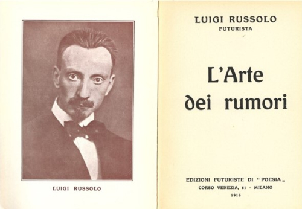
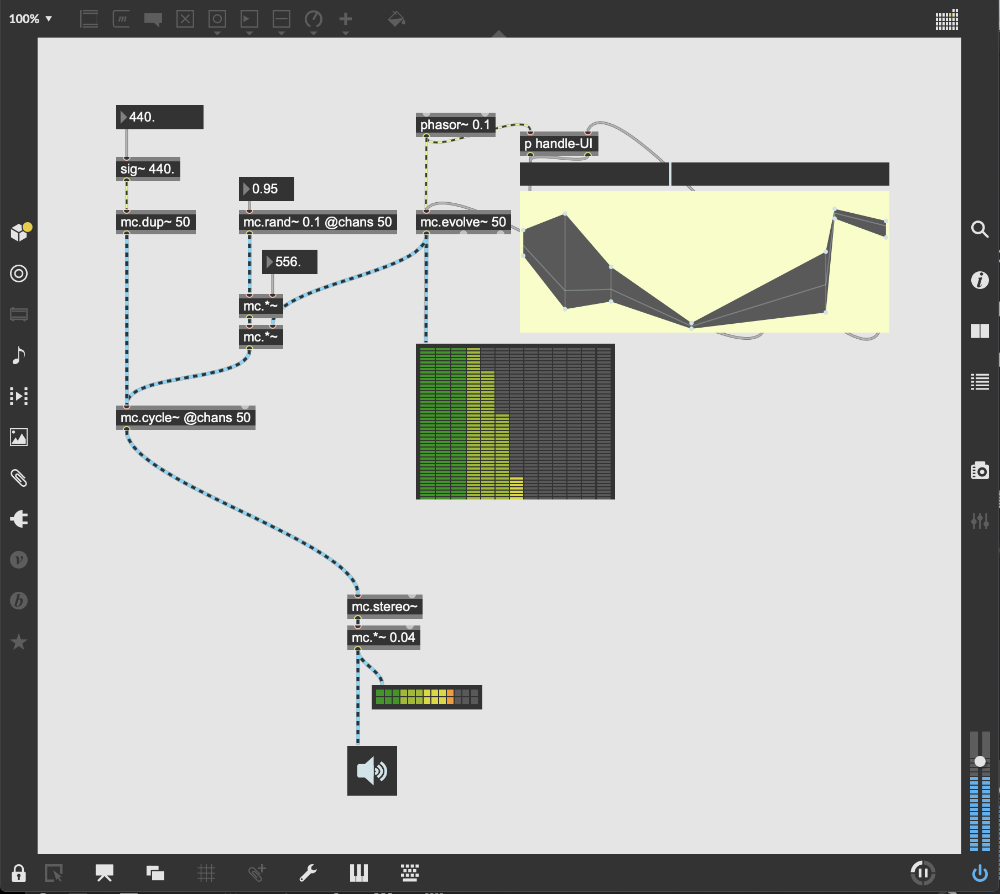
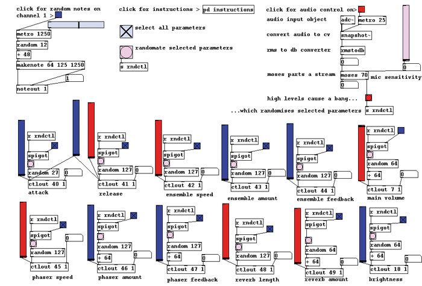

# 前言
## 1.1. 聲音藝術的定義與歷史

### 什麼是聲音藝術？
聲音藝術是一種實驗性的藝術形式，它使用聲音作為主要的媒介。這種藝術形式不僅限於傳統的音樂架構，還包括許多不同的創作和表現方式，如實地錄音、聲音裝置、聲音行為藝術、電子音樂、噪音藝術等。聲音藝術可以是單一的聲音作品，也可以是與視覺藝術、行為藝術、多媒體裝置等融合的跨領域創作。

例如
賈尼特·卡迪 (Janet Cardiff) 的《Soundwalks》：賈尼特·卡迪是一位知名的聲音藝術家，以在公共空間進行的“聲音漫步”而著名。在這些“聲音漫步”中，她會帶領一群人在城市中行走，鼓勵他們專注於周圍的聲音環境，這種活動旨在提高人們對日常生活中忽略的聲音的覺察。


<iframe width="560" height="315" src="https://www.youtube.com/embed/sOkQE7m31Pw" title="YouTube video player" frameborder="0" allow="accelerometer; autoplay; clipboard-write; encrypted-media; gyroscope; picture-in-picture; web-share" allowfullscreen></iframe>
*此作品在德國卡塞爾的老火車站展出，觀眾在觀看和聆聽Cardiff和Miller創作的影片和聲音時，漫步穿越這個空間。*

蘇珊·菲利普茲（Susan Philipsz）是一位來自蘇格蘭的藝術家，主要使用錄製的聲音來創作裝置藝術。她的作品通常涉及將自己的歌聲投射到公共或半公共的空間，營造出一種獨特而引人入勝的聽覺體驗。她的聲音裝置常常會挑戰觀眾對於音樂、聲音、空間與身份之間關係的理解。


<iframe width="560" height="315" src="https://www.youtube.com/embed/s_yMZJkzbcw" title="YouTube video player" frameborder="0" allow="accelerometer; autoplay; clipboard-write; encrypted-media; gyroscope; picture-in-picture; web-share" allowfullscreen></iframe>

蘇珊·菲利普茲的《Study for Strings》：蘇珊·菲利普茲是一位使用聲音和影像的藝術家，她的作品《Study for Strings》是一部基於二戰時期作曲家帕維爾·哈斯的同名弦樂作品的裝置藝術，該作品在塔林音樂節上首次演奏。"Study for Strings"是由捷克作曲家Pavel Haas於1943年在特雷濟恩集中營裡創作的一首音樂作品。Haas是二戰期間一位優秀的作曲家，他在納粹集中營中被囚禁，並在那裡創作了這部作品。不幸的是，他在1944年在奧斯維辛集中營遇害。

蘇珊·菲利普茲請一位中提琴手和一位大提琴手演奏Pavel Haas的《弦樂研究》中的他們各自的部分。然而錄製他們分開演奏每個音符，以便每個音符都來自其自己的揚聲器，她將揚聲器安裝在火車軌道上。這種效果就是將樂曲碎片化並散布在廣大的區域。將錄音擴大並延伸到空間，有抽象化個別音符，將其與整體作品分離的效果。開頭讓人聯想到工業或火車在軌道上移動的聲音。中間部分更為憂鬱，個別的音符彼此交叉呼喚，最後的撥弦聲似乎使軌道上方的電纜活躍起來。

菲利普茲的版本透過一系列揚聲器播放每個音符，每個揚聲器都代表樂曲中的一個音符，這種表現方式帶給觀眾全新的聽覺和視覺體驗。

她在2010年獲得了英國著名的特納獎（Turner Prize），成為首位以聲音藝術獲獎的藝術家。她的一個知名作品是《Lowlands》，這件作品中，她在蘇格蘭格拉斯哥的三個不同的地下橋樑下播放了自己獨唱的傳統蘇格蘭民謠。這種在公共空間裡的聲音投射，既創造出一種深度的個人與內心體驗，也引發觀眾對於公共空間的新的理解與思考。

<iframe width="560" height="315" src="https://www.youtube.com/embed/UWeKzTDi-OA" title="YouTube video player" frameborder="0" allow="accelerometer; autoplay; clipboard-write; encrypted-media; gyroscope; picture-in-picture; web-share" allowfullscreen></iframe>


另一件著名作品是《Surround Me》，這是一個在倫敦市區多個地點進行的大型公共聲音裝置。在這個作品中，她使用了16世紀和17世紀的英格蘭和蘇格蘭的音樂作品，通過這些音樂對城市的歷史和公共空間進行了重新思考和詮釋。

<iframe width="560" height="315" src="https://www.youtube.com/embed/-vt5w5VuECY" title="YouTube video player" frameborder="0" allow="accelerometer; autoplay; clipboard-write; encrypted-media; gyroscope; picture-in-picture; web-share" allowfullscreen></iframe>

```
我想要與Artangel共同創作一個專門為倫敦打造的作品。當我最初來這裡尋找地點時，周末的金融區的寂靜給我留下了深刻的印象。這裡在工作日有超過35萬人在這裡工作，但到了周末，這個城市變成了一個空蕩蕩、寂靜無聲的地方。我認為，讓其他人體驗這種詭異的寂靜會很有趣，這使我想到了一個讓人穿越城市的歌曲循環的概念。我決定在皇家交易所（Royal Exchange）的銀行周圍安排一個廣闊的歌曲循環。我想我可以將它近似為老倫敦城的邊界，這讓我從莫爾蓋特（Moorgate）走到倫敦橋（London Bridge）。我逐漸意識到倫敦橋對於早期現代城市的重要性，並且非常高興能將其作為一個地點納入其中。這幫助我將河流引入到這個項目中，河流強烈喚起的流動水的意象，幾乎在所有的聲音作品中都有所體現。
```

蘇珊·菲利普茲的作品多樣而深入，她利用自己的聲音和獨特的裝置方式，創造出一種獨特的藝術語言，通過聲音與空間的交互，引導觀眾重新思考我們如何與世界相連。

### 聲音藝術歷史
約翰·凱吉的《4分33秒》(4'33")：這是一個非常知名的聲音藝術作品，由實驗音樂家約翰·凱吉在1952年創作。這首作品的譜面上寫著“在任何情況下，不管用什麼儀器，都不演奏”。其目的是讓觀眾專注於音樂會廳內的其他聲音，如觀眾的呼吸聲、座位的摩擦聲等，從而重新審視我們對“音樂”和“聲音”的定義。

<iframe width="560" height="315" src="https://www.youtube.com/embed/JTEFKFiXSx4" title="YouTube video player" frameborder="0" allow="accelerometer; autoplay; clipboard-write; encrypted-media; gyroscope; picture-in-picture; web-share" allowfullscreen></iframe>


聲音藝術的起源可以追溯到20世紀初的未來主義運動，義大利的未來主義者魯索洛·魯索洛 (Luigi Russolo) 在他的“噪聲的藝術”中主張，工業革命帶來的新型機器噪音應該被視為新的音樂語言。

Luigi Russolo（1885年-1947年）是一位意大利作曲家和畫家，他也是未來主義藝術運動的重要人物。他最為人所知的是他在音樂領域的開創性工作，特別是他對噪聲音樂的貢獻。1913年，Russolo寫了一篇名為《噪聲的藝術》的宣言，提出了他對於噪聲在音樂中應用的理念。他認為傳統的音樂結構和旋律已經無法滿足現代社會的聲音需求。他主張，噪聲和不和諧的聲音可以成為創作音樂的新材料。他還設計和創造了一種新的樂器，名為“噪聲器”，這種樂器可以製造出各種不同的噪聲，包括工業和自然聲音，以及其他非傳統的聲音。


*Luigi Russolo在1913年撰寫的《噪聲的藝術》（The Art of Noises）*


Luigi Russolo在1913年撰寫的《噪聲的藝術》（The Art of Noises）是在歐洲一個動盪與變革的時期中產生的。在政治、經濟與科技上，歐洲正經歷著一場產業革命，大規模的工業化與城市化正在迅速改變人們的生活方式與環境。汽車、火車和工廠機械的聲音開始充斥著人們的日常生活，這些新興的聲音現象對Russolo產生了強烈的吸引力。

在藝術與音樂領域，這一時期也是一個極為開放和實驗的時代。從未來主義到立體主義，從抽象主義到達達主義，藝術家們在尋求打破傳統藝術規範的新表達方式。在音樂上，作曲家們如克勞德·德彪西和阿諾·勋伯格等人正在開拓和諧與旋律的新領域，而俄羅斯作曲家伊戈爾·斯特拉文斯基的《春之祭》在1913年巴黎首演時更引發了騷動。

在這樣的社會文化背景下，Russolo的《噪聲的藝術》進一步挑戰了音樂的傳統定義，他主張將日常生活中的各種噪聲納入音樂創作的範疇，尤其是那些與工業化和現代都市生活相關的聲音。這不僅反映了他作為未來主義藝術家的革新精神，也代表了20世紀初音樂與藝術領域中的一種實驗與尋求變革的潮流。Russolo的觀念和他的作品都對20世紀的實驗音樂和電子音樂產生了深遠影響。他對聲音的開放態度和他的實驗精神對許多後來的作曲家和藝術家產生了深遠的影響，他的理念被認為是現代音樂，特別是聲音藝術的重要先驅。

<iframe width="560" height="315" src="https://www.youtube.com/embed/BYPXAo1cOA4" title="YouTube video player" frameborder="0" allow="accelerometer; autoplay; clipboard-write; encrypted-media; gyroscope; picture-in-picture; web-share" allowfullscreen></iframe>

然而，作為一種確立的藝術形式，聲音藝術通常被認為是在1960年代和1970年代興起的，與電子音樂、實驗音樂、觀念藝術等相關。

電子音樂的起源可以追溯到19世紀末和20世紀初的實驗聲音設備。然而，真正的電子音樂作為一種藝術形式的出現，發生在20世紀40年代和50年代，當時科技發展提供了新的工具和技術來創作和操作聲音。

早期的電子音樂形式是使用磁帶的音樂創作，其於1940年代在法國和德國實驗室發展出來。這種方法涉及錄製自然或合成的聲音，然後在播放過程中進行操作，例如更改速度或反轉磁帶，以創造出新的聲音和紋理。法國的實驗室被稱為"具象音樂" (Musique concrète)，而德國的則被稱為"電子音樂" (Elektronische Musik)。

在1940年代和1950年代，音樂創作者開始使用磁帶錄音機來創作音樂，其中包括法國的"具象音樂" (Musique concrète) 和德國的 "電子音樂" (Elektronische Musik) 兩種主要流派。

**具象音樂 (Musique concrète)**

這種音樂形式由法國的皮耶·舒弗（Pierre Schaeffer）於1948年發起。具象音樂的理念是使用實際錄製的聲音（而不是合成聲音）作為創作材料。這些聲音可以是自然的、人工的、樂器的，甚至是日常生活中的聲音。這些聲音會被錄製下來，然後透過磁帶機進行剪切、拼接、變速、反轉等操作，創造出新的聲音與音樂結構。

舒弗的《鐵路研究》(Étude aux chemins de fer) 是具象音樂的開創作品。該曲中的所有聲音均來自錄製的火車聲音，經過磁帶操作後形成一種充滿節奏與動感的音樂。

<iframe width="560" height="315" src="https://www.youtube.com/embed/N9pOq8u6-bA" title="YouTube video player" frameborder="0" allow="accelerometer; autoplay; clipboard-write; encrypted-media; gyroscope; picture-in-picture; web-share" allowfullscreen></iframe>

**電子音樂 (Elektronische Musik)**

與具象音樂相對，德國的電子音樂更側重於使用電子產生的聲音。科隆的西德廣播公司電子音樂工作室是這一流派的中心。在此，音樂家會利用磁帶錄音機和早期的電子樂器，如振蕩器和磁帶回放等，來產生和操作聲音。

卡爾海因茨·史托克豪森是德國電子音樂的重要創作家，他的《接觸》(Kontakte) 是1960年代電子音樂的重要作品。該作品中，史托克豪森使用電子產生的聲音，並透過磁帶操作來創造出豐富而多變的音響效果。

<iframe width="560" height="315" src="https://www.youtube.com/embed/l_UHaulsw3M" title="YouTube video player" frameborder="0" allow="accelerometer; autoplay; clipboard-write; encrypted-media; gyroscope; picture-in-picture; web-share" allowfullscreen></iframe>

這些初期的磁帶音樂創作方式為音樂的發展打開了全新的領域，對後續的電子音樂與聲音藝術有著深遠的影響。

在1950年代，使用電子樂器的音樂開始興起，包括電子合成器。電子合成器可以產生、塑造和控制廣泛的聲音。這種樂器的早期模型包括RCA Mark II音樂合成器，以及羅伯特·摩格於1964年創建的Moog合成器。

電子合成器的歷史可以追溯到19世紀，但直到20世紀中葉的技術進步，這種樂器才變得普遍且具有創新性。以下是電子合成器的主要發展階段：

**初期實驗（19世紀末至20世紀初）**

最早的電子樂器包括特雷門（theremin）、奧恩斯馬丁諾（Ondes Martenot）和特拉烏特尼姆（Trautonium）。這些樂器可以產生電子聲音，但並不是合成器，因為它們缺乏音色控制和其他合成功能。

特雷門（Theremin）是一種於1920年代由俄羅斯物理學家萊昂·特雷門（Leon Theremin）所發明的電子樂器，是世界上最早的電子樂器之一。特別之處在於，演奏者無需接觸樂器就能演奏，因此特雷門也常被視為首款“無接觸”音樂器具。

<iframe width="560" height="315" src="https://www.youtube.com/embed/K6KbEnGnymk" title="YouTube video player" frameborder="0" allow="accelerometer; autoplay; clipboard-write; encrypted-media; gyroscope; picture-in-picture; web-share" allowfullscreen></iframe>
*THEREMIN - Over The Rainbow*


特雷門的操作原理主要基於兩個金屬天線，一個控制音調，另一個控制音量。音調天線通常是一根直立的棒，而音量天線則是一個水平的环形結構。演奏者可以通過改變手與這兩個天線之間的距離來控制音樂的音高和音量。

當演奏者的手靠近音調天線時，音調會變高；而手離音量天線越遠，音量就越小。這種演奏方式需要精確的手部控制和練習，但也可以產生獨特和魔幻的音效。

特雷門在電影配樂中常被用來創造超自然或神秘的氛圍，例如在1951年的科幻電影《天外來客》中就有使用到。此外，特雷門也在流行音樂、搖滾音樂和實驗音樂中得到應用，例如樂團The Led Zeppelin在他們的作品《Whole Lotta Love》中就使用了特雷門。

<iframe width="560" height="315" src="https://www.youtube.com/embed/xpdhqljxhtQ" title="YouTube video player" frameborder="0" allow="accelerometer; autoplay; clipboard-write; encrypted-media; gyroscope; picture-in-picture; web-share" allowfullscreen></iframe>
*Whole Lotta Love theramin solo*


## Ondes Martenot

<iframe width="560" height="315" src="https://www.youtube.com/embed/v0aflcF0-ys" title="YouTube video player" frameborder="0" allow="accelerometer; autoplay; clipboard-write; encrypted-media; gyroscope; picture-in-picture; web-share" allowfullscreen></iframe>

Ondes Martenot（馬腾諾波）是一種早期的電子樂器，由法國音樂家和發明家 Maurice Martenot 在 1928 年發明。它的名字來自法語 "ondes"（意為波）和發明者的姓氏 "Martenot"。Martenot 受到無線電和熱爾曼電樂器（Theremin）的啟發，創造了一種能夠產生豐富且具有表達力的音色的樂器。

Ondes Martenot 的外觀與傳統鋼琴有一些相似，有一個鍵盤和一個拉桿，兩者都可以用來控制音高。鍵盤可以產生固定的半音，而拉桿則允許滑動的音調，這使得演奏者可以做出獨特的顫音和滑音效果。此外，還有一個可以控制音量的旋鈕。

Ondes Martenot 的聲音源自一個或多個電子振蕩器，並可以通過一系列的揚聲器（包括帶有共鳴弦的揚聲器和帶有鼓皮的揚聲器）來產生不同的音色。由於它可以產生從純淨的正弦波到複雜的諧波聲音的廣闊音色範圍，所以它在電影配樂和古典音樂中都有使用。

許多作曲家，包括法國作曲家 Olivier Messiaen 和 Tristan Murail，以及電影配樂作曲家如 Thomas Newman 和 Jonny Greenwood（也是搖滾樂團 Radiohead 的成員），都在他們的作品中使用過 Ondes Martenot。

雖然 Ondes Martenot 並不如電子琴或合成器那麼廣為人知，但它仍然是電子音樂的重要部分，並對許多後來的電子樂器產生了影響。


**模擬合成器（1960年代到1970年代）**

60年代和70年代的實驗電子音樂進一步發展，並被創新的作曲家如卡爾·赫因茨·史托克豪森、皮耶·布列茲、約翰·凱吉和保羅·蘭尼斯等人所採用。同時，電子音樂也開始影響流行音樂領域，從搖滾樂到迪斯可音樂，再到80年代和90年代的電子舞曲。

最後，電腦音樂在1970年代開始出現，當時的電腦技術讓作曲家可以以更複雜的方式操作聲音。電腦音樂的發展現在已經包括數位音訊工作站，以及MIDI（樂器數位介面）等技術，這些都使得音樂創作更加靈活和多樣化。

最初的模擬合成器，如摩格合成器（Moog synthesizer）和ARP合成器，於1960年代問世。它們利用電子電路（如振蕩器和濾波器）來產生和塑造聲音。這些樂器大多以鍵盤為基礎，並通過調節旋鈕和滑桿來控制聲音參數。


<iframe width="560" height="315" src="https://www.youtube.com/embed/n3K_fZDvINs" title="YouTube video player" frameborder="0" allow="accelerometer; autoplay; clipboard-write; encrypted-media; gyroscope; picture-in-picture; web-share" allowfullscreen></iframe>


Moog合成器是由美國工程師和創業家羅伯特·摩格（Robert Moog）在1960年代初期開發的一種模擬電子音樂合成器。它的出現改變了音樂創作的方式，並在流行音樂和實驗音樂中引起了革命。

原始的Moog合成器是一種大型的模組化合成器，由各種不同的模組組成，包括振盪器、濾波器、包絡產生器等。這些模組通過配線（patch cables）相連接，可以產生和修改電子信號，以創造出豐富多樣的音色。

最早的Moog合成器對於許多音樂家來說體積過大、價格過高，並且操作起來相對複雜。然而，當Moog公司在1970年代推出小型化、簡化操作的迷你摩格（Minimoog）時，它迅速成為了專業和業餘音樂家的首選。Minimoog合成器因其豐富的聲音和攜帶方便的特性，被廣泛用於流行音樂、搖滾音樂和電子音樂中。

<iframe width="560" height="315" src="https://www.youtube.com/embed/sLx_x5Fuzp4" title="YouTube video player" frameborder="0" allow="accelerometer; autoplay; clipboard-write; encrypted-media; gyroscope; picture-in-picture; web-share" allowfullscreen></iframe>
*A Brief History of the Minimoog Part I*


Moog合成器在許多經典音樂作品中扮演了重要的角色，包括 The Beatles 的 "Here Comes the Sun"，Pink Floyd 的 "Dark Side of the Moon"，以及許多Kraftwerk的作品等。此外，它也在電影音樂和電視配樂中有廣泛的應用，例如在 Wendy Carlos 的 "Switched-On Bach" 中，就全程使用了Moog合成器進行演奏。

Moog合成器的獨特音色、創新的設計，以及其在音樂創作中的靈活性，使其成為電子音樂的代表性工具之一。


**數字合成器和MIDI（1980年代）**

1980年代見證了數字合成器的興起，如山葉的DX7，以及樂器數字接口（MIDI）的出現。數字合成器使用數學算法（例如頻率調變合成）來產生聲音，而MIDI則允許不同的電子音樂設備互相溝通和控制。

<iframe width="560" height="315" src="https://www.youtube.com/embed/eeHNVVcuSVs" title="YouTube video player" frameborder="0" allow="accelerometer; autoplay; clipboard-write; encrypted-media; gyroscope; picture-in-picture; web-share" allowfullscreen></iframe>

MIDI（Musical Instrument Digital Interface，音樂儀器數位介面）在聲音藝術中起到關鍵作用，因為它改變了音樂創作、表演和錄音的方式。

標準化的通信：MIDI是一種通信協議，允許不同製造商的音樂硬體和軟體之間進行互動和溝通。這種兼容性實現了跨平台的音樂製作，讓音樂家可以更輕鬆地創作音樂。

複雜度與靈活性：MIDI不僅能夠記錄音符的音高、強度和持續時間，還可以記錄其他音樂參數，如音調彎曲、震蕩、音量變化等。這種多維度的音樂信息使得音樂創作更為複雜和靈活。

數位音樂製作：MIDI的出現與電腦音樂製作的崛起緊密相連。透過MIDI，音樂家可以直接在電腦上進行音樂創作，包括編輯、混音和製作等各種過程，這大大提高了音樂製作的效率和可能性。

互動性：MIDI還提供了高度的互動性，音樂家可以即時地控制和改變音樂的各個層面。在即時演奏、聲音裝置和互動裝置藝術等領域中，MIDI已成為一個無可或缺的工具。

經濟實惠：因為MIDI文件只記錄演奏信息而不是實際的音頻信號，所以它們的大小通常非常小，便於傳輸和儲存。此外，許多開源和免費的軟體也支持MIDI，使得音樂製作更為經濟實惠。


**軟體合成器和虛擬樂器（1990年代至今）**


90年代以後，隨著個人電腦的普及以及數位音訊技術的發展，軟體合成器開始真正進入主流，以下為這個時期軟體合成器的主要發展歷程：

1. **虛擬樂器 (VST) 的出現**：VST（Virtual Studio Technology）是一種由德國公司Steinberg在1996年開發的接口，它允許第三方開發者創建並加入自己的插件，如軟體合成器和效果器，進而擴大數位音樂製作軟體的功能。這種開放的架構使得軟體合成器得以快速發展和創新。
2. **模擬合成的復興**：在90年代和2000年代，許多軟體合成器嘗試模擬老式硬體合成器的聲音和工作方式，這樣的合成器被稱為虛擬類比合成器。這些軟體合成器如Arturia的 Moog Modular V、Minimoog V 和Korg的Legacy Collection等，讓使用者能夠在電腦上體驗到類比合成的樂趣，並以更便宜的價格獲得原本昂貴且難以取得的樂器聲音。
3. **物理模擬合成器的興起**：物理模擬合成是指使用數學模型來模擬真實樂器的物理行為，如弦樂器或管樂器的振動行為。軟體如Modartt的Pianoteq和Applied Acoustics Systems的 Tassman等採用此技術，可以產生非常自然且逼真的聲音。
4. **取樣合成的普及**：隨著儲存空間和處理能力的增加，取樣合成器如Kontakt, Spectrasonics的Omnisphere等也變得更為常見。這些合成器使用大量取樣音源來產生聲音，可以模擬多種不同的樂器和人聲。
5. **編程音樂語言的進步**：為了更深入地控制和創造聲音，一些音樂家和開發者創造了編程語言，如Max/MSP, Pure Data和SuperCollider等。這些環境讓使用者能夠直接以程式碼來產生和操作聲音，提供了無限的可能性。

自1990年代以來，電腦技術的進步使得軟體合成器和虛擬樂器成為可能。這些應用程式可以模擬模擬合成器和數字合成器的功能，或者創造全新的合成技術。它們也可以模擬實體樂器的聲音，從而在數字工作站（DAW）中使用。

電子合成器的發展為音樂創作帶來了無限的可能性，使得音樂人可以探索和創造出各種新的聲音和音樂風格。


## 1.2. 聲音藝術的形式與類型

聲音藝術是一個寬廣的領域，其形式和類型非常多元。以下是一個聲音藝術的形式與類型的大綱：

1. **聲音裝置**：這類型的作品在特定的空間中配置和播放聲音。有時候，這些裝置可能會用到特殊的揚聲器或者是互動技術。

2. **聲音雕塑**：這類型的聲音藝術作品使用物理物件來創造聲音。這可能包括使用傳統樂器，或者建造新的、專為創造特殊聲音的物體。

3. **聲景藝術**：這類型的聲音藝術關注的是特定地點的聲音環境。藝術家可能會記錄和編輯這些聲音，並且在展示時重現。

4. **聲音行為藝術**：這類型的聲音藝術強調的是在特定的時間和地點製造的聲音。藝術家可能會使用各種非傳統的方法來產生聲音，例如身體動作或者是非樂器的物體。

5. **電子音樂和電腦音樂**：這類型的聲音藝術使用電子和電腦技術來創造和修改聲音。可能包括實驗音樂、聲響藝術，以及各種由編程語言（如Max/MSP、Pure Data）創作的作品。

   

每種類型都有其獨特的特點，並且往往與其它的藝術形式（如視覺藝術、表演藝術、文學等）交織在一起。聲音藝術的多樣性使得它能夠以各種方式來探索聲音的可能性。

### 聲音裝置

以下是一些重要的聲音裝置作品：

1. **賈尼特·卡迪（Janet Cardiff）的"Forty Part Motet"**：這個作品是一個重新解讀英國作曲家湯瑪斯·塔利斯（Thomas Tallis）在1570年代創作的40部分莫泰特（Motet）合唱作品。每一個揚聲器播放一個歌手的聲音，創造出身臨其境的空間音樂體驗。

   <iframe width="560" height="315" src="https://www.youtube.com/embed/38ORiaia9r8" title="YouTube video player" frameborder="0" allow="accelerometer; autoplay; clipboard-write; encrypted-media; gyroscope; picture-in-picture; web-share" allowfullscreen></iframe>

2. **池田亮司（Ryoji Ikeda）的"data.matrix"**：薩博提的作品通常採用極端的音頻頻率和簡單的視覺元素來創造強烈的感官體驗。在"data.matrix"中，一連串的電子聲音和閃爍的抽象數據視覺效果一起形成一種超感官體驗。

<iframe width="560" height="315" src="https://www.youtube.com/embed/F5hhFMSAuf4" title="YouTube video player" frameborder="0" allow="accelerometer; autoplay; clipboard-write; encrypted-media; gyroscope; picture-in-picture; web-share" allowfullscreen></iframe>


3. **馬克思·紐豪斯（Max Neuhaus）的"Times Square"**：紐豪斯在紐約時代廣場的地下安裝了一個永久性的聲音裝置。裝置發出的聲音經過特殊調製，與周圍城市的聲音混合在一起，創造出一種新的聲音環境。

<iframe width="560" height="315" src="https://www.youtube.com/embed/kA-fihBFWBI" title="YouTube video player" frameborder="0" allow="accelerometer; autoplay; clipboard-write; encrypted-media; gyroscope; picture-in-picture; web-share" allowfullscreen></iframe>

馬克斯·紐豪斯（Max Neuhaus）的"Times Square"是他的代表作之一，該作品於1977年首次公開展出。該裝置位於紐約市的時代廣場地鐵站附近，是一種無形的聲音裝置或聲音雕塑。

這個作品並不直接使用揚聲器播放錄音，而是使用了一種特殊的技術來振動地面，產生一種持續的，富有共鳴的聲音。這個聲音是如此地與眾不同，以至於許多經過的行人甚至可能不會意識到它的存在，誤以為它是來自城市自身的聲音。

"Times Square"的創新之處在於，它把音樂和聲音藝術從傳統的演出空間——比如音樂廳和畫廊——帶到了公共空間。它也挑戰了我們對聲音和音樂的認知，讓我們去重新思考和聆聽我們日常生活中的聲音。這個作品在1992年被關閉，但在2002年由DIA藝術基金會重新安裝，並一直持續到今天，成為紐約市公共藝術的一個重要部分。

以上這些聲音裝置作品通過創新的方式來探索聲音在空間中的表現和感知方式，並且將觀眾融入到作品中，使他們成為體驗的一部分。

## 聲音雕塑

聲音雕塑是一種藝術形式，它結合了聲音和空間元素來創作一種全新的聽覺體驗。聲音雕塑可能包括實體雕塑，它們產生或改變聲音，或者可能完全由聲音組成，以特定的方式配置在空間中。

以下是一些代表性的聲音雕塑作品：

1. **Harry Bertoia "Sonambient Sculptures"**：哈利·貝托亞是一位著名的工業設計師和雕塑家，他的Sonambient雕塑是一組由金屬棒和板構成的雕塑，當風吹過或被觸摸時，它們會產生美妙的共鳴聲。

<iframe width="560" height="315" src="https://www.youtube.com/embed/a9EF_zO5ihs" title="YouTube video player" frameborder="0" allow="accelerometer; autoplay; clipboard-write; encrypted-media; gyroscope; picture-in-picture; web-share" allowfullscreen></iframe>

   

2. **Bill Fontana "Sound Sculptures"**：比爾·豐塔納的聲音雕塑利用了現場錄音和廣播技術，將特定的聲音放置在公共空間，如城市街道或建築內部。他的作品通常反映了作品所在的地點，使觀眾以全新的方式聆聽他們的環境。

   Bill Fontana（1947年生於美國俄亥俄州）是一位國際知名的聲音藝術家，他以創造聲音雕塑而聞名，並在公共藝術領域做出了重大貢獻。他的創作多使用錄音技術，並把聲音作為雕塑或表演藝術的主要元素。

   Fontana於1970年在紐約學習音樂，並在1970年代初開始創作他的首部聲音藝術作品。他的早期作品主要探討城市和自然聲音環境的各種可能性。他的作品在全球各地的藝術機構和公共空間展出，包括紐約的惠特尼美術館、倫敦的泰特現代藝術館、巴黎的龐畢度中心等等。

   以下是一些他的代表作品：

   1. **"Sound Sculptures Through the Golden Gate"（1987年）**：此作品使用傳送過金門大橋的聲音，這些聲音被實時廣播到舊金山的藝術博物館。

<iframe width="560" height="315" src="https://www.youtube.com/embed/tQOIa-1Y6Qo" title="YouTube video player" frameborder="0" allow="accelerometer; autoplay; clipboard-write; encrypted-media; gyroscope; picture-in-picture; web-share" allowfullscreen></iframe>

​      

   2. **"Sound Island"（1994年）**：這是一個為法國巴黎諾特丹大教堂所創作的公共聲音藝術，使用了教堂鐘聲的錄音。

   3. **"Harmonic Bridge"（2006年）**：在這部作品中，Fontana捕捉了英國倫敦塔橋上的聲音，並把它們傳送到附近的海濱空間。

   Fontana的作品旨在挑戰觀眾對環境聲音的認知，並引導我們重新思考聲音在我們日常環境中的角色。他的作品中常常融入了聲音的時間性和空間性，從而打破了音樂與聲音藝術的界限。

   

3. **Bernhard Leitner “Sound Spaces”**：伯納德·萊特納的作品主要關注聲音如何與建築空間互動。他的"Sound Spaces"作品系列中，特定的聲音會在特定的建築結構中播放，創造出一種聽覺體驗，使觀眾能夠以全新的方式感知空間。

<iframe width="560" height="315" src="https://www.youtube.com/embed/uPbq9aixozo" title="YouTube video player" frameborder="0" allow="accelerometer; autoplay; clipboard-write; encrypted-media; gyroscope; picture-in-picture; web-share" allowfullscreen></iframe>

<iframe width="560" height="315" src="https://www.youtube.com/embed/pMInTCr9__o" title="YouTube video player" frameborder="0" allow="accelerometer; autoplay; clipboard-write; encrypted-media; gyroscope; picture-in-picture; web-share" allowfullscreen></iframe>

   

這些只是眾多聲音雕塑的一部分，這種藝術形式以其多樣性和創新性而聞名，並繼續推動我們對聲音和空間的理解。


## 聲景藝術

聲景藝術，或稱為聲音景觀藝術，源自於聲景學（Soundscape Studies）或聲景生態學（Acoustic Ecology）的研究領域，並將其延伸至藝術創作中。這個領域專注於我們聽覺環境的探索和理解，並認識到這種環境對我們的行為和感知的影響。

一般認為聲景學的創始人是加拿大作曲家和環境學家 R. Murray Schafer，他在1970年代提出了聲景的概念。Schafer的工作促使許多藝術家開始以創新的方式探索聲音和空間的關係，並使聲景藝術成為聲音藝術的一個重要分支。

以下是一些重要的聲景藝術家和他們的作品：

1. **Hildegard Westerkamp**：作為一名作曲家和聲景研究員，Westerkamp的作品主要聚焦在環境聲音的收錄與創作。她的聲音漫步作品，如 "Kits Beach Soundwalk"（1989年），引導觀眾在特定的城市環境中漫步，並透過頭戴耳機聆聽環境聲音的實地錄音。

<iframe width="560" height="315" src="https://www.youtube.com/embed/hg96nU6ltLk" title="YouTube video player" frameborder="0" allow="accelerometer; autoplay; clipboard-write; encrypted-media; gyroscope; picture-in-picture; web-share" allowfullscreen></iframe>

   

2. **Janet Cardiff and George Bures Miller**：這對藝術家夫婦創造了一系列的聲音漫步作品，如 "The Missing Voice (Case Study B)"（1999年），引導觀眾在倫敦的街頭體驗一種劇情導向的聲音旅程。

<iframe width="560" height="315" src="https://www.youtube.com/embed/LAhrSiUeP2I" title="YouTube video player" frameborder="0" allow="accelerometer; autoplay; clipboard-write; encrypted-media; gyroscope; picture-in-picture; web-share" allowfullscreen></iframe>

   

3. **Bernie Krause**：作為一名生物聲學家和音樂家，Krause的作品紀錄了各種自然環境中的聲音。他的作品 "The Great Animal Orchestra"（2016年）在巴黎的Fondation Cartier展出，將收錄的自然聲音轉換成一種動態的聲音和視覺裝置。

<iframe width="560" height="315" src="https://www.youtube.com/embed/btrinTDDjnQ" title="YouTube video player" frameborder="0" allow="accelerometer; autoplay; clipboard-write; encrypted-media; gyroscope; picture-in-picture; web-share" allowfullscreen></iframe>


這些藝術家和他們的作品，展現了聲景藝術如何透過創作，讓我們重新審視並深入理解聲音在我們生活中的重要性。


## 聲音行為藝術

聲音行為藝術通常以行為、空間和時間的觀念為基礎，重視藝術家與聲音的物理互動。

- **John Cage**：Cage 是20世紀最有影響力的作曲家之一，他對聲音的寬廣定義深深影響了聲音行為藝術的發展。他的作品 "4'33"" 是一部沒有任何指定音樂的作品，演奏者在整個4分鐘33秒的時間內不進行任何傳統的音樂演奏，讓觀眾專注於演奏環境中的自然聲音。
- **Nam June Paik**：白南準作為錄像藝術的先驅，Paik 也創作了多部音樂行為藝術作品，例如 "One for Violin Solo"（1962年），在這個行為裡，他慢慢提高一把小提琴，然後突然將其摔在地上，產生單一、短暫的噪聲。

<iframe width="560" height="315" src="https://www.youtube.com/embed/XGTPpvHxsVg" title="YouTube video player" frameborder="0" allow="accelerometer; autoplay; clipboard-write; encrypted-media; gyroscope; picture-in-picture; web-share" allowfullscreen></iframe>

<iframe width="560" height="315" src="https://www.youtube.com/embed/cTXTOJLFmFw" title="YouTube video player" frameborder="0" allow="accelerometer; autoplay; clipboard-write; encrypted-media; gyroscope; picture-in-picture; web-share" allowfullscreen></iframe>

## 電子音樂和電腦音樂

**電子音樂**和**電腦音樂**有許多共同之處，但主要的區別在於創作和執行的方式。電子音樂通常指的是使用電子儀器和設備（如合成器、麥克風、錄音設備等）創作的音樂，而電腦音樂則專指使用電腦作為主要創作工具的音樂。

1. **電子音樂**

   - **Karlheinz Stockhausen**：他是20世紀最有影響力的作曲家之一，並且在電子音樂的發展中起著關鍵的角色。他的作品《聯絡》（Kontakte）在電子音樂的發展史上有劃時代的影響，該作品既可以作為純粹的四聲道音樂表演，也可以與現場演奏的鋼片琴和打擊樂器合奏。

   - **Delia Derbyshire**：在BBC的廣播工作室工作期間，Derbyshire使用錄音帶剪接技術創作出了許多電子音樂作品。她最知名的作品可能是1963年為英國科幻劇集《Doctor Who》創作的主題曲。

<iframe width="560" height="315" src="https://www.youtube.com/embed/CM8uBGANASc" title="YouTube video player" frameborder="0" allow="accelerometer; autoplay; clipboard-write; encrypted-media; gyroscope; picture-in-picture; web-share" allowfullscreen></iframe>

<iframe width="560" height="315" src="https://www.youtube.com/embed/puzHEbL4-xs" title="YouTube video player" frameborder="0" allow="accelerometer; autoplay; clipboard-write; encrypted-media; gyroscope; picture-in-picture; web-share" allowfullscreen></iframe>


2. **電腦音樂**

   - **Max Mathews**：他被認為是電腦音樂的先驅，他在貝爾實驗室創作的"Music I"是世界上第一個電腦音樂程式，此後他開發出了一系列的"Music N"軟體，這些軟體為電腦音樂的發展打下了基礎。
   
<iframe width="560" height="315" src="https://www.youtube.com/embed/mT3U98cFqSs" title="YouTube video player" frameborder="0" allow="accelerometer; autoplay; clipboard-write; encrypted-media; gyroscope; picture-in-picture; web-share" allowfullscreen></iframe>

<iframe width="560" height="315" src="https://www.youtube.com/embed/ZFUVR-clo8g" title="YouTube video player" frameborder="0" allow="accelerometer; autoplay; clipboard-write; encrypted-media; gyroscope; picture-in-picture; web-share" allowfullscreen></iframe>


   - **John Chowning**：他在電腦音樂的發展中起著重要的角色，特別是他在頻率調變合成（FM synthesis）方面的創新。他的作品"Turenas"（1972年）是首個完全利用電腦合成的立體聲作品，對電腦音樂的發展有深遠影響。


<iframe width="560" height="315" src="https://www.youtube.com/embed/w4g92vX1YF4" title="YouTube video player" frameborder="0" allow="accelerometer; autoplay; clipboard-write; encrypted-media; gyroscope; picture-in-picture; web-share" allowfullscreen></iframe>


<iframe width="560" height="315" src="https://www.youtube.com/embed/kSbTOB5ft5c" title="YouTube video player" frameborder="0" allow="accelerometer; autoplay; clipboard-write; encrypted-media; gyroscope; picture-in-picture; web-share" allowfullscreen></iframe>

<iframe width="560" height="315" src="https://www.youtube.com/embed/tpysRrYXxg4" title="YouTube video player" frameborder="0" allow="accelerometer; autoplay; clipboard-write; encrypted-media; gyroscope; picture-in-picture; web-share" allowfullscreen></iframe>

這些藝術家與他們的作品都是電子音樂與電腦音樂領域裡的重要里程碑，透過這些創新的工作，他們擴大了音樂的邊界，並開創了全新的創作與聆聽音樂的方式。

筆者在2012所創作的Auto Music Machine，利用puredata合成聲音，並利用對位法的概念讓音樂自行發展，並每次都製作出完全不同之音樂。

<iframe src="https://player.vimeo.com/video/24908632?h=005097bcdc" width="640" height="480" frameborder="0" allow="autoplay; fullscreen; picture-in-picture" allowfullscreen></iframe>
<p><a href="https://vimeo.com/24908632">Auto Music Machine</a> from <a href="https://vimeo.com/user4314583">Jinyao Lin</a> on <a href="https://vimeo.com">Vimeo</a>.</p>


## 1.3. Max/MSP和Pure Data的介紹

### Max/MSP

Max/MSP是一款由Cycling '74開發的圖形化編程語言，專門用於音樂和多媒體創作。它的名字源於軟體的兩個主要元素：Max（一個音樂圖形化編程環境）和MSP（Max的音訊插件）。

1. **Max**：Max的主要功能是讓使用者能夠建立和控制音樂或多媒體的程序。使用者可以透過所謂的"對象"（objects）- 可以接收、處理或產出數據的軟體組件 - 來建立他們的程序。這些對象用線路相連，形成一個數據流的路徑，就像電子電路一樣。
2. **MSP**：MSP為Max提供了對音訊數據的直接控制。在MSP中，Max的對象可以接收和產出音訊信號，並對它們進行一系列的操作，包括過濾、混合、分析和合成。

Max/MSP以其靈活性和強大功能而聞名，是許多作曲家、表演者、藝術家和研究者的首選工具。透過Max/MSP，使用者可以建立從簡單的音效處理到複雜的音樂生成系統的所有東西。

除了Max/MSP，Cycling '74也開發了一個名為Jitter的視覺處理插件，可以用於影片和3D圖形，使Max/MSP成為一個全面的多媒體創作工具。


*max/msp*


**Pure Data**（通常縮寫為Pd）是一種即時的視覺編程語言，專為創建互動的多媒體作品而設計。它由Miller Puckette於1990年代中期創建，他也是Max/MSP的共同創建者之一。Pd專注於音訊、視訊以及圖形處理，並且在音訊處理、即時互動、MIDI控制、視訊合成以及2D/3D圖形等眾多領域中得到了廣泛的應用。

Pd的主要特點包括：

1. **視覺化編程**：與傳統的文字編程語言不同，Pd使用了視覺化的編程方式。使用者可以通過拖拽並連接不同的物件來創建程序，這使得Pd對於視覺學習者來說特別直觀。
2. **即時處理**：Pd是一種即時編程環境，這意味著您可以在程式運行時修改和調整它。這使得Pd非常適合進行即時音訊處理和互動設計。
3. **跨平台兼容**：Pd可以在多種操作系統上運行，包括Windows、macOS和Linux。它的源代碼也是開源的，這意味著任何人都可以自由地下載並修改它。

在聲音藝術中，Pd常常被用於創建電子音樂、實時音訊處理、互動裝置等。由於其靈活和開放性，Pd已經成為了聲音藝術家和實驗音樂家的重要工具之一。


*pure data*


## 1.4. 為什麼這兩個工具對聲音藝術家重要

Max/MSP和Pure Data（Pd）對於聲音藝術家的重要性主要體現在以下幾個方面：

實時音訊處理和創作：兩者都提供實時音訊處理的功能，這使得藝術家能在創作過程中即時聆聽和調整音訊效果，大大提高了創作的自由度和靈活性。

視覺化編程環境：透過視覺化編程環境，藝術家可以透過拖拽和連接模塊的方式來設計和實現音訊處理算法，這種方式比傳統的文本編程更直觀，對於非專業程序員的藝術家來說更容易上手。

高度的客製化能力：Max/MSP和Pd都支援使用者自定義模塊和擴展，藝術家可以根據自己的需求來擴充這些工具的功能，這大大擴大了其應用範疇。

支援多媒體互動：除了音訊處理，Max/MSP和Pd還支援視訊處理和感測器輸入等功能，使得藝術家可以輕易地創作出多媒體互動藝術作品。

龐大的社區資源：Max/MSP和Pd都有著龐大的用戶社區，藝術家可以從社區中學習到許多新的技巧和創意，也可以分享自己的作品並獲得反饋。