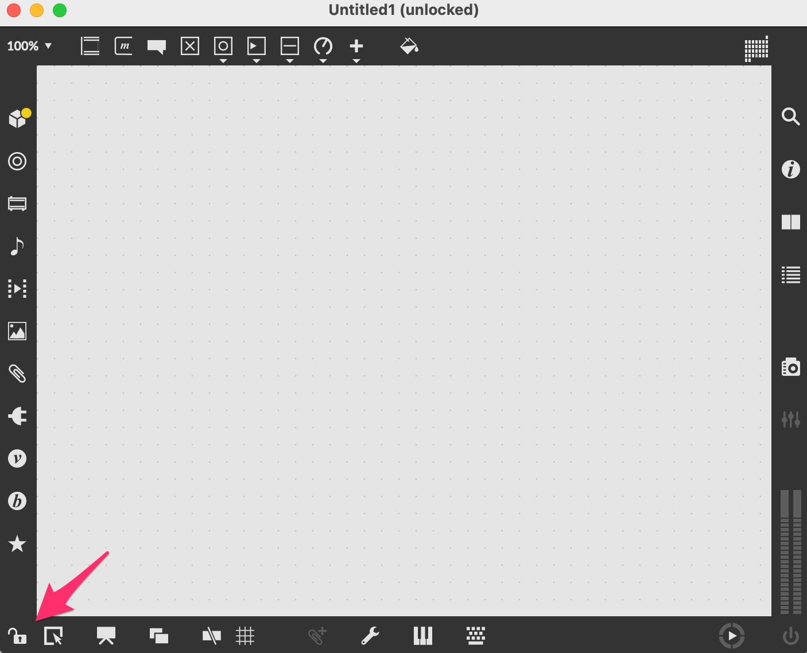
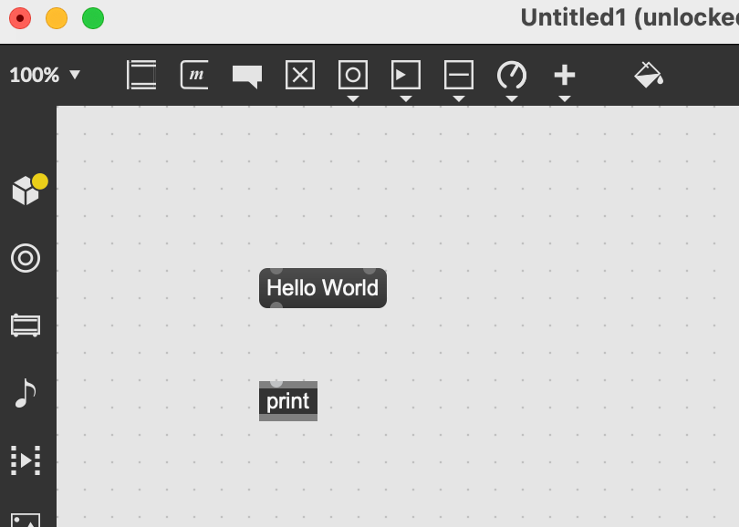
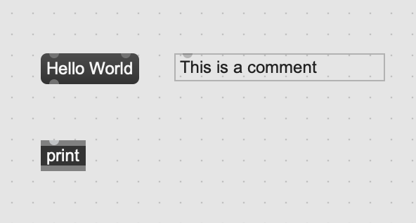
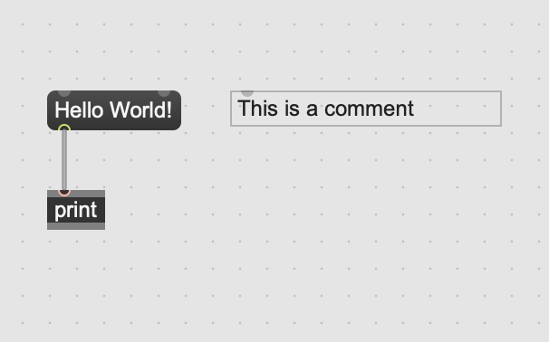
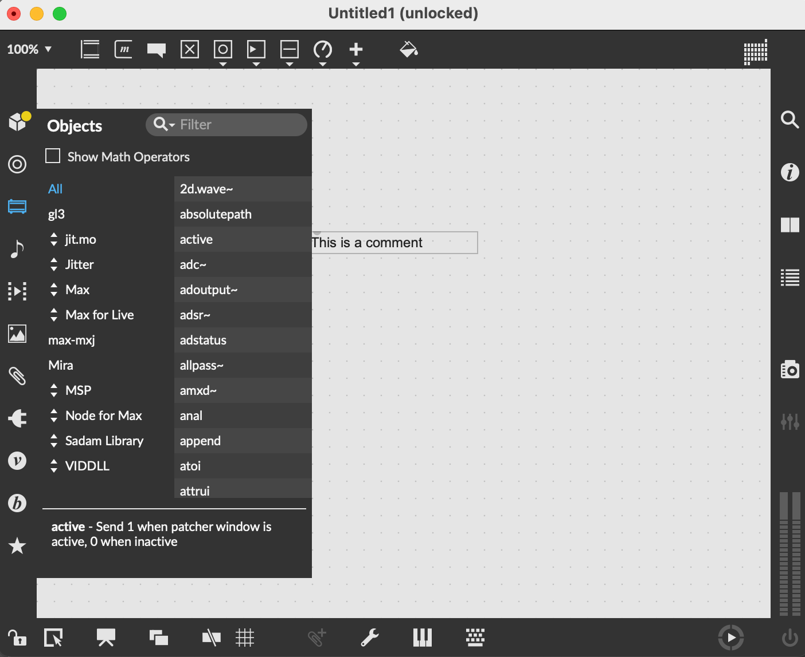

# 第二部分：Max/MSP的使用
## 3.1. Max/MSP基本操作與界面介紹

Max/MSP是一款強大的視覺程式語言軟體，廣泛用於音樂和多媒體項目。其主要特點是以"物件"(objects)的形式進行程式設計，這些物件經由連接線相互連結以建立資料和訊號流，從而創造出複雜的音樂和視覺作品。

以下是Max/MSP的基本操作和界面介紹：

1. **物件盒(Object Box)**：這是創建新物件的主要工具，您可以在物件框中輸入任何Max物件的名稱，包括數學運算元、控制結構、MIDI處理、音訊處理等。一個新的物件框在被創建時是空的，您需要輸入對應的物件名稱來使其生效。

   在 Max/MSP 中新增一個 Object Box 是相當簡單的，以下是步驟：

   1. 確定您目前處於 "patching mode"（編輯模式），這是新增或編輯物件的模式。如果您不確定，可以查看 Max/MSP 左下角的 Lock 按鈕是否處於解鎖狀態（Lock 圖示顯示為沒上鎖）。如果沒有，點擊該按鈕即可切換模式。
   
   *切換編輯模式*

   2. 在工作區域任一位置點擊滑鼠左鍵兩下，這時工作區會出現一個新的 Object Box。
   3. 在此 Object Box 中，您可以輸入物件名稱（例如 "+", "metro", "random" 等），然後按 Enter 或點擊工作區的其他位置，輸入的名稱就會生效，Object Box 也會根據輸入的物件名稱改變其外觀或接口。
   

請注意，要讓 Object Box 有效，您需要輸入一個已存在的物件名稱。如果您不確定某個名稱是否存在，可以在 Max 的左側欄位的物件庫中搜尋。

*新增一個物件*

2. **訊息盒(Message Box)**：訊息盒允許您傳遞靜態或動態的數據訊息。訊息可以是數字、文字或列表，並且可以在執行時透過其他物件動態改變。

   在 Max/MSP 中增加 Message Box 的步驟如下：

   1. 確認您處於 "patching mode"（編輯模式），這是您可以新增或編輯物件的模式。如果您不確定是否處於此模式，請查看 Max/MSP 左下角的 Lock 按鈕是否處於解鎖狀態（Lock 圖示顯示為沒上鎖）。如果不是，您可以點擊該按鈕切換模式。
   2. 將滑鼠移動到想增加訊息盒的地方，按下'M'按鍵。這將在工作區新增一個 Message Box。
   3. 開始輸入您需要的消息。例如，您可能輸入一個數字、一個音符名稱，或一個給某個物件的特定指令。完成後，點擊工作區的其他位置，或按 Enter 鍵，您的設定將會生效。

   Message Box 對於在 Max/MSP 環境中傳遞信息或指令非常有用。它可以直接與其他物件連接，並透過點擊 Message Box 或透過輸入設定來觸發消息的傳遞。

*新增一個Hello World的Message box*

   

3. **註解(Comment)**：註解允許您在patcher中添加文字說明。這對於記錄專案資訊和說明物件的功能非常有用。

   在 Max/MSP 中增加註解（Comment）的步驟如下：

   1. 確認您處於 "patching mode"（編輯模式），這是您可以新增或編輯物件的模式。如果您不確定是否處於此模式，請查看 Max/MSP 左下角的 Lock 按鈕是否處於解鎖狀態（Lock 圖示顯示為沒上鎖）。如果不是，您可以點擊該按鈕切換模式。
   2. 將滑鼠移動到想增加註解的地方，按下'C'按鍵。這將在工作區新增一個 Comment。
   3. 點擊 Comment Box，並開始輸入您需要的註解。完成後，點擊工作區的其他位置，或按 Enter 鍵，您的註解將會生效。

   註解對於說明 patch 中的特定部分的功能、提醒自己或他人有關某一部分的注意事項、或者只是當作一種組織工作區的工具非常有用。

   

   

   

4. **連接線(Patching Cords)**：連接線用於連接物件，從一個物件的輸出口傳遞數據或訊號到另一個物件的輸入口。

   連接線（Patch cord）在 Max/MSP 中是一種視覺表達，用於連接並傳遞訊息和數據流程從一個物件（Object）到另一個物件。您可以視之為聲音或數據的 "管道"。

   在 Max/MSP 中，您可以通過以下步驟使用連接線：

   

   1. 確保您正在"編輯模式"（patching mode）下工作，您可以從左下角的圖示確認您是否處於編輯模式。
   2. 點選並拖拉一個物件的輸出口（通常在下方）以開始畫出一條連接線。
   3. 繼續拖拉至另一個物件的輸入口（通常在上方），當您的滑鼠指針接近一個物件的輸入口時，該輸入口將會變亮表示可以連接。
   4. 釋放滑鼠，將會看到連接線確實連接了兩個物件。

   根據你的設計需求，連接線可以有多種使用方式。例如，您可以連接一個數字物件（Number Object）到一個聲音物件，以此將數值數據轉換為聲音信號；或者將一個訊號物件（Signal Object）與一個輸出物件連接，以此將信號導出到音訊接口或其他輸出設備。

   連接線的使用使得數據和訊息流可以在不同的物件之間自由地流動，提供了極大的靈活性和創作可能性。透過不同的連接方式，您可以構建出各種複雜的聲音和數據處理流程。

5. **模式切換(Mode Switching)**：Max有兩種主要模式，"patching mode"和"locked mode"。在patching mode下，您可以創建和修改物件，並調整他們的連接。在locked mode下，您可以與物件互動，例如點擊按鈕或滑動滑桿等。

   在 Max/MSP 中，模式切換（Mode Switching）是一個基本的功能，它允許使用者在"編輯模式"（Patching Mode）和"表演模式"（Performance Mode）之間切換。

   1. 編輯模式（Patching Mode）：此模式下，使用者可以創建、刪除、連接物件，並調整物件的位置與屬性。也就是說，在此模式下，您可以製作和編輯您的音樂或藝術作品。
   2. 表演模式（Performance Mode）：此模式下，使用者可以運行和互動自己所創建的 Max 程式。在此模式下，您無法改變物件的連接和配置，但可以透過您已設定的互動物件（如按鈕、滑桿等）來控制程式運行。

   這個模式切換功能的設計，讓使用者在創作和演出時能有最佳的操作環境。在編輯模式下，使用者可以專注於設計和編程；在表演模式下，使用者可以專注於實際的音樂演奏或藝術創作，不需要擔心誤觸物件或連接線，也更方便在實際演出或展示中進行操作。

   要切換模式，您可以使用工具列上的"模式切換"按鈕，或是使用鍵盤快捷鍵。在 Max 程式視窗中，您可以看到左下角有一個小鎖的圖示，當它處於鎖定（上鎖）狀態時，表示您現在處於表演模式；當它處於解鎖狀態時，表示您現在處於編輯模式。在 Windows 系統中，使用 Ctrl+E 可以進行模式切換；在 Mac 系統中，使用 Command+E 可以進行模式切換。

   Max/MSP還有一個演示模式(Presentation Mode)， 是 Max/MSP 中的一個功能，允許您在不需要編輯 patch 的情況下自定義其外觀。您可以更改 UI 物件的大小、位置和顏色，甚至可以添加新的 UI 物件。Presentation Mode 非常適合製作演示或製作具有特定外觀的 patch。

   要進入 Presentation Mode，您可以按下 Command/Ctrl+E。在 Presentation Mode 中，您可以使用滑鼠或鍵盤來移動和調整 UI 物件。您也可以使用 Command/Ctrl+Option/Alt 鍵來複製 UI 物件。

   當您完成對 patch 外觀的更改後，您可以按下 Command/Ctrl+E 再次退出 Presentation Mode。您的更改將被保存到 patch 中。

   以下是一些使用 Presentation Mode 的技巧：

   使用 Command/Ctrl+Option/Alt 鍵來複製 UI 物件以快速創建相同的物件。
   使用 Command/Ctrl+Shift 鍵來調整 UI 物件的大小以使其更容易查看。
   使用 Command/Ctrl+Number 鍵來更改 UI 物件的顏色。
   使用 Command/Ctrl+Spacebar 鍵來隱藏 UI 物件以專注於音樂。
   Presentation Mode 是 Max/MSP 的強大功能，可以幫助您創建具有特定外觀和感覺的 patch。

6. **物件庫(Object Library)**：在Max的左側欄位，您可以找到一個完整的物件庫，列出所有可用的Max物件，分類為各種類型，例如音訊處理、視覺處理、數學運算等。您可以透過拖曳將這些物件添加到patcher中。

   在 Max/MSP 中，物件庫（Object Library）是一個功能強大的工具，裡面含有眾多的預設物件供使用者使用和參考。這些預設物件涵蓋了許多功能，如音頻處理、數據計算、視覺化顯示等等，並且可以直接拖曳到編輯視窗中使用。

      1. 開啟物件庫：在 Max 主視窗的菜單列上選擇 "Window"，然後選擇 "Object Explorer" 即可開啟物件庫視窗。

      2. 使用物件庫：在物件庫視窗中，您可以看到所有可用的物件列表，並可以使用搜索欄來快速找到您需要的物件。點擊任何一個物件名稱，都會在底部的資訊欄中顯示該物件的詳細資訊，包括功能描述、用途、輸入輸出端口的資訊，以及有時會附帶的一些使用範例。

      3. 使用物件：找到您需要的物件後，直接拖曳它到編輯視窗中即可。您也可以直接在編輯視窗中輸入物件名稱來創建新的物件。

         物件庫是 Max/MSP 的一個重要功能，它提供了一個直觀的方式來查看和使用所有的預設物件。無論您是初學者還是經驗豐富的使用者，都可以從中找到所需的物件，並了解其運作原理，進而應用在您自己的創作中。

7. **控制台(Console)**：在 Max/MSP 中，控制台（Console）是一個非常重要的工具，它主要用於顯示程式的運行信息，包括錯誤訊息、警告、系統訊息等等，可以幫助開發者了解程式的運行狀態以及進行調試。

   控制台的位置：控制台在 Max 主視窗的菜單列上，選擇 "Window"，然後選擇 "Max Console" 就可以開啟控制台視窗。

   使用控制台：在控制台視窗中，您可以看到 Max 程式運行時的所有信息，包括物件創建失敗、連接錯誤、運行錯誤等等。這些信息可以幫助您追蹤程式的運行情況，找出可能存在的問題。

   控制台是 Max/MSP 的一個重要功能，它提供了一個直觀的方式來查看和理解您的程式運行情況。當您在編寫或運行 Max 程式時遇到問題，控制台的信息往往能夠提供重要的線索來幫助您找到並解決問題。所以，熟練使用和理解控制台的信息，對於掌握 Max/MSP 並進行有效的音樂創作是非常重要的。

熟悉了這些基本元素和操作之後，您就可以開始用Max/MSP創建自己的音樂和多媒體項目了。Max/MSP的學習曲線可能稍陡，但其強大的功能和靈活性使其成為了音樂和多媒體創作的重要工具。

## 3.1.1. 物件(Object)
## 3.1.2. 訊息(Message)
## 3.1.3. 補丁(Patch)
## 3.2. 數據處理
## 3.2.1. 數據類型和基本運算
## 3.2.2. 數據結構（如陣列）
## 3.2.3. 控制結構（如迴圈、條件語句）
## 3.3. 聲音處理
## 3.3.1. 基本聲音生成與處理
## 3.3.2. 效果器與合成器的實作
## 3.4. 互動裝置與多媒體應用
## 3.5. Max/MSP案例研究：分析知名藝術作品