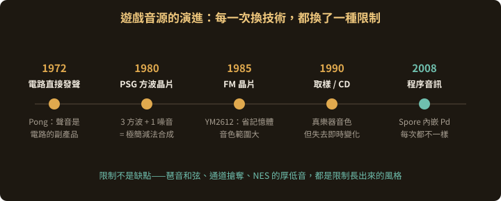
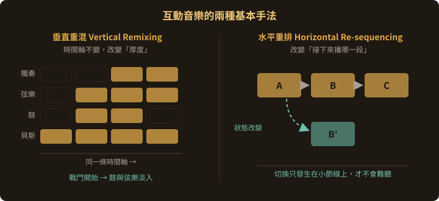

# 電子遊戲音樂的歷史

## 4.1 為什麼聲音藝術課要談遊戲音樂

前面六章談的是藝術家在美術館、音樂廳、街道上做的事。這一章要談一件規模大得多、卻常被藝術教育忽略的事：

電子遊戲是人類史上規模最大、被最多人親身經歷過的互動聲音裝置。

第 8 章 8.6 節分析互動作品時問了四個問題：輸入是什麼、映射怎麼設計、聲音怎麼產生、為什麼要即時。每一款遊戲都必須回答這四個問題，而且要在幾毫秒內回答完，一天回答幾百萬次。

除此之外，遊戲音樂還有兩個對這門課特別重要的理由：

1. 它是「限制下的創作」最好的教材。早期主機只有三個方波通道，作曲家必須在極端限制中做出音樂。而理解那些限制，就是在理解第 7 章的合成原理：晶片音樂等於一本硬體化的減法合成教科書。
2. 它是 Pure Data 最大的產業出口。2008 年的《Spore》把 Pure Data 整個嵌進遊戲裡跑程序音樂；這個做法後來被整理成 **libpd**，讓你在這門課學到的補丁，可以直接變成一款遊戲、一支 App 的聲音引擎（見 7.8）。



---

## 4.2 沒有音效晶片的年代（1972–1977）

### 《Pong》(1972)：聲音是電路的副產品

Atari 的《Pong》沒有任何音效晶片。工程師 Al Alcorn 被要求加入聲音時，他的作法是在機器既有的同步產生器（sync generator）電路裡，找出本來就存在的幾個頻率，把它們接到喇叭上。

那個著名的「嗶」聲並不是設計出來的，而是從既有的電路裡找到的。

這件事在藝術課裡很好用：它是 Russolo《噪音的藝術》主張的另一種版本。聲音材料不必是「音樂的」，機器本身運作時發出的東西就可以是素材。

### 《Space Invaders》(1978)：史上第一段會回應玩家的音樂

Taito、西角友宏設計。遊戲底下有一個**四個音的下行循環**，不斷重複。

而這個循環還有一個設計：外星人被消滅得越多，它就跑得越快。

原本這是硬體的副作用：畫面上剩下的外星人越少，機器要處理的東西越少，跑得就越快。但西角友宏決定留下這個現象，於是它變成了設計。

- 玩得越好 → 敵人越少 → 音樂越快 → **越緊張**
- 這是一個負回饋的心理設計：你的成功製造你的壓力

遊戲音樂的起點就在這裡。音樂從背景變成了遊戲狀態的聽覺化。用第 8 章的語言說，這是一條極簡但完整的映射：剩餘敵人數對應播放速度。

▶️ [Space Invaders (1978) 原始街機實機](https://www.youtube.com/watch?v=3XBVhoeKb8M)

▶️ [Space Invaders 遊戲聲音分析](https://www.youtube.com/watch?v=oy_usKHTXOY)

---

## 4.3 PSG 晶片時代（1980 年代前期）

PSG（Programmable Sound Generator，可程式化聲音產生器）是第一代專用的遊戲音源晶片。最常見的兩顆：

| 晶片 | 用在哪 | 規格 |
|---|---|---|
| **AY-3-8910**（General Instrument） | MSX、ZX Spectrum、多款街機 | 3 個方波通道 + 1 個噪音產生器 + 包絡產生器 |
| **SN76489**（Texas Instruments） | SG-1000、Master System、Mega Drive 的副晶片 | 3 個方波通道 + 1 個噪音通道 |

### 這就是第 7 章的內容

把規格翻譯成這門課的語言：

- **方波通道** = `[phasor~] → [>~ 0.5]`。方波只有**奇數倍泛音**（見 7.3 節），所以晶片音樂那種「中空、帶點簧片味」的音色是物理必然，不是風格選擇。
- **噪音通道** = `[noise~]`。負責所有的鼓、爆炸、腳步、風。
- **包絡產生器** = 7.6 節的 ADSR，只是被燒進硬體。

整台機器就是一台極簡的減法合成器。你在第 7 章學的每一個概念，在這裡都能一眼對上。

🎛 [聽一段方波琶音](https://jinyaolin.github.io/SOUNDART/lab/?preset=chiptune)　— 方波 + 快速輪流跳三個音，就是本節說的琶音和弦

### 限制長出來的技巧

只有三個通道，卻要同時有旋律、低音、和聲、打擊。作曲家因此發展出一整套壓縮技法：

- **琶音和弦（arpeggio）**：沒有多餘通道彈和弦，就用**一個通道以極快速度輪流跳過三個音**（每一影格換一個音）。人耳會把它聽成一個帶顫抖的和弦。這是晶片音樂最有辨識度的聲響。
- **通道搶奪（channel stealing）**：音效發生時，暫時借走一個音樂通道。玩家開槍，低音就消失一拍。這在當年是妥協，今天聽起來卻是風格。
- **脈衝寬度（duty cycle）**：方波的高低比例可調（12.5% / 25% / 50%）。改變比例就改變泛音結構，這是這類晶片唯一能調的音色旋鈕。

---

## 4.4 NES / 紅白機（1983）：五個通道的語法

任天堂 Famicom / NES 的 **2A03** 晶片有五個通道，這個配置定義了一整個世代的聽覺記憶：

| 通道 | 能做什麼 | 通常負責 |
|---|---|---|
| **脈衝 1**（Pulse） | 方波，4 種脈衝寬度，可調音量與掃頻 | 主旋律 |
| **脈衝 2**（Pulse） | 同上 | 和聲、副旋律 |
| **三角波**（Triangle） | 固定音量、不能調大小聲 | 低音線 |
| **噪音**（Noise） | 白噪音，可切換週期 | 鼓、爆炸、腳步 |
| **DPCM** | 極低位元的取樣播放 | 人聲、特殊音效 |

三角波不能調音量這件事，直接決定了 NES 音樂的低音永遠是那種厚而平的質感。這類限制與其說是缺點，不如說是風格的來源。

▶️ [NES 的五個聲音通道](https://www.youtube.com/watch?v=tg4S3HHReIM)

▶️ [Famicom 擴充音源晶片解說](https://www.youtube.com/watch?v=_mopUkLpXQM)

### 近藤浩治與《超級瑪利歐兄弟》(1985)

**近藤浩治**在兩個脈衝通道 + 一個三角波 + 一個噪音的條件下，寫出了大概是人類史上最多人能哼出來的一段旋律。

他的作法可以拆開來看：

- 主旋律用切分音（syncopation），讓它**聽起來比實際音符多**
- 低音線走的是快速的行走貝斯，撐住整首曲子的動能
- 每一首曲子都對應一種**遊戲狀態**（地上、地下、水中、城堡、無敵），而且切換是瞬間的
- 剩餘時間不足時整首曲子升速，這是《Space Invaders》那條映射的直系後代

▶️ [近藤浩治：定義了遊戲音樂的人](https://www.youtube.com/watch?v=l9JzT5nPx5Q)

▶️ [《超級瑪利歐兄弟》主題曲](https://www.youtube.com/watch?v=nsff88sufkI)

### 擴充晶片

Famicom 的卡帶可以自帶額外音源晶片（Konami VRC6、Namco 163、Sunsoft 5B 等），等於買遊戲送硬體升級。這是遊戲產業特有的現象：音源規格不是固定的，可以隨作品擴充。

---

## 4.5 FM 時代（1985–1993）

第 7 章 7.5 節講的 FM 合成，在 1980 年代中期進了遊戲機。

| 晶片 | 用在哪 |
|---|---|
| **YM2151**（OPM） | 大型電玩（Sega System 16、Capcom 等） |
| **YM2612**（OPN2） | Mega Drive／Genesis，6 個 FM 通道 + SN76489 PSG |
| **OPL2 / OPL3**（YM3812 / YMF262） | PC 的 AdLib 與 Sound Blaster 音效卡 |

### 為什麼 FM 對遊戲特別合適

- **省記憶體**：不用存波形，只要存參數（比例、指數、包絡）。在卡帶容量以 KB 計的年代，這是決定性的。
- **音色範圍大**：同一顆晶片能做出貝斯、鐘、銅管、鼓，PSG 的方波做不到。
- **即時可變**：參數可以逐格改，做得出滑音、掃頻、音色漸變。

Mega Drive 那種銳利、帶金屬味、貝斯特別衝的聲音，就是 YM2612 的 FM 特性。回到 7.5 節：非整數比的調變比例產生非諧波泛音，聽起來就是金屬。

▶️ [Sega Genesis 與 FM 合成（Simon Hutchinson）](https://www.youtube.com/watch?v=Tkt3WyhwYWI)

Mega Drive 的音色可以在 Pd 裡用 7.5 節的補丁重建：調變比例設 1:1，再加一條快速衰減的包絡到調變深度上，那就是《音速小子》貝斯的骨架。

---

## 4.6 取樣與 CD：音質換掉了互動性

### SNES（1990）：八通道取樣

超級任天堂用 Sony 的 **SPC700 + S-DSP**：8 個通道播放壓縮取樣（ADPCM），還有**硬體殘響**。

技術上這是第 7 章 5.7 + 7.8 節的硬體版：`[tabread4~]` 讀取樣、`[rev1~]` 加空間。真實樂器的聲音第一次進入家用主機。

代價是音訊記憶體只有 64KB，所以那個年代的作曲家全部都是壓縮取樣的專家。

### CD 音軌：品質的高峰，互動的低谷

PC Engine CD-ROM²（1988）、Mega CD（1991）、PlayStation（1994）帶來 CD 音質的配樂。

但這裡發生了一件在課程脈絡下需要停下來討論的事：

但 CD 音軌是預先錄好的，它不能隨玩家的行為改變。

技術進步的同時，遊戲音樂倒退回線性播放，變成配上去的背景音樂，而不是《Space Invaders》那種會回應你的系統。

這個張力貫穿整個 1990 年代，也直接催生了下一節的東西。

---

## 4.7 iMUSE（1991）：讓音樂重新變成互動的

LucasArts 的 **Michael Land** 與 **Peter McConnell** 開發了 **iMUSE**（Interactive Music Streaming Engine），首次用在《Monkey Island 2: LeChuck's Revenge》(1991)。

它解決的問題是：當玩家從一個房間走到另一個房間，音樂怎麼換才不會突兀？

iMUSE 的答案是，音樂不再是一首一首的檔案，而是一套**帶有標記與分支的系統**：

- 樂曲中埋入**轉換點（hook）**，切換只發生在音樂上合理的位置（下一小節、下一個樂句）
- 目的地不同，走的**過渡樂句**也不同
- 同一個場景的音樂可以隨狀態**加層或減層**

結果是玩家在場景之間走動時，音樂像一個現場樂手一樣跟著你走，沒有淡出淡入，也沒有斷點。

▶️ [iMUSE 無縫轉換示範](https://www.youtube.com/watch?v=7N41TEcjcvM)

▶️ [《Monkey Island 2》Woodtick 的 20 分鐘 iMUSE 轉換](https://www.youtube.com/watch?v=PGokqD7ExEY)

### 兩種基本手法（至今仍是業界標準）

**垂直重混（Vertical Remixing）**
同一段音樂拆成好幾層（鼓、貝斯、弦樂、獨奏），**依遊戲狀態決定哪幾層在響**。玩家進入戰鬥，打擊層淡入；血量低，加一層不安的弦樂。時間軸不變，**厚度改變**。

**水平重排（Horizontal Re-sequencing）**
音樂切成一段一段，**依遊戲狀態決定下一段接什麼**。時間軸改變，但每段本身完整。



這兩招你現在就做得出來。垂直重混是幾個 `[tabplay~]` 同步播放，各自乘上一個 `[line~]` 控制的音量（7.6 節）；水平重排是用 `[select]` 決定下一段播哪個檔。遊戲業界花了十年才標準化的東西，就是這門課第 6、7 章的組合。

---

## 4.8 中介軟體與程序音訊（2000 年代至今）

### 中介軟體

現代遊戲很少自己寫音訊引擎，而是用**中介軟體（middleware）**：

- **FMOD**（Firelight Technologies）
- **Wwise**（Audiokinetic）

這兩套做的事情就是把 iMUSE 的概念做成給音樂人用的圖形介面：狀態機、參數、層、隨機化、空間音訊。它們本身就是視覺化程式環境，你在這門課學到的「用連線建構邏輯」，換一個介面就能上手。

### 程序音訊：Pure Data 的產業出口

**程序音訊（procedural audio）** 是指聲音不是預先錄好的檔案，而是在執行當下即時算出來的。這也是這門課從第 7 章開始一直在做的事。

最重要的案例是 《Spore》(2008，Maxis／EA)：

- 音訊團隊（Kent Jolly、Aaron McLeran）把 **Pure Data 整個嵌進遊戲**，讓音樂即時生成
- 玩家的生物、城市、載具怎麼設計，音樂就怎麼長，沒有兩個玩家聽到完全一樣的配樂
- **Brian Eno** 參與了細胞階段的生成式音樂設計（他就是「generative music」這個詞的推廣者）

▶️ [《Spore》城市音樂規劃器（GDC 2008 示範）](https://www.youtube.com/watch?v=GHCRzAcGS0Y)

這個「把 Pd 塞進別的程式裡」的做法，後來由 Peter Brinkmann 整理成 **libpd**（2010），一個可以嵌入 iOS、Android、遊戲引擎的 Pure Data 函式庫。

這是本課程最直接的產業接點：你在第 6、7 章寫的補丁，透過 libpd 可以原封不動變成一款手機遊戲的聲音引擎。這也是 Pure Data 相對 Max/MSP 的優勢（見 8.7 節對照表），它可以被嵌入，Max 不行。

### 為什麼程序音訊仍然是少數

即使到今天，絕大多數遊戲的音樂仍然是錄好的檔案 + 中介軟體切換。原因很實際，

- 預錄的品質仍然比即時合成好（真樂團、真錄音室）
- 程序音訊的**可控性差**：作曲家難以保證每一次生成都好聽
- 開發成本與人才稀缺

但在**需要無限變化**的地方（開放世界的環境音、生物的叫聲、載具引擎、天氣），程序音訊是唯一的解。《No Man's Sky》(2016) 就用了大量程序化的生物與環境聲音設計。

---

## 4.9 動手：做一個會回應狀態的音樂系統

用第 6、7 章的東西，做一個最小的**垂直重混**系統：

```plaintext
[tgl]  ← 「進入戰鬥」開關
  |
[t f f]
  |          |
[$1 1000(  [1 - $1(          <- 一個淡入、一個淡出（互補）
  |          |
[line~ ]   [line~ ]
  |          |
  |       [tabplay~ 探索層]
  |          |
[tabplay~ 戰鬥層]
  |          |
 [*~ ]     [*~ ]             <- 各自乘上自己的音量包絡
  |          |
  +----+-----+               <- 訊號自動相加（7.1 節）
       |
   [*~ 0.3]
       |
    [dac~ ]
```

**做法**：兩段等長、同調性、同速度的循環（一段安靜、一段緊張），永遠**同時**在播，只是音量此消彼長。切換開關時，音樂不會斷，只會「變濃」或「變淡」。

**進階練習**

1. 把 `[tgl]` 換成一個 0～1 的滑桿，做出**連續**的緊張度，而不是開關。
2. 加上第三層（打擊），只在緊張度 > 0.7 時才進來（用 `[moses]` 或 `[>]`）。
3. 做水平重排版本：用 `[metro]` 對齊小節，`[random]` 從三段素材裡挑下一段接上，確保切換只發生在小節線上。
4. 重現《Space Invaders》：`[metro]` 的間隔隨「剩餘敵人數」縮短。用一個數字框當敵人數，看看速度變化如何改變你的感受。

---

## 4.10 小結：遊戲音樂教會聲音藝術的三件事

一、限制會長出風格。
三個方波通道逼出了琶音和弦；三角波不能調音量造就了 NES 的低音質感；64KB 音訊記憶體訓練出一整代的取樣壓縮高手。覺得 Pd 做不出某個聲音的時候，先別急著找外掛，限制裡通常就有答案。

二、映射就是設計。
《Space Invaders》只有一條映射（敵人數 → 速度），但它是整個遊戲張力的來源。第 8 章 8.5 節說過「把數值變順往往比接得上更重要」，遊戲產業用四十年證明了這句話。

三、互動的技術問題，最後都是音樂問題。
iMUSE 最困難的地方不在程式，而在判斷要在哪裡切才不難聽。垂直重混與水平重排說到底都是音樂結構的問題，而不是工程問題。

這也是為什麼這門課先講第 1、2 章才講工具。技術能回答「怎麼做」，但「該不該在這裡切」只有耳朵能回答。

---

## 延伸

- 想做晶片音樂：查 **FamiTracker**（NES）、**Deflemask**、**LSDJ**（Game Boy）
- 想做遊戲音訊：**FMOD** 與 **Wwise** 都有免費的個人／教育授權
- 想把 Pd 帶進遊戲：**libpd**（<https://github.com/libpd/libpd>），有 Unity 與 Unreal 的接法
- 相關章節：合成原理見[第 7 章](07-puredata-synthesis.md)；互動與映射見[第 8 章](08-maxmsp.md)
