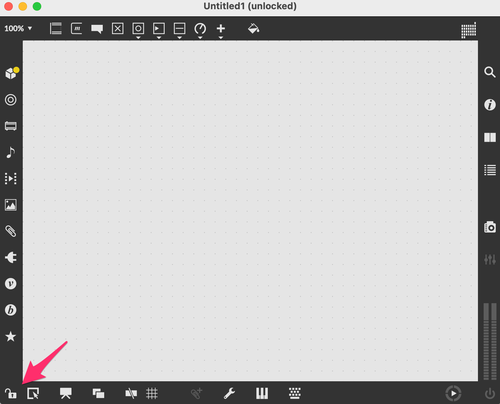
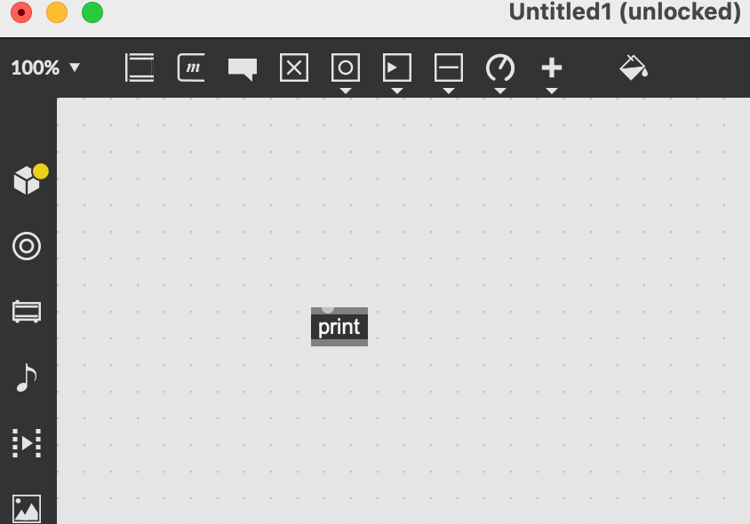
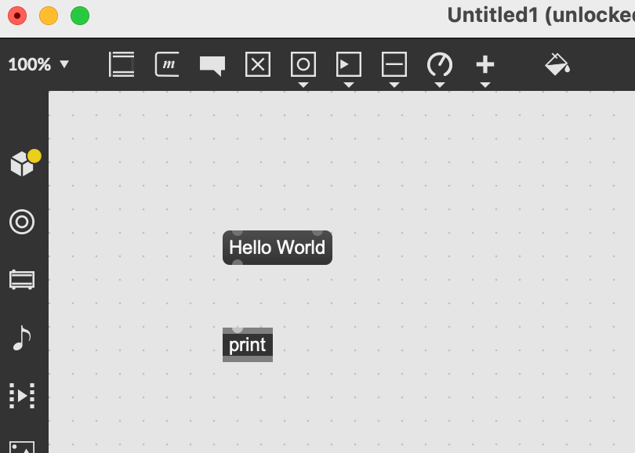
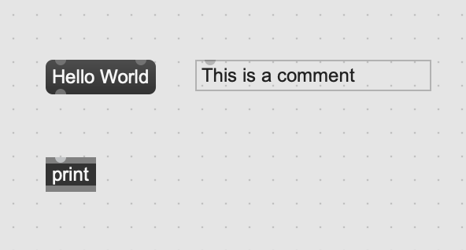
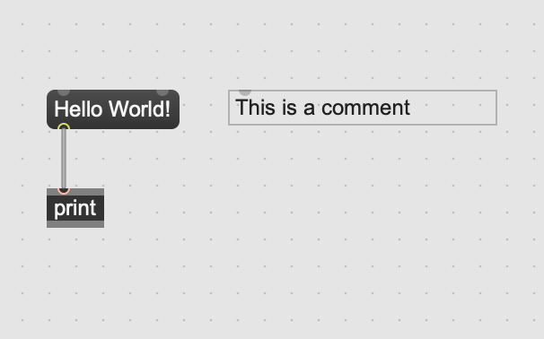
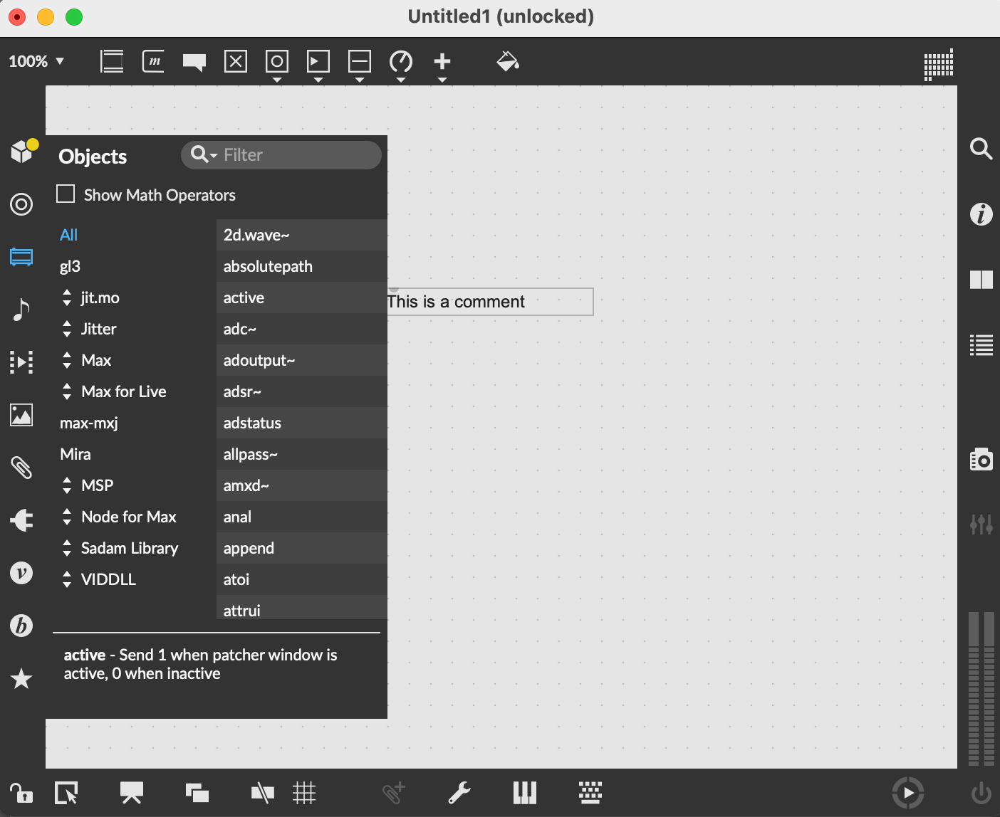

# Max/MSP的使用

## 8.1 Max/MSP 基本操作與界面介紹

Max/MSP是一款強大的視覺程式語言軟體，廣泛用於音樂和多媒體項目。其主要特點是以"物件"(objects)的形式進行程式設計，這些物件經由連接線相互連結以建立資料和訊號流，從而創造出複雜的音樂和視覺作品。

以下是Max/MSP的基本操作和界面介紹：

1. **物件盒(Object Box)**：這是創建新物件的主要工具，您可以在物件框中輸入任何Max物件的名稱，包括數學運算元、控制結構、MIDI處理、音訊處理等。一個新的物件框在被創建時是空的，您需要輸入對應的物件名稱來使其生效。

   在 Max/MSP 中新增一個 Object Box 是相當簡單的，以下是步驟：

   1. 確定您目前處於 "patching mode"（編輯模式），這是新增或編輯物件的模式。如果您不確定，可以查看 Max/MSP 左下角的 Lock 按鈕是否處於解鎖狀態（Lock 圖示顯示為沒上鎖）。如果沒有，點擊該按鈕即可切換模式。
      
      *切換編輯模式*

   2. 在工作區域任一位置點擊滑鼠左鍵兩下，這時工作區會出現一個新的 Object Box。
   3. 在此 Object Box 中，您可以輸入物件名稱（例如 "+", "metro", "random" 等），然後按 Enter 或點擊工作區的其他位置，輸入的名稱就會生效，Object Box 也會根據輸入的物件名稱改變其外觀或接口。

請注意，要讓 Object Box 有效，您需要輸入一個已存在的物件名稱。如果您不確定某個名稱是否存在，可以在 Max 的左側欄位的物件庫中搜尋。


*新增一個物件*


2. **訊息盒(Message Box)**：訊息盒允許您傳遞靜態或動態的數據訊息。訊息可以是數字、文字或列表，並且可以在執行時透過其他物件動態改變。

   在 Max/MSP 中增加 Message Box 的步驟如下：

   1. 確認您處於 "patching mode"（編輯模式），這是您可以新增或編輯物件的模式。如果您不確定是否處於此模式，請查看 Max/MSP 左下角的 Lock 按鈕是否處於解鎖狀態（Lock 圖示顯示為沒上鎖）。如果不是，您可以點擊該按鈕切換模式。
   2. 將滑鼠移動到想增加訊息盒的地方，按下'M'按鍵。這將在工作區新增一個 Message Box。
   3. 開始輸入您需要的消息。例如，您可能輸入一個數字、一個音符名稱，或一個給某個物件的特定指令。完成後，點擊工作區的其他位置，或按 Enter 鍵，您的設定將會生效。

   Message Box 對於在 Max/MSP 環境中傳遞信息或指令非常有用。它可以直接與其他物件連接，並透過點擊 Message Box 或透過輸入設定來觸發消息的傳遞。


*新增一個Hello World的Message box*

   

3. **註解(Comment)**：註解允許您在patcher中添加文字說明。這對於記錄專案資訊和說明物件的功能非常有用。

   在 Max/MSP 中增加註解（Comment）的步驟如下：

   1. 確認您處於 "patching mode"（編輯模式），這是您可以新增或編輯物件的模式。如果您不確定是否處於此模式，請查看 Max/MSP 左下角的 Lock 按鈕是否處於解鎖狀態（Lock 圖示顯示為沒上鎖）。如果不是，您可以點擊該按鈕切換模式。
   2. 將滑鼠移動到想增加註解的地方，按下'C'按鍵。這將在工作區新增一個 Comment。
   3. 點擊 Comment Box，並開始輸入您需要的註解。完成後，點擊工作區的其他位置，或按 Enter 鍵，您的註解將會生效。

   註解對於說明 patch 中的特定部分的功能、提醒自己或他人有關某一部分的注意事項、或者只是當作一種組織工作區的工具非常有用。

   

   

   

4. **連接線(Patching Cords)**：連接線用於連接物件，從一個物件的輸出口傳遞數據或訊號到另一個物件的輸入口。

   連接線（Patch cord）在 Max/MSP 中是一種視覺表達，用於連接並傳遞訊息和數據流程從一個物件（Object）到另一個物件。您可以視之為聲音或數據的 "管道"。

   在 Max/MSP 中，您可以通過以下步驟使用連接線：

   

   1. 確保您正在"編輯模式"（patching mode）下工作，您可以從左下角的圖示確認您是否處於編輯模式。
   2. 點選並拖拉一個物件的輸出口（通常在下方）以開始畫出一條連接線。
   3. 繼續拖拉至另一個物件的輸入口（通常在上方），當您的滑鼠指針接近一個物件的輸入口時，該輸入口將會變亮表示可以連接。
   4. 釋放滑鼠，將會看到連接線確實連接了兩個物件。

   根據你的設計需求，連接線可以有多種使用方式。例如，您可以連接一個數字物件（Number Object）到一個聲音物件，以此將數值數據轉換為聲音信號；或者將一個訊號物件（Signal Object）與一個輸出物件連接，以此將信號導出到音訊接口或其他輸出設備。

   連接線的使用使得數據和訊息流可以在不同的物件之間自由地流動，提供了極大的靈活性和創作可能性。透過不同的連接方式，您可以構建出各種複雜的聲音和數據處理流程。

5. **模式切換(Mode Switching)**：Max有兩種主要模式，"patching mode"和"locked mode"。在patching mode下，您可以創建和修改物件，並調整他們的連接。在locked mode下，您可以與物件互動，例如點擊按鈕或滑動滑桿等。

   在 Max/MSP 中，模式切換（Mode Switching）是一個基本的功能，它允許使用者在"編輯模式"（Patching Mode）和"表演模式"（Performance Mode）之間切換。

   1. 編輯模式（Patching Mode）：此模式下，使用者可以創建、刪除、連接物件，並調整物件的位置與屬性。也就是說，在此模式下，您可以製作和編輯您的音樂或藝術作品。
   2. 表演模式（Performance Mode）：此模式下，使用者可以運行和互動自己所創建的 Max 程式。在此模式下，您無法改變物件的連接和配置，但可以透過您已設定的互動物件（如按鈕、滑桿等）來控制程式運行。

   這個模式切換功能的設計，讓使用者在創作和演出時能有最佳的操作環境。在編輯模式下，使用者可以專注於設計和編程；在表演模式下，使用者可以專注於實際的音樂演奏或藝術創作，不需要擔心誤觸物件或連接線，也更方便在實際演出或展示中進行操作。

   要切換模式，您可以使用工具列上的"模式切換"按鈕，或是使用鍵盤快捷鍵。在 Max 程式視窗中，您可以看到左下角有一個小鎖的圖示，當它處於鎖定（上鎖）狀態時，表示您現在處於表演模式；當它處於解鎖狀態時，表示您現在處於編輯模式。在 Windows 系統中，使用 Ctrl+E 可以進行模式切換；在 Mac 系統中，使用 Command+E 可以進行模式切換。

   Max/MSP還有一個演示模式(Presentation Mode)， 是 Max/MSP 中的一個功能，允許您在不需要編輯 patch 的情況下自定義其外觀。您可以更改 UI 物件的大小、位置和顏色，甚至可以添加新的 UI 物件。Presentation Mode 非常適合製作演示或製作具有特定外觀的 patch。

   要進入 Presentation Mode，Mac 上是 Command+Option+E、Windows 上是 Ctrl+Alt+E（注意：Command/Ctrl+E 是切換「編輯模式」，兩者不同）。物件要先在右鍵選單勾選 Add to Presentation，才會出現在 Presentation Mode 裡。在 Presentation Mode 中，您可以使用滑鼠或鍵盤來移動和調整 UI 物件。您也可以使用 Command/Ctrl+Option/Alt 鍵來複製 UI 物件。

   當您完成對 patch 外觀的更改後，再按一次 Command+Option+E（Ctrl+Alt+E）即可退出 Presentation Mode。您的更改將被保存到 patch 中。

   以下是一些使用 Presentation Mode 的技巧：

   使用 Command/Ctrl+Option/Alt 鍵來複製 UI 物件以快速創建相同的物件。
   使用 Command/Ctrl+Shift 鍵來調整 UI 物件的大小以使其更容易查看。
   使用 Command/Ctrl+Number 鍵來更改 UI 物件的顏色。
   使用 Command/Ctrl+Spacebar 鍵來隱藏 UI 物件以專注於音樂。
   Presentation Mode 是 Max/MSP 的強大功能，可以幫助您創建具有特定外觀和感覺的 patch。

6. **物件庫(Object Library)**：在Max的左側欄位，您可以找到一個完整的物件庫，列出所有可用的Max物件，分類為各種類型，例如音訊處理、視覺處理、數學運算等。您可以透過拖曳將這些物件添加到patcher中。

   在 Max/MSP 中，物件庫（Object Library）是一個功能強大的工具，裡面含有眾多的預設物件供使用者使用和參考。這些預設物件涵蓋了許多功能，如音頻處理、數據計算、視覺化顯示等等，並且可以直接拖曳到編輯視窗中使用。

      1. 開啟物件庫：在 Max 主視窗的菜單列上選擇 "Window"，然後選擇 "Object Explorer" 即可開啟物件庫視窗。

      2. 使用物件庫：在物件庫視窗中，您可以看到所有可用的物件列表，並可以使用搜索欄來快速找到您需要的物件。點擊任何一個物件名稱，都會在底部的資訊欄中顯示該物件的詳細資訊，包括功能描述、用途、輸入輸出端口的資訊，以及有時會附帶的一些使用範例。

      3. 使用物件：找到您需要的物件後，直接拖曳它到編輯視窗中即可。您也可以直接在編輯視窗中輸入物件名稱來創建新的物件。

         物件庫是 Max/MSP 的一個重要功能，它提供了一個直觀的方式來查看和使用所有的預設物件。無論您是初學者還是經驗豐富的使用者，都可以從中找到所需的物件，並了解其運作原理，進而應用在您自己的創作中。




7. **控制台(Console)**：在 Max/MSP 中，控制台（Console）是一個非常重要的工具，它主要用於顯示程式的運行信息，包括錯誤訊息、警告、系統訊息等等，可以幫助開發者了解程式的運行狀態以及進行調試。

   控制台的位置：控制台在 Max 主視窗的菜單列上，選擇 "Window"，然後選擇 "Max Console" 就可以開啟控制台視窗。

   使用控制台：在控制台視窗中，您可以看到 Max 程式運行時的所有信息，包括物件創建失敗、連接錯誤、運行錯誤等等。這些信息可以幫助您追蹤程式的運行情況，找出可能存在的問題。

   控制台是 Max/MSP 的一個重要功能，它提供了一個直觀的方式來查看和理解您的程式運行情況。當您在編寫或運行 Max 程式時遇到問題，控制台的信息往往能夠提供重要的線索來幫助您找到並解決問題。所以，熟練使用和理解控制台的信息，對於掌握 Max/MSP 並進行有效的音樂創作是非常重要的。


熟悉了這些基本元素和操作之後，您就可以開始用Max/MSP創建自己的音樂和多媒體項目了。Max/MSP的學習曲線可能稍陡，但其強大的功能和靈活性使其成為了音樂和多媒體創作的重要工具。


---

## 8.2 三個基本單位：物件、訊息、補丁

Max 的整個世界只由三種盒子和一種線構成。搞懂這三個盒子的分工，就等於學會了 Max 的文法。

### 8.2.1 物件（Object）

**物件是「會做事的東西」**。你在物件盒裡打什麼名字，它就變成什麼工具。

在 Max 裡新增物件的最快方式是：在編輯模式下按 **`n`**（不用滑鼠雙擊），游標所在處就會出現一個空的物件盒。

物件盒的內容分成兩部分：

```
[metro 500]
  ↑     ↑
物件名  引數（argument）
```

- **物件名**決定它是什麼（`metro` 是節拍器）
- **引數**是它的初始設定值（500 = 每 500 毫秒觸發一次）

引數只是「初始值」，執行中通常可以從 inlet 改掉。`[metro 500]` 的右 inlet 送進 250，它就變成每 250 毫秒觸發一次。

#### inlet 與 outlet

和 Pure Data 完全相同的邏輯（見第 6 章）：

- **inlet 在上方**，接收資料
- **outlet 在下方**，送出資料
- **最左邊的 inlet 是 hot inlet**，收到資料會立刻觸發運算
- **其他 inlet 是 cold inlet**，只把值存起來，等 hot inlet 被觸發時才用

把滑鼠停在任何一個 inlet 上方，Max 會跳出提示告訴你這個 inlet 收什麼。**這是 Max 比 Pd 友善的地方之一**——不確定的時候，滑過去看提示，或按住 Option/Alt 點擊物件打開它的說明檔（help patch），每個物件的說明檔本身就是一個可以直接玩的範例補丁。


### 8.2.2 訊息（Message）

**訊息盒是「被存起來的一句話」**。按 **`m`** 新增。

物件是動詞，訊息是名詞——訊息盒本身不做事，它只是**在被觸發時，把裡面的內容送出去**。觸發方式有兩種：在鎖定模式下用滑鼠點它，或是從上面接一個 bang 進來。

```plaintext
[bang]                <- 觸發器
|
[440(                 <- 訊息盒（右邊是斜角，和物件盒的直角不同）
|
[cycle~ ]             <- 收到 440，把頻率設成 440 Hz
```

訊息盒有幾個進階寫法，是 Max 的日常：

| 寫法 | 意義 |
|---|---|
| `[440(` | 送出數字 440 |
| `[1 2 3(` | 送出一個 list（三個元素） |
| `[open(` | 送出一個 symbol（指令），例如叫 `[serial]` 打開連接埠 |
| `[set 440(` | 送出「set 440」——多數物件收到會**只設定不觸發** |
| `[$1(` | `$1` 是變數，會被替換成收到的第一個值 |
| `[frequency $1(` | 收到 440 時，實際送出 `frequency 440` |
| `[; dsp start(` | 分號開頭 = 送到全域接收者，這裡是啟動 DSP |

**`$1` 是訊息盒最重要的功能**。它讓一個訊息盒可以動態組出不同內容，是把使用者操作轉成物件指令的橋梁。

### 8.2.3 補丁（Patch）

**補丁就是你的程式**——一個 `.maxpat` 檔案，裡面裝著所有物件、訊息、註解與連接線。

#### 兩種模式

| 模式 | 快捷鍵 | 你在做什麼 |
|---|---|---|
| 編輯模式（Patching / Unlocked） | Cmd/Ctrl + E | 蓋房子：新增物件、拉線、搬位置 |
| 鎖定模式（Locked） | Cmd/Ctrl + E | 住房子：按按鈕、拉滑桿、聽聲音 |
| 演示模式（Presentation） | Cmd+Option+E / Ctrl+Alt+E | 給別人看：只顯示你挑過的 UI 元件 |

左下角的鎖頭圖示會告訴你現在在哪個模式。

#### 讓補丁不會變成一團義大利麵

補丁一大就會亂，Max 提供了幾個整理工具，值得從第一天就養成習慣：

- **`[p 名稱]`（subpatch，子補丁）**：把一整段功能收進一個盒子裡，雙擊打開。例如把整組濾波器包成 `[p filter]`。
- **`[send]` / `[receive]`（簡寫 `[s]` / `[r]`）**：無線傳輸訊息，不用拉線。`[s freq]` 送出的東西，任何一個 `[r freq]` 都收得到。音訊版本是 `[send~]` / `[receive~]`。
- **註解（按 `c`）**：三個月後回來看自己的補丁，你會非常感謝當初寫的那幾行字。
- **對齊**：選取多個物件後 `Arrange` 選單可以自動對齊分佈。線接得整齊不是強迫症，是**除錯速度**。

> **抽象（Abstraction）與子補丁的差別**：子補丁存在母補丁檔案裡；抽象則是一個獨立的 `.maxpat` 檔，放在搜尋路徑中就能像內建物件一樣用名稱叫出來，而且可以重複使用、傳入引數。做到第三個專案時你會開始需要它。

---

## 8.3 數據處理

聲音只是 Max 的一半。另一半是**數據**——把滑鼠、感測器、MIDI、時間、亂數變成有意義的控制訊號。這一節是「讓作品會動」的基礎。

### 8.3.1 數據類型和基本運算

#### Max 的五種基本資料（atom）

| 型別 | 例子 | 說明 |
|---|---|---|
| **int** | `42` | 整數 |
| **float** | `3.14` | 浮點數 |
| **symbol** | `open`、`hello` | 文字／指令 |
| **list** | `1 2 3` | 由空格分隔的一串 atom |
| **bang** | `bang` | 「現在做」——不帶資料，只帶時機 |

外加一個特別的第六種：**signal（訊號）**，只在 MSP 物件之間流動，走的是粗線（見 8.4 節）。

> **bang 是 Max 最抽象也最重要的概念**。它不是資料，是**時間**。所有「什麼時候發生」的邏輯都由 bang 驅動。

#### 基本運算物件

```plaintext
[+ 5]  [- 5]  [* 2]  [/ 2]  [% 12]     <- 加減乘除、取餘數
[expr $i1 * sin($f2)]                   <- 一行寫完複雜算式
[scale 0 127 20. 20000.]                <- 範圍映射：把 0~127 對應到 20~20000
[random 100]                            <- 收到 bang 輸出 0~99 的亂數
[int] [float]                           <- 儲存一個值，收到 bang 輸出它
```

**`[scale]` 是實務中出場率最高的物件之一**。所有「把感測器讀數變成有用參數」的工作都是它在做：MIDI 音量 0～127 要變成 0～1 的振幅、滑鼠 Y 座標要變成 200～2000 Hz 的濾波器頻率——全是 `[scale]`。

`[expr]` 則是當運算複雜到接三四個物件很醜的時候的解法。`$i1` 代表第一個 inlet 收到的整數、`$f1` 代表浮點數、`$s1` 代表 symbol。

#### 執行順序：右到左

**這是 Max 最容易出錯、也最常被跳過的規則**：

> 當一個 outlet 接到多個地方時，Max **一定從最右邊的目標開始執行，再往左**。

而且判斷「右邊」是看**目標物件在畫面上的位置**，不是看你先接哪一條線。這代表：**把物件往旁邊拖一下，程式的行為就變了**。這是視覺程式語言獨有的陷阱。

解法只有一個——**用 `[t]`（`[trigger]`）明確指定順序**：

```plaintext
[bang]
|
[t b b b]        <- 依序輸出三個 bang，順序保證是「右 → 中 → 左」
|   |   |
```

`[t]` 的引數決定每個 outlet 送出什麼型別：`[t b f]`（bang 和 float）、`[t i i]`、`[t l b]` 等。

> **職業習慣**：只要一個 outlet 要接到兩個以上的地方，就插一個 `[t]`。這不是龜毛，是省下未來三小時的除錯。

### 8.3.2 數據結構（如陣列）

當資料多到不能用一個 `[float]` 存的時候，Max 提供這些容器：

| 物件 | 存什麼 | 適合的場合 |
|---|---|---|
| `[coll]` | 編號或命名的資料列 | 樂句、和弦表、參數組、劇本式的資料 |
| `[dict]` | 巢狀的鍵值資料（等同 JSON） | 結構化設定、與網路 API 交換資料 |
| `[table]` | 一維整數陣列，有圖形編輯介面 | 音階對照、機率分佈、曲線 |
| `[buffer~]` | **音訊**取樣資料 | 載入音檔、錄音、波表（見 6.4） |
| `[zl]` | list 的瑞士刀（不儲存，只加工） | 排序、切割、反轉、取長度、去重 |
| `[pattr]` / `[pattrstorage]` | 補丁的參數狀態 | 存讀 preset、整組參數的快照 |

#### `[coll]` 的用法

`[coll]` 像一本可以用編號查的筆記本：

```plaintext
[store 1 60 64 67(     <- 把「60 64 67」存在第 1 格（一個 C 大三和弦）
[store 2 62 65 69(     <- 第 2 格
|
[coll myChords]
|
（送一個數字 1 進去，它就吐出 60 64 67）
```

存好的 `[coll]` 內容可以雙擊打開直接編輯，也可以存成文字檔隨補丁一起帶走（`[coll myChords @savedata 1]`）。做「一首曲子的和弦進行」「一段互動的對白順序」時非常好用。

#### `[zl]` 的用法

`[zl]` 本身不做事，第一個引數決定它做什麼：

```plaintext
[zl len]        <- 算 list 有幾個元素
[zl rev]        <- 反轉
[zl sort]       <- 排序
[zl slice 3]    <- 從第 3 個切成兩段（左右 outlet 各出一段）
[zl group 4]    <- 每收滿 4 個才輸出一個 list
[zl nth 2]      <- 取第 2 個元素
```

處理 list 時先想「`[zl]` 有沒有現成的模式」，通常有。

### 8.3.3 控制結構（如迴圈、條件語句）

Max 沒有 `if / for / while` 這種文字語法，但每一種控制流程都有對應的物件。

#### 條件判斷

```plaintext
[sel 60]              <- select：收到 60 就從左 outlet 送出 bang，其他從右 outlet 原樣送出
[route note ctl]      <- 依開頭的 symbol 分流到不同 outlet
[if $i1 > 64 then bang]   <- 直接寫條件式
[> 64] [< 64] [== 64]     <- 比較運算，輸出 0 或 1
[gate]                <- 閘門：左 inlet 給 0 關、1 開；右 inlet 是要通過的資料
[switch]              <- 多選一：左 inlet 決定放行哪一路輸入
```

`[sel]` 與 `[route]` 的差別值得記住：**`[sel]` 輸出 bang（只在意「是不是」），`[route]` 輸出剩下的資料（在意「內容是什麼」）**。

#### 迴圈

```plaintext
[bang]
|
[uzi 16]          <- 收到一個 bang，瞬間送出 16 個 bang
|      |
|   （中間 outlet 輸出目前是第幾次：1, 2, 3 ... 16）
```

`[uzi]` 是 Max 的 for 迴圈。它的中間 outlet 給你計數值，配合 `[* ]`、`[+ ]` 就能產生一整串遞增的數列——初始化 16 個聲部、一次生成 32 個粒子、把一整個陣列填滿，都靠它。

> ⚠️ `[uzi]` 的 16 次是**在同一個瞬間**跑完的，中間沒有時間流逝。想要「每隔一段時間做一次」，要用 `[metro]` 而不是 `[uzi]`。

#### 時間

```plaintext
[metro 500]              <- 每 500 毫秒送一個 bang（要先送 1 啟動）
[delay 1000]             <- 收到 bang，等 1000 毫秒再送出去
[counter 0 7]            <- 每收到 bang 就數 0,1,2...7,0,1... 循環
[transport] [translate]  <- 用音樂時間（小節/拍/ticks）而非毫秒
[qmetro] [speedlim 50]   <- 低優先度計時／限速，避免 UI 被灌爆
```

**一個典型的「跑八個音」組合**：

```plaintext
[tgl]
|
[metro 250]
|
[counter 0 7]        <- 0~7 循環
|
[coll myScale]       <- 用 0~7 查出對應的 MIDI 音高
|
[mtof]               <- MIDI 音高轉成頻率（Hz）
|
[cycle~ ]            <- 發聲
```

`[mtof]`（MIDI to frequency）與 `[ftom]` 是連接「音樂世界」與「聲學世界」的翻譯官，寫任何跟音高有關的東西都會用到。

---

## 8.4 聲音處理（MSP）

Max 名字裡的 **MSP**（Max Signal Processing）是它的音訊引擎。上面講的一切都是「訊息」，而 MSP 處理的是「訊號」。

### 訊號與訊息的分界

| | 訊息（Max） | 訊號（MSP） |
|---|---|---|
| 線的外觀 | 細的黑線 | **粗的黃黑條紋線** |
| 物件命名 | `[cycle]` | `[cycle~]`（結尾有 `~`） |
| 發生時機 | 有事件才發生 | DSP 開著就以取樣率持續運作 |
| 數值範圍 | 任意 | 音訊慣例是 **-1 到 1** |

> 和 Pure Data 一樣：**`~` 代表音訊**。這個約定是 Miller Puckette 從 Max 帶到 Pd 的，兩邊完全一致。

**要有聲音，DSP 必須先打開**：點 `[ezdac~]`（喇叭圖示）本身，或送一個 `[startwindow(` 訊息給 `[dac~]`，或在 Audio Status 視窗開啟。

### 8.4.1 基本聲音生成與處理

#### 音源

| 物件 | 波形 | 備註 |
|---|---|---|
| `[cycle~ 440]` | 正弦波 | Max 最基本的振盪器，實際上是讀一張 512 點的波表 |
| `[saw~ 440]` | 鋸齒波 | Max 8 起內建的**限頻**版本，不會產生疊頻雜訊 |
| `[rect~ 440]` | 方波 | 同上，可調脈衝寬度 |
| `[tri~ 440]` | 三角波 | 同上 |
| `[phasor~ 440]` | 0～1 上升斜坡 | 不是拿來直接聽的，是拿來當「位置訊號」驅動別的東西 |
| `[noise~]` | 白噪音 | 各頻率均等 |
| `[pink~]` | 粉紅噪音 | 低頻較多，聽起來比白噪音自然 |

> **`[cycle~]` 與 `[phasor~]` 的分工**是 MSP 的核心心法：`[cycle~]` 產生「聽得到的東西」，`[phasor~]` 產生「掃過去的位置」。後者接到 `[wave~]`、`[index~]`、`[groove~]` 上，就能讀波表、讀取樣、掃描任何東西。

#### 最小發聲補丁

```plaintext
[cycle~ 440]
|
[*~ 0.1]          <- 音量壓到 10%（沒給引數的 [*~] 預設是 0，等於靜音）
|
[ezdac~ ]         <- 帶開關的音訊輸出（點一下開始）
```

> ⚠️ 戴耳機時，`[*~]` 的初始值務必設小（0.05～0.1）。合成器送出滿刻度訊號的機會比你想像的高很多。

#### 音量與包絡

直接用 `[tgl]` 開關訊號會產生「喀」聲，原因和 Pd 一章（7.6 節）說明的完全相同——振幅的瞬間跳變本身就是一次點擊噪音。

Max 的解法：

```plaintext
[line~ ]          <- 送「目標值 時間」的 list，產生線性斜坡，例如 [1 10(
[curve~ ]         <- 同上但可以是指數曲線，聽感比線性更自然
[adsr~ 5 100 0.6 400]     <- 直接產生完整 ADSR 包絡，收到非 0 觸發、收到 0 放開
[function]        <- 可以用滑鼠畫的包絡 UI，接 [line~] 播放
```

**`[adsr~]` 是 Max 比 Pd 方便的地方**——Pd 要自己用 `[vline~]` 拼包絡，Max 直接給你一個物件。`[function]` 更進一步，讓你用畫的。

#### 濾波

```plaintext
[lores~ 1000 0.6]      <- 低通 + 共振（第二個參數是共振量，接近 1 會嘯叫）
[onepole~ 500]         <- 最單純的一階低通，常用來平滑控制訊號
[reson~ 1 800 20]      <- 帶通共振器
[svf~ 800 0.5]         <- 狀態變數濾波器，四種輸出（低通/高通/帶通/帶阻）同時給你
[biquad~]              <- 通用二階濾波器，配 [filtergraph~] 用滑鼠畫頻率響應
```

`[filtergraph~]` 配 `[biquad~]` 是 Max 的招牌體驗：**在圖上拖曳曲線，係數自動算好送進濾波器**。

### 8.4.2 效果器與合成器的實作

#### 減法合成器

把前面的零件組起來，就是一台標準的類比式合成器：

```plaintext
[kslider]                        <- 螢幕鍵盤，輸出 MIDI 音高
|
[t i i]
|         |
[mtof]  [adsr~ 5 200 0.7 500]    <- 音高走左路，包絡走右路
|         |
[saw~ ]   |                      <- 泛音豐富的音源
|         |
[lores~ 1200 0.7]                <- 濾波器：削掉高頻，決定音色
|         |
[*~ ]-----+                      <- 用包絡控制音量
|
[*~ 0.2]
|
[ezdac~ ]
```

想讓它更生動，把包絡**同時**送去控制 `[lores~]` 的截止頻率（經過 `[scale]` 映射到 300～4000 Hz）。「一按下去先亮後暗」是類比合成器最有辨識度的聲音特徵。

#### FM 合成器

```plaintext
[nbx]                       <- 載波頻率
|
[t f f]
|          |
|       [* 2]               <- 調變比例 2:1
|          |
|       [cycle~ ]
|          |
|       [*~ 300]            <- 調變深度（可以接包絡讓它衰減）
|          |
+-------[+~ ]
           |
        [cycle~ ]           <- 載波
           |
        [*~ 0.15]
           |
        [ezdac~ ]
```

原理與參數意義（比例、調變指數）和 Pd 那章 7.5 節完全相同，只是 `[osc~]` 換成 `[cycle~]`。**這一點值得注意：一旦理解了合成的原理，換工具只是換物件名稱。**

#### 取樣播放

```plaintext
[buffer~ mySound drums.wav]     <- 開一塊記憶體，載入音檔
[groove~ mySound]               <- 可變速、可循環的播放器
[play~ mySound]                 <- 用 [line~] 指定播放位置區間
[record~ mySound]               <- 即時錄音進 buffer
[wave~ mySound]                 <- 當波表用（配 [phasor~] 掃）
[waveform~ ]                    <- 顯示波形並可用滑鼠選取範圍的 UI
```

`[groove~]` 是最常用的：送 1 進去是原速播放、0.5 是半速（低八度）、-1 是倒放。

#### 延遲與效果

```plaintext
[tapin~ 2000]        <- 開一塊 2 秒的延遲緩衝區，訊號寫進去
|
[tapout~ 375]        <- 從 375 毫秒前讀出來
|
[*~ 0.6]             <- 回授量，務必 < 1，否則會無限累積
|
（接回 [tapin~] 就形成回聲）
```

`[tapin~]` / `[tapout~]` 這一對，等同於 Pd 的 `[delwrite~]` / `[delread~]`。延遲時間的長短決定它是哪一種效果（梳狀濾波 / 鑲邊 / 合唱 / 回聲），對照表見 Pd 那章的 7.8 節，兩邊完全通用。

殘響方面，Max 內建的範例補丁與 BEAP 模組提供了現成的殘響單元（例如 `yafr2~` 這個經典的範例抽象），也可以用多組 `[tapout~]` 自己搭。

#### 複音（Polyphony）

單一 `[cycle~]` 一次只能發一個音。要同時發多個音，用 `[poly~]`：

1. 把「一個聲部」的完整合成器做成一個獨立的補丁檔（例如 `myvoice.maxpat`）
2. 在主補丁放 `[poly~ myvoice 16]`——一次開 16 個複製
3. 用 `[poly 16]`（無 `~`）分配音符給空閒的聲部

這是 Max 做真正的樂器時的標準架構。

#### 其他值得知道的

- **`[pfft~]`**：頻域處理。把訊號轉到頻譜再操作（做 vocoder、頻譜凍結、時間伸縮），是聲音藝術裡的重要工具。
- **`[mc.]` 前綴**：Max 8 起的多聲道包裝。`[mc.cycle~ 64]` 一個物件就是 64 個振盪器，做大規模聲音場、環繞喇叭陣列時非常省事。
- **`[gen~]`**：在 MSP 裡面寫**逐取樣點**的運算（一般 MSP 物件是逐 block 的）。要做自訂濾波器或極低延遲的演算法時用它。
- **RNBO**：Max 8.5 之後的模組，可以把 `[gen~]` 風格的補丁**匯出成 VST 外掛、網頁 JavaScript、或燒進 Raspberry Pi**。這解決了 Max 長年的痛點——作品不用再綁在 Max 上執行。

---

## 8.5 互動裝置與多媒體應用

Max 真正的強項不是合成聲音（Pd 也能做），而是**把各種東西接在一起**：感測器、影像、網路、燈光、投影、Ableton Live。這是它在裝置藝術與劇場領域幾乎沒有對手的原因。

### 常見的輸入來源

| 來源 | 物件 | 說明 |
|---|---|---|
| 鍵盤／滑鼠 | `[key]` `[keyup]` `[mousestate]` | 最快的原型測試工具 |
| MIDI 控制器 | `[notein]` `[ctlin]` `[bendin]` | 旋鈕、鍵盤、打擊墊 |
| Arduino／感測器 | `[serial]` | 讀取序列埠；距離、壓力、光線、加速度 |
| 網路 / OSC | `[udpreceive]` + `[route]` | 手機 App、其他電腦、TouchOSC |
| 麥克風 | `[adc~]` → `[analyzer~]` 類 | 用聲音本身當控制訊號 |
| 攝影機 | `[jit.grab]` | 影像追蹤（見下） |
| 平板 | `[mira.frame]`（Mira App） | 把補丁的 UI 直接鏡射到 iPad |

#### 用 OSC 接手機

OSC（Open Sound Control）是裝置藝術的通用語言。手機裝 TouchOSC 之類的 App，就能無線控制補丁：

```plaintext
[udpreceive 8000]          <- 監聽 8000 埠
|
[route /fader1 /fader2]    <- 依 OSC 位址分流
|          |
[scale 0. 1. 200. 2000.]   <- 映射到有用的範圍
|
（送去控制濾波器）
```

#### 用 Arduino 接感測器

```plaintext
[metro 20]                 <- 每 20 毫秒問一次
|
[serial a 9600]            <- a = 第一個序列埠，9600 baud
|
[zl group 3]               <- 收滿三個位元組再處理
|
[scale 0 1023 0. 1.]       <- Arduino 的 analogRead 是 0~1023
```

> **裝置藝術的實務建議**：感測器的原始讀數幾乎都是抖的。在 `[scale]` 之後接一個 `[onepole~]` 或 `[slide]` 做平滑，作品的質感會立刻不一樣。**「把數值變順」這件事，往往比「接得上」更決定作品好不好。**

### Jitter：影像與 3D

**Jitter** 是 Max 的視覺模組，物件都以 `jit.` 開頭。它處理的是**矩陣（matrix）**——一張影像就是一個二維矩陣。

```plaintext
[jit.grab]           <- 從攝影機抓影格
[jit.movie]          <- 播放影片檔
[jit.matrix]         <- 矩陣的容器與轉換
[jit.op @op *]       <- 對整個矩陣做數學運算
[jit.3m]             <- 算出矩陣的最小/中間/最大值 → 變成控制數字
[jit.world]          <- OpenGL 3D 渲染視窗
[jit.gl.gridshape]   <- 3D 幾何物件
```

**聲音藝術家最常用 Jitter 做的兩件事**：

1. **影像 → 聲音**：用 `[jit.grab]` 抓攝影機，比較連續兩張影格的差異（frame differencing）得到「動了多少」，再用 `[jit.3m]` 把它變成一個數字去控制音量或濾波器。這就是最經典的「**觀眾一動，聲音就變**」互動裝置。
2. **聲音 → 影像**：用 `[peakamp~]` 或 `[fft~]` 分析聲音，把結果送去驅動 3D 物件的大小、顏色、變形。

### Max for Live

2009 年 Cycling '74 與 Ableton 合作，讓 Max 補丁可以直接變成 **Ableton Live 裡的裝置**。這件事的意義很大：

- 你的補丁可以**掛在 Live 的軌道上**，和一般的效果器、樂器一樣使用
- 可以用 `[live.*]` 系列 UI 物件，外觀與 Live 一致
- 可以讀寫 Live 本身的資料（音軌、片段、音符），做出 Live 原本做不到的功能

對聲音藝術家來說，這代表**實驗性的想法可以直接進入正規的音樂製作流程**，不必在兩套軟體之間來回搬。也因為 Max for Live，Max 的使用者數量在 2010 年之後大幅成長。

---

## 8.6 案例研究：從作品反推技術

分析一件互動聲音作品時，可以固定問這四個問題（呼應第 2 章 2.3 節的評價方法）：

1. **輸入是什麼？** 觀眾的動作、環境的聲音、時間、還是資料流？
2. **映射（mapping）怎麼設計的？** 輸入的變化如何對應到聲音的變化？這是最能看出作者功力的一層。
3. **聲音本身怎麼產生？** 合成、取樣、現場收音處理？
4. **為什麼要即時？** 如果換成預錄播放，這件作品會失去什麼？答不出來的話，互動可能只是裝飾。

### 案例一：Philippe Manoury《Jupiter》(1987)

長笛與即時電子音樂的作品，在 IRCAM（法國龐畢度中心的音樂研究機構）以 4X 音訊工作站完成——**這正是 Max 誕生的現場**。Miller Puckette 當時在 IRCAM 開發的軟體（後來以 Max Mathews 命名為 Max）就是為了解決這類作品的需求。

技術上的關鍵是 **score following（樂譜追蹤）**：電腦「聽」現場長笛演奏，判斷演奏者現在走到樂譜的哪一個音，然後在正確的時間點觸發對應的電子聲響。

- **輸入**：麥克風收到的長笛聲，經過音高偵測
- **映射**：偵測到的音符序列 → 與預存樂譜比對 → 決定目前位置 → 觸發對應事件
- **為什麼要即時**：演奏者可以自由地呼吸、伸縮速度，電子聲部會跟著走。這是預錄播放（演奏者必須追著卡點跑）根本做不到的**音樂性**。

《Jupiter》確立了一整個作品類型的技術模型，之後三十多年的「樂器 + 即時電子」作品幾乎都建立在這個架構上。

▶️ [Philippe Manoury《Jupiter》長笛與即時電子](https://www.youtube.com/watch?v=q8varyj7B1k)

▶️ [IRCAM 樂譜追蹤（score following）示範｜Manoury《Partita I》](https://www.youtube.com/watch?v=q55Okme1vTc)　— 直接看電腦怎麼「聽懂」演奏者走到哪一個音

### 案例二：David Rokeby《Very Nervous System》(1982–1991)

雖然早於 Max 的普及（Rokeby 當年自行開發硬體與軟體），但它是**所有影像互動聲音裝置的原型**，也是今天用 Max + Jitter 最常被重建的作品模型。

攝影機拍攝觀眾，系統偵測影像的變化量，把「身體的動作」轉換成聲音。Rokeby 自己的說法點出了關鍵——這個系統的目的不是讓人「操作」它，而是讓人**在與它相處的過程中，重新意識到自己的身體**。

- **輸入**：攝影機影像（用 Max 重建的話就是 `[jit.grab]`）
- **映射**：影格差異運算 → 動作量與位置 → 對應到音高、密度、音色
- **值得學的地方**：它刻意讓映射**不完全可預測**。如果動作和聲音是一對一的死板對應，人五分鐘就玩膩了；留一點模糊與延遲，人反而會待上半小時。**這是互動設計上的重要一課：可預測性與吸引力常常是反比。**

▶️ [David Rokeby《Very Nervous System》(1986–90)](https://www.youtube.com/watch?v=SrawKucSSRw)　— 看觀眾的身體如何直接變成聲音

### 案例三：Autechre 的生成式現場

英國電子雙人組 Autechre 長期以 Max/MSP 建構自己的演出系統。他們的作法不是用 Max 播放預先做好的曲子，而是**寫一套會自己產生音樂的系統，現場讓它跑**——演出者的角色更接近「調整參數的園丁」，而不是「按下播放鍵的人」。

這代表了 Max 使用者的另一種典型：**把工具本身當成作品的一部分**。補丁不是達成某個聲音的手段，補丁就是樂器、就是樂譜、就是作曲家。

- **值得學的地方**：當你發現自己在 Max 裡做的事情，用一般的音樂軟體也能做，而且更快——那大概表示你還沒用到 Max 真正的價值。Max 的優勢在於**做出別的軟體裡不存在的東西**。

---

## 8.7 給 Pure Data 使用者的對照表

學完前面幾章的 Pd 之後轉來 Max，八成的知識可以直接搬過來。差別大致如下：

| | Pure Data | Max/MSP |
|---|---|---|
| 授權 | 免費、開源 | 商業軟體（有 30 天試用；教育版較便宜） |
| 正弦振盪器 | `[osc~]` | `[cycle~]` |
| 音訊輸出 | `[dac~]` | `[dac~]` / `[ezdac~]` |
| 延遲 | `[delwrite~]` / `[delread~]` | `[tapin~]` / `[tapout~]` |
| 包絡 | `[vline~]` 自己拼 | `[adsr~]`、`[function]` 現成 |
| 取樣資料 | array + `[tabread4~]` | `[buffer~]` + `[groove~]` |
| 新增物件 | 雙擊或 Ctrl+1 | 按 `n` |
| 新增訊息 | Ctrl+2 | 按 `m` |
| 影像 | GEM（外掛） | Jitter（內建、成熟很多） |
| 內建物件數量 | 少而精 | 多，且說明檔品質高 |
| 可嵌入性 | **libpd 可嵌入 App／遊戲／手機** | RNBO 匯出（較新） |
| 適合 | 學原理、跨平台、嵌入產品、預算為零 | 做裝置、接硬體與影像、與 Ableton 整合 |

> 更完整的比較、五個真實情境該怎麼選、以及什麼時候該兩個都不用，見[第 9 章](09-comparison.md)。

> **兩者不是二選一。** 很多人的實際狀態是：用 Pd 學原理與做嵌入式的東西，用 Max 做展場裝置與需要影像的專案。原理是共通的——`~` 是訊號、hot inlet 觸發、右到左執行、訊號自動相加，這些規則在兩邊完全一樣。學會一個，另一個只是查對照表。

---

## 8.8 練習

1. **鍵盤發聲器**：用 `[kslider]` → `[mtof]` → `[cycle~]` → `[adsr~]` → `[ezdac~]`，做一台按得出音階的單音合成器。
2. **滑鼠濾波器**：用 `[mousestate]` 的 Y 座標經 `[scale]` 控制 `[lores~]` 的截止頻率，體會「映射」的手感。
3. **八音循環**：用 `[metro]` + `[counter]` + `[coll]` 存一組音階，做一個會自己跑的序列器。
4. **加上人味**：在第 3 題的音高上加一點 `[random]` 的偏移、在時間上加一點 `[drunk]` 的擾動。比較「完全準確」和「有點不準」哪一個好聽。
5. **接一個實體輸入**：用 MIDI 控制器或 Arduino 的一顆電位器，控制第 1 題的濾波器。體會實體旋鈕和滑鼠的差別。
6. **影像互動**：用 `[jit.grab]` + `[jit.3m]` 把攝影機前的動作量變成音量，做出你的第一個互動裝置原型。

---

## 小結

Max/MSP 的學習曲線確實比較陡，但它陡的地方不在於物件難學——而在於**它幾乎什麼都能做，所以你必須先知道自己要做什麼**。

這一章的重點按重要性排序：

1. **物件、訊息、補丁**三個基本單位，以及 hot / cold inlet 與**右到左**的執行順序——不理解這個，補丁行為永遠像在擲骰子。
2. **`[t]`（trigger）**：一個 outlet 接兩個以上目標時就插一個，這是最省時間的習慣。
3. **`~` 的分界**：訊號與訊息是兩個世界，`[scale]`、`[line~]`、`[snapshot~]` 是它們之間的橋。
4. **映射（mapping）才是創作**：接得上不難，難的是決定「這個動作應該讓聲音怎麼變」。技術部分本章已經給完，剩下的是回到第 1、2 章的問題——你想讓觀眾聽見什麼、感覺到什麼。
