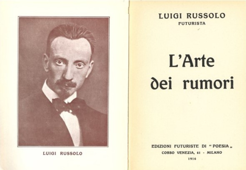
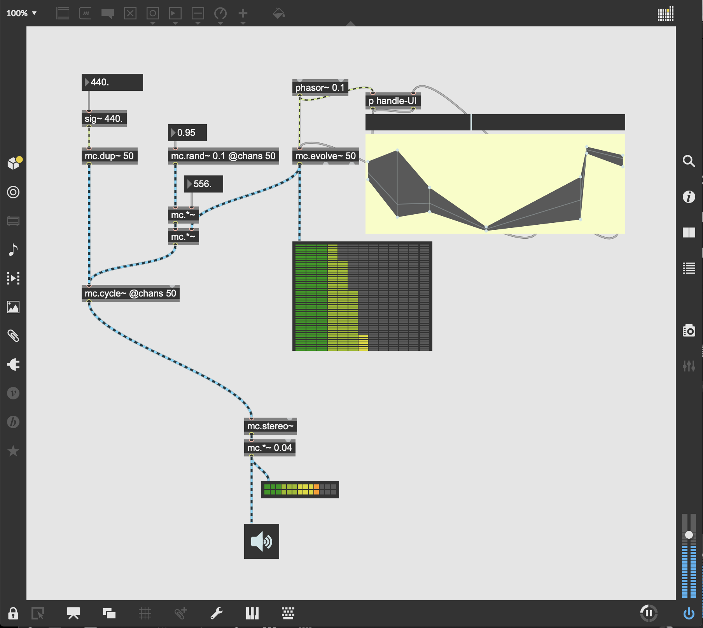
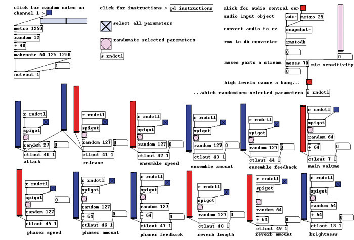

<!-- .slide: class="title" -->
# 聲音藝術

## 是什麼、從哪來、為什麼重要

第 1 章 · 前言

Note:
這一章不碰任何軟體。目的是先建立一個問題意識：為什麼「聲音」會變成一種藝術材料？

---

## 先問一個問題

### 這是音樂嗎？

- 一段工廠機械的運轉聲
- 四分三十三秒的無聲
- 時代廣場地下持續了四十年的低鳴
- 你現在聽到的冷氣聲

Note:
讓學生先回答，不要急著給答案。多數人會說前三個「是藝術但不是音樂」，第四個「什麼都不是」。這正是這一章要鬆動的東西。

---

## 1913：一切的起點

**Luigi Russolo《噪音的藝術》宣言**

▶ <a href="https://www.youtube.com/watch?v=BYPXAo1cOA4">噪音器 Intonarumori</a>·<a href="https://www.youtube.com/watch?v=pSuqDExaopg">《城市的甦醒》1913</a>

---

## Russolo 主張了什麼

> 傳統的音樂結構和旋律，已經無法滿足現代社會的聲音需求。

- 未來主義畫家，1913 年寫下《噪音的藝術》
- 主張**噪音與不和諧音可以成為音樂的新材料**
- 自製「噪音器」（Intonarumori），模擬工業與自然的聲響

Note:
背景很重要：這是工業革命的歐洲，汽車、火車、工廠聲第一次充斥日常生活。同一年，史特拉汶斯基的《春之祭》在巴黎首演引發暴動。整個時代都在打破既有規範。

---

## 一條一百年的線

| 年代 | 誰 | 做了什麼 |
|---|---|---|
| 1913 | Russolo | 把噪音宣告為音樂材料 |
| 1920s | Theremin、Ondes Martenot | 第一批電子樂器 |
| 1930s〜 | Varèse | 主張運用「聲音材料本身」 |
| 1952 | John Cage《4'33"》 | 把「環境聲」放進音樂廳 |
| 1960s | Moog 合成器 | 電子聲音進入流行樂 |
| 1983 | Yamaha DX7、MIDI | 數位合成與設備互通 |
| 1990s〜 | Max/MSP、Pure Data | 聲音創作變成「寫程式」 |

--

## 電子樂器的兩位先驅

**Theremin**（1920）
不用碰觸就能演奏的樂器。天線感應手的距離控制音高與音量。用在科幻片配樂、Led Zeppelin〈Whole Lotta Love〉。

**Ondes Martenot**（1928）
鍵盤 + 拉桿，可以做出滑音與顫音。Messiaen、Radiohead 的 Jonny Greenwood 都用過。

▶ <a href="https://www.youtube.com/watch?v=K6KbEnGnymk">Theremin 演奏</a>·<a href="https://www.youtube.com/watch?v=xpdhqljxhtQ">Whole Lotta Love 特雷門獨奏</a>·<a href="https://www.youtube.com/watch?v=v0aflcF0-ys">Ondes Martenot 演奏</a>

Note:
這兩件樂器的意義：聲音第一次可以「不從振動的物體來」，而是從電路來。這是後面所有合成器的祖先。

--

## 從硬體到軟體

- **1960s 類比合成器**：Moog、ARP。用振盪器與濾波器產生並塑形聲音，模組之間用 patch cable 相連
- **1980s 數位合成與 MIDI**：DX7 用數學演算法（FM）造聲；MIDI 讓不同廠牌設備能互相溝通
- **1990s 之後 軟體合成器**：VST（1996）、虛擬類比、物理模擬、取樣
- **同時期**：Max/MSP、Pure Data、SuperCollider —— **用程式直接產生與操作聲音**

> 注意「patch」這個詞：從 Moog 的實體接線，一路留到今天的 Pd 補丁。

▶ <a href="https://www.youtube.com/watch?v=n3K_fZDvINs">Moog System 55 示範</a>·<a href="https://www.youtube.com/watch?v=UsW2EDGbDqg">Wendy Carlos 與 Moog｜BBC</a>·<a href="https://www.youtube.com/watch?v=eeHNVVcuSVs">原版 DX7</a>

---

## 聲音藝術的五種形式

1. **聲音裝置** — 在特定空間中配置與播放聲音
2. **聲音雕塑** — 用實體物件創造或改變聲音
3. **聲景藝術** — 關注特定地點的聲音環境
4. **聲音行為藝術** — 藝術家與聲音的身體互動
5. **電子／電腦音樂** — 以電子設備或電腦為主要創作工具

---

## 聲音裝置：三件代表作

**Janet Cardiff《Forty Part Motet》**
40 支喇叭各播一位歌手的聲音，重演 1570 年代的 40 聲部經文歌。你可以走到任何一個「人」旁邊聽。

**Ryoji Ikeda《data.matrix》**
極端頻率 + 閃爍的抽象數據視覺，強烈的感官體驗。

**Max Neuhaus《Times Square》(1977)**
紐約時代廣場地下的永久裝置，**不用喇叭播放錄音**，而是讓地面共鳴。多數行人以為那是城市本身的聲音。

▶ <a href="https://www.youtube.com/watch?v=38ORiaia9r8">Forty Part Motet｜Tate</a>·<a href="https://www.youtube.com/watch?v=F5hhFMSAuf4">data.matrix</a>·<a href="https://www.youtube.com/watch?v=kA-fihBFWBI">Times Square</a>

Note:
Times Square 最值得討論：它 1992 年被關閉，2002 年由 DIA 基金會重新安裝至今。一件「你不知道它存在」的作品，算不算成功？

---

## 聲景藝術

源自加拿大作曲家 **R. Murray Schafer** 1970 年代提出的「聲景」（Soundscape）概念與聲景生態學。

- **Hildegard Westerkamp**《Kits Beach Soundwalk》(1989) — 帶著耳機在城市裡行走，聆聽環境的實地錄音
- **Janet Cardiff & George Bures Miller**《The Missing Voice》(1999) — 劇情導向的聲音漫步
- **Bernie Krause**《The Great Animal Orchestra》(2016) — 自然環境錄音轉成聲音與視覺裝置

> 聲景藝術的核心不是「做出新聲音」，而是**讓人重新聽見已經在那裡的聲音**。

▶ <a href="https://www.youtube.com/watch?v=hg96nU6ltLk">Kits Beach Soundwalk</a>·<a href="https://www.youtube.com/watch?v=LAhrSiUeP2I">Cardiff & Miller</a>·<a href="https://www.youtube.com/watch?v=btrinTDDjnQ">The Great Animal Orchestra</a>

---

## 聲音行為藝術

**John Cage《4'33"》(1952)**
演奏者四分三十三秒不演奏任何音符。觀眾被迫聽見咳嗽、椅子、空調、自己的呼吸。

**Nam June Paik《One for Violin Solo》(1962)**
極緩慢地舉起一把小提琴，然後猛然砸向地面。整件作品只有一個聲音。

▶ <a href="https://www.youtube.com/watch?v=JTEFKFiXSx4">Cage《4'33"》</a>·<a href="https://www.youtube.com/watch?v=XGTPpvHxsVg">One for Violin Solo</a>

Note:
Cage 的作品常被誤解成「什麼都沒有」。實際上正好相反：它宣稱「從來就沒有真正的無聲」。這個觀念是整個聲音藝術的地基。

---

## 兩位當代藝術家

**Susan Philipsz**
用自己的歌聲投射到公共空間。2010 年獲**特納獎**——史上第一位以聲音藝術獲獎的藝術家。

- 《Study for Strings》：把 Pavel Haas 在集中營寫的弦樂曲拆解，每個音符從各自的喇叭發出，沿著火車軌道排列
- 《Surround Me》：在倫敦金融區週末的空城裡，佈置一圈 16、17 世紀的歌曲

> 「週末金融區的寂靜給我留下了深刻的印象……我認為讓其他人體驗這種詭異的寂靜會很有趣。」

▶ <a href="https://www.youtube.com/watch?v=s_yMZJkzbcw">Study for Strings</a>·<a href="https://www.youtube.com/watch?v=UWeKzTDi-OA">Lowlands</a>·<a href="https://www.youtube.com/watch?v=-vt5w5VuECY">Surround Me</a>

---

## 進入工具：Max/MSP 與 Pure Data

---

## Max/MSP

由 **Cycling '74** 開發的圖形化程式語言。

- **Max** — 建立與控制音樂／多媒體流程的環境，用「物件」與連接線構成資料路徑
- **MSP** — 音訊處理的部分，讓物件能收發音訊訊號
- **Jitter** — 影像與 3D 圖形模組

商業軟體。以靈活與強大著稱，是許多作曲家、表演者、藝術家的首選。

---

## Pure Data

由 **Miller Puckette**（也是 Max 的原始開發者）於 1990 年代中期創建。**開源、免費、跨平台**。

---

## 為什麼是這兩個工具

- **即時處理** — 邊改邊聽，不用算圖、不用等匯出
- **視覺化程式** — 拖拉與連線，對非程式背景的創作者友善
- **高度客製** — 可以自訂模組、擴充功能，長成你需要的樣子
- **多媒體整合** — 除了聲音，還能接影像、感測器、網路

> 真正的重點：這兩個工具讓你做出**別的軟體裡不存在的東西**。
> 如果你在 Max 裡做的事情，用一般的音樂軟體也能做而且更快——那大概還沒用到它的價值。

---

<!-- .slide: class="title" -->
## 本章結束

下一章：聲音的元素、創作過程，與怎麼評價一件作品

Note:
作業建議：找一件本章提到的作品，用 2.3 節的四個角度寫 300 字分析。
