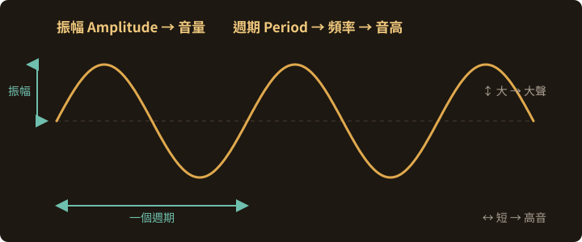
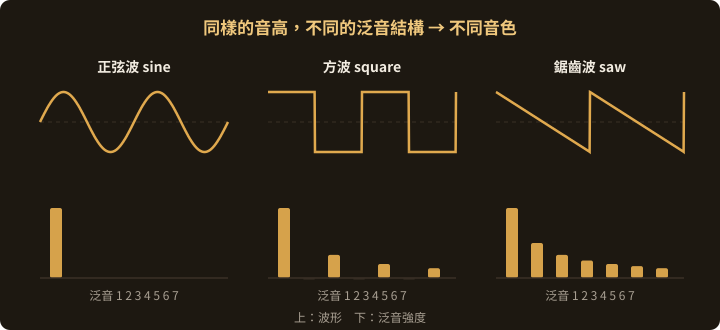

<!-- .slide: class="title" -->
# 深入理解聲音藝術

## 元素、過程、評價

第 2 章

Note:
這一章很短但很關鍵。它給的是「詞彙」——之後討論任何作品、任何技術，都要用到這些詞。

---

## 聲音的七個元素

分析任何聲音，都可以從這七個維度切入。

| 元素 | 是什麼 | 物理對應 |
|---|---|---|
| **音高** Pitch | 聲音的高低 | 頻率 |
| **音量** Loudness | 強度的主觀感覺 | 振幅 |
| **音色** Timbre | 為何能分辨不同樂器 | 波形、諧波結構 |
| **節奏** Rhythm | 聲音事件的時間組織 | — |
| **空間** Space | 聲音在空間中的分布 | — |
| **質感** Texture | 複雜度與層次 | — |
| **持續時間** Duration | 聲音的長度 | — |

▶ <a href="https://www.youtube.com/watch?v=YsZKvLnf7wU">泛音、諧波與音色</a>

---

## 音高與音量來自同一條波

振幅決定聽到多大聲，週期決定聽到多高——第 7、8 章所有合成技術都在操作這兩件事

---

## 前三個元素會反覆出現

之後所有技術章節都在處理這三件事：

- **音高** → 振盪器的頻率（第 7、8 章的 `[osc~]`、`[cycle~]`）
- **音量** → 乘法與包絡（`[*~]`、ADSR）
- **音色** → 泛音結構 → **這是合成技術的核心戰場**

> 音色由「波形、諧波結構、起始與消散的過程」決定。
> 第 7 章的加法／減法／調變合成，全部都在回答同一個問題：**怎麼控制泛音。**

Note:
特別強調「起始與消散的過程」——很多人以為音色只跟波形有關，但包絡（attack）對辨識樂器的貢獻極大。把鋼琴音的起音切掉，多數人會認不出那是鋼琴。

▶ <a href="https://www.youtube.com/watch?v=97jwN_MBEWI">加法合成：用正弦波疊出音色</a>

---

## 音色 ＝ 泛音的配方

三個波形的基頻完全相同，聽起來卻完全不一樣——差別只在下方那排泛音的強度分布

---

## 後四個元素是聲音藝術的主場

**空間**與**質感**在傳統音樂裡是配角，在聲音藝術裡常常是主角。

- Cardiff《Forty Part Motet》— 40 支喇叭，觀眾用**走路**改變自己聽到的混音
- Philipsz《Study for Strings》— 每個音符從不同位置發出，樂曲被**拆散在空間裡**
- Neuhaus《Times Square》— 作品的意義完全依附在那個**特定地點**上

> 一旦聲音離開喇叭、進入空間，**位置本身就變成素材**。

▶ <a href="https://www.youtube.com/watch?v=38ORiaia9r8">Forty Part Motet</a>·<a href="https://www.youtube.com/watch?v=s_yMZJkzbcw">Study for Strings</a>·<a href="https://www.youtube.com/watch?v=kA-fihBFWBI">Times Square</a>

---

## 創作過程的四個階段

1. **概念發展與計劃** — 確定主題與目標，研究相關作品、理論與技術
2. **聲音收集與創作** — 現場錄音、電子合成、音效設計、聲音處理
3. **聲音編輯與組織** — 剪接、混音、處理、組合、順序安排
4. **作品的實現與展示** — 多聲道系統設計、裝置設計、視覺設計、展呈方式

---

## 這四步不是直線

實務上它是一個**來回的循環**：

- 收集素材時發現了有趣的東西 → 回頭修改概念
- 展示空間的限制（天花板高度、迴音、動線）→ 回頭改編輯
- 技術做不出來 → 概念要調整，或去學新的技術

> **最常見的失敗**：概念很漂亮，但從來沒有真的動手聽過。
> 聲音藝術是耳朵的藝術——**盡早做出一個會發聲的粗糙版本**，比想清楚再做有用得多。

Note:
這也是為什麼後面要學 Pd／Max：它們的即時性讓「先做出來聽聽看」變得非常便宜。

▶ <a href="https://www.youtube.com/watch?v=hg96nU6ltLk">Kits Beach Soundwalk：一次完整的聲景創作</a>

---

## 怎麼評價一件聲音作品

聲音藝術和視覺藝術最大的差別：**多了時間性**。持續多久、什麼順序、什麼節奏，都是作品的一部分。

四個評價角度：

▶ <a href="https://www.youtube.com/watch?v=JTEFKFiXSx4">Cage《4'33"》— 拿這件來練習四個角度</a>

---

## 一、內容與概念

- 藝術家想傳達什麼想法？
- 這個概念**如何透過聲音**表達出來？
- 作品是否成功引起了思考與情感反應？

> 難的是第二個問題。概念寫在展牆上不算數——**要能從聽的經驗本身長出來。**

---

## 二、聲音材料與技術

- 用了哪些聲音材料？怎麼收集或製作的？
- 用了什麼處理與混音技術？
- **這些技術是否有效地服務於內容與概念？**

> 最後一句是重點。技術炫不炫不是評價標準，
> **技術有沒有用在對的地方**才是。

---

## 三、時間結構與空間設計

- 聲音的時間順序與節奏怎麼安排？這如何影響感知？
- 聲音在空間中怎麼分布與運動？
- 這個空間設計如何**擴展**了作品的體驗與意義？

---

## 四、創新性與影響力

- 展現了哪些創新的思維或技術？
- 這些創新是否拓寬了聲音藝術的邊界？
- 對後續的創作與觀眾產生了多大影響？

Note:
提醒學生：第四點是最難也最容易誤用的標準。「沒看過」不等於「創新」。要問的是「它讓後來的人多了什麼可能性」。

---

## 給互動作品的額外四問

之後做裝置時（第 8 章），再加上這組：

1. **輸入是什麼？** 觀眾的動作、環境聲、時間、資料？
2. **映射怎麼設計？** 輸入的變化如何對應到聲音的變化？
3. **聲音怎麼產生？** 合成、取樣、現場收音處理？
4. **為什麼要即時？** 換成預錄播放會失去什麼？

> 第 4 題答不出來的話，互動可能只是裝飾。

---

<!-- .slide: class="title" -->
## 本章結束

接下來開始動手：Pure Data

Note:
從這裡開始要打開軟體了。建議下一堂課前先裝好 PlugData 或 Pd Vanilla。
