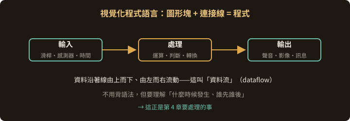
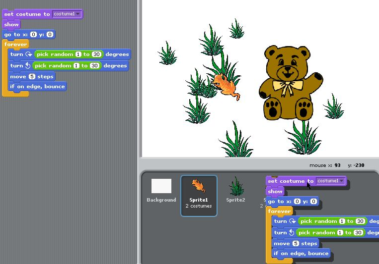
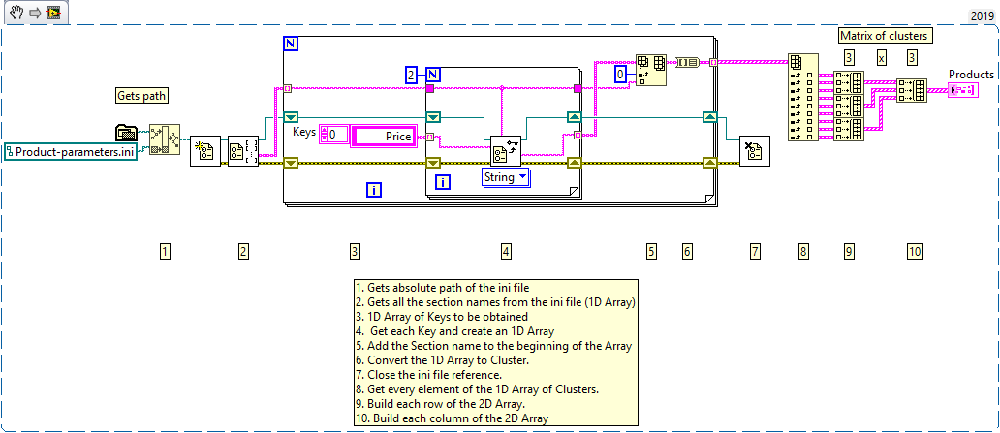
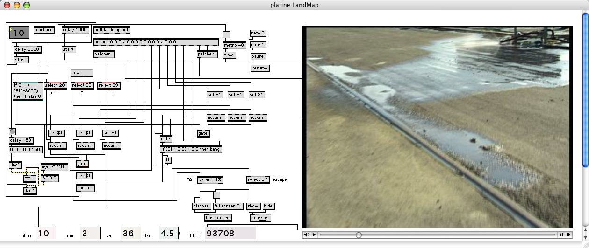

<!-- .slide: class="title" -->
# Pure Data

## 視覺化程式語言與 Pd 入門

第 3 章

---

## 什麼是視覺化程式語言

**VPL（Visual Programming Language）**：用圖形元素而不是文字程式碼來表示程式結構。

- 用**圖形塊**代表指令
- 用**連接線**表示邏輯流與資料流
- 拖放操作就能建構程式

> 對沒有程式背景的人來說，門檻低很多——這正是它在藝術與設計領域普及的原因。

---

## 視覺化程式語言在做什麼

沒有語法要背，但「誰先誰後」的問題一件也沒少

---

## 你可能已經見過的 VPL

**Scratch**（MIT 媒體實驗室）— 面向兒童與初學者的程式教育工具

--

## Blockly

Google 開發的網頁版視覺化程式工具，可生成 JavaScript、Python 等語言的程式碼

--

## LabVIEW

National Instruments 開發，用於工程與科學：數據採集、儀器控制、數據分析

▶ <a href="https://www.youtube.com/watch?v=tGEpHNN-COo">LabVIEW 入門介紹</a>

--

## Max/MSP

專門用於音訊、影像與多媒體處理，支援即時運算

▶ <a href="https://www.youtube.com/playlist?list=PLasl9I6VeCCqdfQpjZwV-rjIXQS3OnoDe">Cycling '74 官方「Getting Started with Max」</a>

---

## VPL 的優勢與代價

| 優勢 | 挑戰 |
|---|---|
| 降低學習門檻 | **大型專案會變得難以管理** |
| 操作直觀、即時回饋 | 效能可能不如文字語言 |
| 快速原型與迭代 | 轉往文字程式需要重新適應 |

> 「補丁變成一團義大利麵」是所有 VPL 使用者的共同宿命。
> 解法在第 4 章之後：子補丁、抽象、`[send]`／`[receive]`、以及**寫註解**。

---

## Pure Data 的來歷

**Miller Puckette** 於 1990 年代中期開發。

他先前在 **IRCAM**（法國龐畢度中心的音樂聲學研究所）工作時，開發了 Max/MSP 的前身。

> **Pd 可以看作 Max 的自由軟體版本**——同一個人的兩個作品。
> 隨著時間推移，兩者發展出不少差異，但**核心邏輯完全相同**。

▶ <a href="https://www.youtube.com/watch?v=aldrM2yoz1g">Miller Puckette 訪談</a>·<a href="https://www.youtube.com/watch?v=N9_J5qsntrc">Puckette 本人的 Pd 課程 MUS171 第一講</a>

---

## 發展里程碑

| 年 | 事件 |
|---|---|
| 1996 | Puckette 開始開發 Pure Data |
| 1997 | 首次公開發布 |
| 2000s 初 | 社群成形，出現 Gem、Zexy 等第三方擴充 |
| 2007 | Pd-extended 發布（打包大量擴充） |
| 2013 | Pd-extended 停止更新，社群轉回 vanilla |
| 2016 | Pd-L2Ork → Purr Data，現代化介面 |

---

## Pd 的五個特點

- **開源自由** — BSD 授權，可自由使用、修改、分發
- **跨平台** — Windows、macOS、Linux
- **即時音訊處理** — 為即時創作與互動而設計
- **模組化** — 自建模組，圖形介面連接
- **擴充豐富** — 圖形、視訊、感測器、網路通訊

原始碼：<https://github.com/pure-data/pure-data>

---

## 該裝哪一個版本

| 版本 | 說明 | 建議 |
|---|---|---|
| **Pd Vanilla** | 官方核心版，輕量、快速 | ✅ 學原理最推薦 |
| **PlugData** | 現代化介面，可當 VST3 在 DAW 裡用 | ✅ 初學者最推薦 |
| Purr Data | HTML5 介面，教育導向 | 教學環境 |
| Pd-extended | 打包大量擴充，**2013 已停更** | 不建議新專案 |
| MobMuPlat | 讓 Pd 補丁跑在 iOS／Android | 行動裝置演出 |

Note:
實務建議：課堂統一用 PlugData（介面友善、跨平台一致），有興趣再裝 Vanilla 看原版長什麼樣。兩者補丁檔案完全相容。

▶ <a href="https://www.youtube.com/watch?v=dJK0zbEsFOs">PlugData 安裝與設定</a>·<a href="https://www.youtube.com/watch?v=s0Gr2YmHz1A">把 Pure Data 當 VST 用</a>

---

## PlugData 值得單獨一提

- **VST3 外掛格式** — 可以直接在 Ableton Live、FL Studio、Cubase 裡使用
- **現代化介面** — 比原版直觀許多
- **與 Pd 完全相容** — 現有補丁不用修改就能開
- **跨平台** — Windows / macOS / Linux

> 意義：Pure Data 的能力可以直接進入正規的音樂製作流程，不用在兩套軟體之間搬來搬去。

---

## Pd 的四個主要組件

- **物件（Object）** — 基本單元。`[osc~]` 產生正弦波、`[dac~]` 音訊輸出
- **訊息（Message）** — 傳送資料與控制訊號
- **資料流控制** — `[bng]`、`[tgl]`、滑桿等，用來調整參數
- **子補丁與抽象** — 組織與重用，等同傳統程式的函式

> 下一章開始逐一拆解。

▶ <a href="https://www.youtube.com/watch?v=hgoDpuaTi8M">深夜樂堂：Pd 物件與訊息（中文）</a>·<a href="https://www.youtube.com/watch?v=1o5Wasmd8yU">Intro to Pure Data：只用三個物件</a>

---

## Pd 用在哪裡

- **電子音樂創作** — 作曲與現場演出
- **互動裝置** — 聲音裝置、互動藝術
- **音訊處理與效果器** — 即時處理、自製效果
- **視聽多媒體** — 搭配 Gem 等擴充做視聽作品

> 另外值得知道：**libpd** 讓 Pd 能嵌入 App、遊戲與手機——
> 這是 Pd 相對 Max 的一個獨特優勢。

---

<!-- .slide: class="title" -->
## 本章結束

下一章：打開 Pd，認識物件

Note:
課後：裝好軟體，開啟後找到主控台（Pd window）與一個空白補丁視窗。下次上課直接開始接東西。
