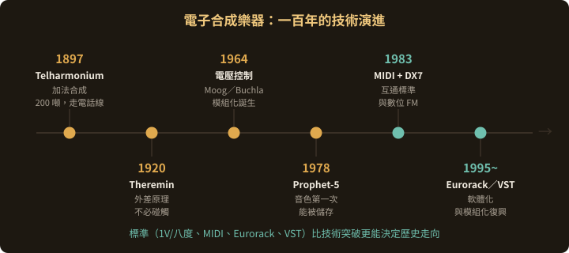
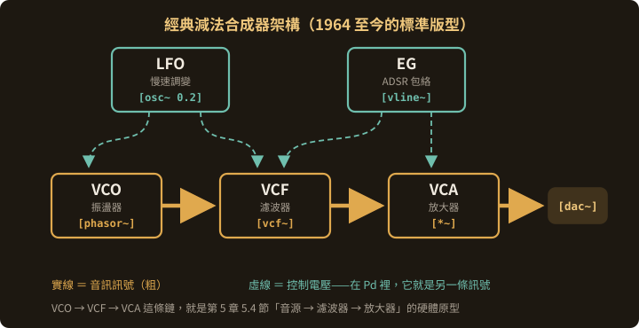

<!-- .slide: class="title" -->
# 電子合成樂器

## 一百年的歷史與技術

第 3 章

Note:
這章跟第 1 章不重疊：第 1 章講的是藝術史脈絡，這裡講的是機器本身——技術怎麼演進、為什麼那些技術決定了它們的聲音。

---

## 分析任何一台電子樂器，問三個問題

| 問題 | 技術上叫什麼 | 第 7 章對應 |
|---|---|---|
| **聲音從哪裡來？** | 音源 | `[osc~]` `[phasor~]` `[tabread4~]` |
| **怎麼被塑形？** | 濾波、包絡、調變 | `[vcf~]` `[vline~]` `[*~]` |
| **人怎麼控制它？** | 介面 | 第 8 章的映射問題 |

> 這三個問題貫穿整章。
> **它們也是你將來自己設計樂器時要回答的三個問題。**

---

## 一百年的技術演進



<p class="figcap">標準比技術突破更能決定歷史走向</p>

---

## 1897 Telharmonium：史上第一台合成器

**Thaddeus Cahill**，硬體版的**加法合成**：

- 一整排**齒輪發電機**產生純音，混合出音色
- 重約 **200 噸**，佔滿整層樓
- 真空管還沒發明，沒有喇叭——**聲音透過電話線送到餐廳與旅館**

> 它失敗了。但它證明了：
> **聲音可以完全從電裡生出來，不需要任何振動的物體。**
>
> 而且它的商業模式是「用線路把音樂送到訂戶家裡」——比 Spotify 早了一百年。

<p class="vidlinks">▶ <a href="https://www.youtube.com/watch?v=AV34h-YCMbE">Telharmonium：合成的合成</a><span class="sep">·</span><a href="https://www.youtube.com/watch?v=5PGOM9QnLWw">1902 年的第一份電子音樂錄音</a></p>

---

## 1920 Theremin：聽到的是差頻

它的原理用到的就是第 7 章的**環形調變**：

1. 機器內有兩個**超音波**振盪器（如 200,000 Hz 與 200,440 Hz）
2. 兩者混合產生**差頻 = 440 Hz** ← **這才是你聽到的聲音**
3. 手接近天線改變電容，讓其中一個振盪器漂移
4. 差頻跟著改變 → 音高改變

> Theremin 沒有「產生 440 Hz」，
> **它是讓兩個聽不見的高頻相減，剩下 440 Hz。**

代價：音高**完全連續**，沒有琴格沒有鍵，全靠耳朵與手的空間記憶。

<p class="vidlinks">▶ <a href="https://www.youtube.com/watch?v=K6KbEnGnymk">Theremin 演奏〈Over the Rainbow〉</a></p>

---

## 1928 Ondes Martenot：兩種都要

解決 Theremin 的演奏難題：**鍵盤 + 帶狀滑環**。
鍵盤給你確定的音高，滑環給你連續的滑音——**不必二選一**。

還有一個常被忽略的創新：**多種擴音器**。

除了一般喇叭，還有裝了**共鳴弦**的 *palme*、裝了**鑼**的金屬擴音器。

> 同樣的訊號，經過不同的物理共鳴體，變成不同的樂器。
> **這個想法今天叫 convolution reverb 與 resonator——
> 1928 年是用真的弦跟真的鑼做的。**

<p class="vidlinks">▶ <a href="https://www.youtube.com/watch?v=v0aflcF0-ys">Ondes Martenot 演奏</a></p>

--

## 1935 Hammond Organ：加法合成的實體介面

把 Telharmonium 的齒輪原理縮小到能搬進教堂，
並用九根**抽拉桿（drawbar）**讓演奏者即時調整每個泛音的音量。

> ### 抽拉桿就是加法合成的實體介面。
>
> 你在 7.3 節接的那四個 `[osc~] → [*~]`，
> Hammond 在 1935 年就做成九根可以用手推的桿子了。

---

## 1964：電壓控制的革命

Moog（紐約）與 Buchla（舊金山）幾乎同時、各自獨立地做出同一個突破。

想法極其簡單：

> ## 用一個電壓代表一個參數值。

--

## 這帶來兩個巨大的後果

**一、任何東西可以控制任何東西**
LFO 的輸出是電壓，濾波器的截止頻率吃電壓——所以 LFO 可以掃濾波器。你不需要為此設計專門的電路。

**二、模組可以自由互接**
用一條線把 A 的輸出接到 B 的輸入就行。

> ### 這就是「模組化合成器」，
> ### 也是 Pure Data 補丁的物理原型。

Moog 訂的 **1V/八度** 標準至今仍是模組合成的通用語言。

<p class="vidlinks">▶ <a href="https://www.youtube.com/watch?v=9uFKlsyzVlI">Moog vs Buchla：電壓控制之爭</a></p>

---

## 五個基本模組 ＝ 第 7 章的硬體版



<p class="figcap">你在 Pd 裡接的每一個減法合成補丁，都是 1964 年這個架構的軟體版</p>

<p class="lablink">🎛 <a href="../lab/?preset=ch3-vcovcfvca">在瀏覽器接一次這個架構（鍵盤 a w s e d f 可彈）</a></p>

--

## 對照表

| 模組 | 做什麼 | Pd 對應 |
|---|---|---|
| **VCO** | 產生波形，頻率吃電壓 | `[osc~]` `[phasor~]` |
| **VCF** | 濾波，截止頻率吃電壓 | `[vcf~]` `[lop~]` |
| **VCA** | 音量，增益吃電壓 | `[*~]` |
| **EG** | 產生 ADSR 形狀的電壓 | `[vline~]` |
| **LFO** | 慢速振盪，調變別的東西 | `[osc~ 0.2]` |

---

## Moog ladder filter：一個電路成為一種聲音

Moog 的 24 dB/八度低通濾波器（電路長得像梯子）有專利保護。

它的失真特性與共振行為，就是「Moog 的聲音」。

> 這是電子樂器史上反覆出現的現象：
> ### 一個特定的電路缺陷，變成了一種被追求的音色。

同樣的故事後來發生在 TB-303、SP-1200、磁帶飽和上。

---

## 東岸 vs 西岸：兩種哲學

| | **Moog（東岸）** | **Buchla（西岸）** |
|---|---|---|
| 介面 | **鍵盤** | **觸控板、無鍵盤** |
| 出發點 | 從豐富的波形**減去** | 從單純的波形**加上**複雜度 |
| 核心技巧 | 濾波（VCF） | 波形塑形、FM、low-pass gate |
| 想做什麼 | 讓電子樂器**能演奏既有的音樂** | 讓電子樂器**做出不存在的聲音** |
| 代表 | 《Switched-On Bach》 | 實驗音樂、聲音藝術 |

<p class="vidlinks">▶ <a href="https://www.youtube.com/watch?v=N50XkzMkZp8">西岸合成解說</a><span class="sep">·</span><a href="https://www.youtube.com/watch?v=e6RSfbh9jhY">Buchla 與 Moog 直接對比</a></p>

--

## Buchla 為什麼拒絕鍵盤

> **鍵盤會把音高鎖進十二平均律，
> 也會把「一個音」的觀念強加給你。**

他要的是連續的、非音符的聲音。

> **這跟第 1 章 Russolo、Cage 的主張是同一件事——
> 只是用硬體講。**

Note:
這一頁可以停久一點。Buchla 的立場在藝術系的課裡比在音樂系的課裡更好懂。

---

## 1970 Minimoog：把模組化變成樂器

模組化很強，但**很難搬、很難重現、演出時容易接錯**。

解法：**把最常用的接線在內部預先接好**，只留最需要調的旋鈕，加上鍵盤。

- 3 個 VCO（可微微失諧 → 聲音變厚）
- 1 個 ladder 低通濾波器
- 2 個包絡（一個給濾波器、一個給音量）

這個配置成為往後五十年單體合成器的標準版型。

<p class="vidlinks">▶ <a href="https://www.youtube.com/watch?v=sLx_x5Fuzp4">Minimoog 簡史</a><span class="sep">·</span><a href="https://www.youtube.com/watch?v=UsW2EDGbDqg">Wendy Carlos 與她的 Moog（BBC 1970）</a></p>

---

## 1978 Prophet-5：可以「存」音色的第一台

Dave Smith 的突破不在音色，而在一個今天理所當然的功能——**音色記憶**。

> 在此之前，你調出一個好聲音，只能拿紙筆把每個旋鈕的位置抄下來。
> 演出換音色 ＝ 現場重新轉二十個旋鈕。

### Prophet-5 讓「音色」第一次變成可以儲存、召回、交換的資料。

<p class="vidlinks">▶ <a href="https://www.youtube.com/watch?v=Ruh0B5QKBMs">Prophet 合成器的歷史</a></p>

---

## 1983 MIDI：一個沒有人壟斷的標準

Dave Smith（Sequential）與 **梯郁太郎**（Roland）推動的跨廠牌協定。

技術上很簡陋，**而它成功的原因就在這裡**：

- 串列傳輸 31,250 bps，一條五針線
- 傳的是**演奏事件**而不是聲音：note on/off、力度、控制器、音色切換
- **沒有專利費、沒有授權金**

1983 年 NAMM 展，一台 Prophet-600 與一台 Roland Jupiter-6 成功對接——**兩個競爭對手的機器互相控制**。

--

## 為什麼 MIDI 活了四十年

> ### 因為它只做一件事並做對了：
> ### 它不定義聲音，只定義「發生了什麼」。

**這跟 Pd 裡「訊息」與「訊號」的分野（第 6 章）
是同一個設計哲學。**

<p class="vidlinks">▶ <a href="https://www.youtube.com/watch?v=0aj36OTVUHo">紀念 Dave Smith</a><span class="sep">·</span><a href="https://www.youtube.com/watch?v=gWkDOeiDEYk">合成器的發明者們</a></p>

---

## 數位時代：四條不同的路

類比合成器的極限是**電路**。
數位讓「聲音怎麼算出來」完全交給演算法——於是同時長出好幾條路線。

**FM** · **取樣** · **波表／混合** · **物理建模**

---

## 路線一：FM（Yamaha DX7, 1983）

- Chowning 1973 發表 → 史丹佛授權 Yamaha → DX7（1983）
- **6 個 operator、32 種演算法**，賣出超過十六萬台
- 做得出類比做不到的：電鋼琴、鐘、金屬打擊、清脆貝斯

但它的音色極難編寫。 六個 operator 互相影響，改一個數字聲音就面目全非，**沒有一個旋鈕對應一個聽得懂的效果**。結果：多數人只用內建音色。

> ### 技術上更強大的樂器，如果參數與聽感之間沒有直覺的對應，
> ### 使用者就只會用預設值。**可控性是樂器的一部分。**

<p class="vidlinks">▶ <a href="https://www.youtube.com/watch?v=w4g92vX1YF4">Chowning 談 FM 的起源</a><span class="sep">·</span><a href="https://www.youtube.com/watch?v=eeHNVVcuSVs">原版 DX7</a></p>

---

## 路線二：取樣（Fairlight CMI, 1979）

第一台商業數位取樣器——**把真實聲音錄進記憶體，用鍵盤彈它**。

- 售價約當年一棟房子
- 附帶 **Page R** 圖形化序列器，用光筆在螢幕上畫音符
- 取樣率與位元深度都很低，那種粗糙感後來反而成為一種美學

> **技術上，取樣就是 7.7 節的 `[tabread4~]`。**
> 改變文化的是**價格**而不是技術。
> 當一台取樣機從一棟房子降到一個月薪水，
> 「用別人的錄音做自己的音樂」才變成一整個世代的創作方法。

<p class="vidlinks">▶ <a href="https://www.youtube.com/watch?v=k0dn0lcvWkY">BBC Archive 1980：Fairlight CMI</a><span class="sep">·</span><a href="https://www.youtube.com/watch?v=jkiYy0i8FtA">Fairlight 如何改變音樂</a></p>

---

## 路線三：波表與混合式

**波表合成（PPG Wave, 1981）**
存一整排單週期波形，播放時在它們之間掃描 → 音色**隨時間變形**。

**Roland D-50 的 LA 合成（1987）**
把**取樣的起音**接上**合成的延續音**。

因為人耳辨識樂器主要靠起音的那幾十毫秒（2.1 節），這招用極少的記憶體做出驚人的真實感。

> **一個很聰明的工程妥協**：記憶體貴，就把它花在最關鍵的 50 毫秒上。

---

## 路線四：物理建模

前面三條路都在**描述聲音的結果**。物理建模改問另一個問題：

> ## 不要模仿聲音，模仿發出聲音的物體。

--

## Karplus-Strong：一段噪音 + 一條會衰減的延遲線

```plaintext
[noise~]  ──► 很短的一段（撥弦的瞬間）
     │
  [delwrite~ str 50]     <- 延遲時間 = 1/頻率
     │
  [delread~ str 4.5]
     │
  [lop~ 4000]            <- 每繞一圈濾掉一點高頻（弦會衰減）
     │
  [*~ 0.98]              <- 每繞一圈衰減一點
     │
     └──► 接回 [delwrite~]  形成回授
```

一段噪音在一條會慢慢變鈍的迴圈裡繞——聽起來就是一根弦。

用**幾乎零記憶體**，做出取樣機要好幾 MB 才做得到的事。

<p class="vidlinks">▶ <a href="https://www.youtube.com/watch?v=abQTjZPSgS0">Karplus-Strong 解說</a><span class="sep">·</span><a href="https://www.youtube.com/watch?v=5rVveOpGsWo">在 Pure Data 裡做撥弦</a></p>

---

## 軟體時代的一個諷刺

- **VST**（1996）讓外掛可以裝進音樂軟體
- **虛擬類比**：用數位運算模擬類比電路的行為

> 軟體合成器的競爭焦點，很快從「音色」轉向「**模擬得有多像**」。
> 大量的 CPU 被花在重現類比電路的非線性失真——
>
> ### 業界花了二十年，
> ### 用數位去重建它二十年前拋棄的類比缺陷。

---

## 模組化的復興：Eurorack

1995 年 **Dieter Doepfer** 訂出規格（3U 高度、電源排線標準化），任何人都能做相容模組。2010 年代爆炸性成長。

為什麼在軟體無所不能的時代，人們回頭去買一堆要用線接的盒子？

- **限制帶來決定**：軟體有無限選項，模組系統只有你手上這幾個
- **手的參與**：轉旋鈕與接線是身體動作
- **不可重現性**：拔掉線就沒了，這逼你當下就要好好聽

> **這跟第 4 章的第一課是同一件事：限制會長出風格。**

<p class="vidlinks">▶ <a href="https://www.youtube.com/watch?v=u3JDmMIkBr0">Eurorack 的發明故事</a><span class="sep">·</span><a href="https://www.youtube.com/watch?v=CYQ0x3LtzWg">模組合成入門</a></p>

---

## 而最後一條路，就是這門課

商業合成器必須賣給很多人，所以它**必然是通用的、妥協的**。

> ### 你自己寫的補丁只需要服務一件作品——
> ### 它可以極端、可以難用、可以只有一個功能。

---

## 五種合成方法總覽

| 方法 | 原理一句話 | 代表樂器 | 本教材 |
|---|---|---|---|
| **加法** | 把正弦波疊起來 | Telharmonium、Hammond | 5.3 |
| **減法** | 從豐富的波形削掉頻率 | Minimoog、Prophet-5 | 5.4 |
| **調變** | 用訊號改變訊號的參數 | DX7、YM2612 | 5.5 |
| **取樣／波表** | 播放存好的波形 | Fairlight、PPG | 5.7 |
| **物理建模** | 模擬發聲物體而非聲音 | Yamaha VL1 | 8.6 |
| **顆粒** | 切成微小片段重組 | GRM Tools | 5.9 |

> **每一種方法，你在第 7 章都已經做過了。**

---

## 介面的歷史：常被忽略的另一半

樂器史通常只講「聲音怎麼產生」，
但**「人怎麼控制它」決定的事情更多**。

### 鍵盤的三個隱形限制

1. **音高被離散化**成十二平均律——連續變化成了「特殊效果」
2. **一個鍵 = 一個音**——按下之後很難再細膩改變
3. **十指的限制**成為音樂結構的限制

Buchla 拒絕鍵盤、Theremin 沒有鍵盤、Ondes 同時給你兩種——**它們都在回應同一個問題**。

--

## 另一條線：連續控制

| 介面 | 年代 | 特點 |
|---|---|---|
| Theremin 天線 | 1920 | 完全連續，無視覺參照 |
| Ondes ribbon | 1928 | 連續 + 鍵盤並存 |
| Buchla 觸控板 | 1960s | 壓力與位置 |
| CV / Gate | 1964 | 電壓即控制 |
| Haken Continuum | 1999 | 三維：音高／音色／壓力 |
| **MPE** | 2018 | 讓 MIDI 的**每個音**各自帶表情 |

<p class="vidlinks">▶ <a href="https://www.youtube.com/watch?v=8SfHIi9Ab0E">什麼是 MPE</a><span class="sep">·</span><a href="https://www.youtube.com/watch?v=MibaTa2QxWw">四種 MPE 控制器比較</a></p>

--

## 而你有第三條路

用 Pd / Max 接感測器，自己做介面（8.5 節）。

距離感測器、壓力墊、加速度計、攝影機、麥克風——
每一個都可以映射到任何合成參數。

> **你不必接受鍵盤，也不必花錢買 Continuum。**
>
> 接得上不難，難的是決定「這個動作應該讓聲音怎麼變」。
> **電子樂器一百年的歷史，有一半是在回答這個問題。**

---

## 動手：在 Pd 裡重建一台 Minimoog

```plaintext
[nbx]  ← 音高（Hz）
  |
[t f f f]
  |        |         |
  |    [* 1.007]  [* 0.5]      <- 第二顆微升、第三顆低八度
  |        |         |
[phasor~][phasor~][phasor~]    <- 3 個 VCO
  |        |         |
[-~ 0.5] [-~ 0.5] [-~ 0.5]     <- 去掉直流偏移
  |        |         |
  +--------+---------+         <- 自動相加（＝ mixer）
           |
       [vcf~ 800 6]  ←── [vline~]  濾波器包絡
           |
        [*~ ]      ←── [vline~]  音量包絡（VCA）
           |
       [*~ 0.2] ── [dac~ ]
```

**三顆振盪器微微失諧**（1.000／1.007／0.5）是 Minimoog 厚實的關鍵——完全同頻會很單薄。

---

## 練習

1. 把三顆 VCO 的失諧量做成滑桿，聽「厚度」怎麼隨失諧量改變
2. 把濾波器包絡的 Decay 接到滑桿，做出從「噗」到「哇」的連續變化
3. 加一個 LFO 到濾波器截止頻率（7.4 節），做出自動掃頻
4. 把 `[phasor~]` 換成 `[osc~]` 比較差異——並回答**為什麼減法合成不從正弦波開始**
5. **挑戰**：做出 Karplus-Strong 撥弦，跟這台 Minimoog 比較——同樣是「一根弦」，兩種完全不同的做法

---

## 一百年，三個反覆出現的模式

**一、限制先被詛咒，後被追求**
ladder filter 的失真、DX7 難調的參數、取樣機的低位元、磁帶的飽和——當年都是缺陷，今天全部有人花錢買外掛去模擬。
今天你覺得 Pd 做不好的地方，可能是二十年後有人想要的音色。

**二、標準比技術更能決定歷史**
1V/八度、MIDI、Eurorack、VST——沒有一個是聲音上的突破，**但它們決定了什麼能跟什麼連在一起**。

**三、介面決定了誰能用、能做什麼**
Theremin 太難所以沒普及；DX7 太難調所以大家只用預設；鍵盤太好用所以我們的音樂充滿十二平均律。

---

<!-- .slide: class="title" -->
## 本章結束

設計一個補丁的同時也是在設計一個介面，
你在這個過程裡決定了哪些事情容易做、哪些困難、哪些根本做不到。

> 所以問題又回到第 1、2 章：
> **你想讓誰、用什麼方式、發出什麼聲音？**

Note:
延伸：VCV Rack 是免費開源的 Eurorack 軟體版，學生可以零成本體驗模組化。
