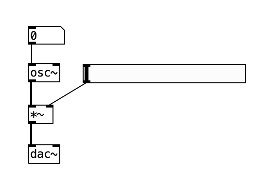
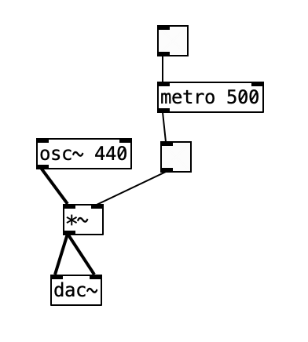
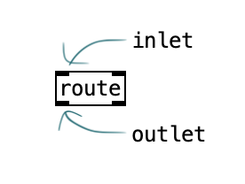
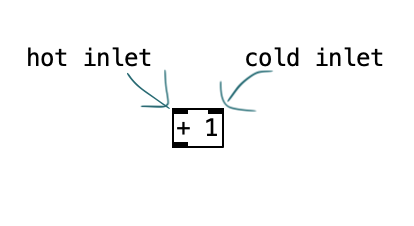
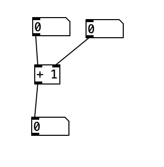
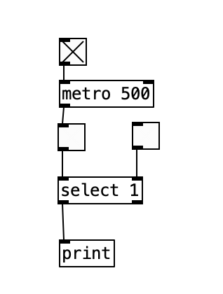
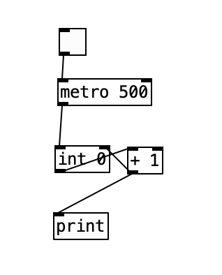
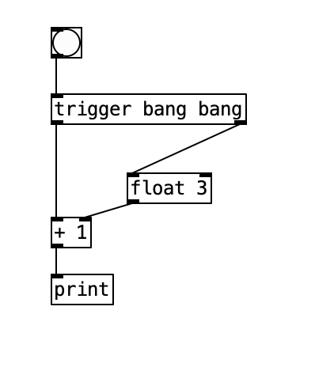

<!-- .slide: class="title" -->
# Pure Data 的物件

## 補丁行為的所有規則，都在這一章

第 4 章

Note:
這是整套教材最重要的一章。合成技巧可以查，但「補丁為什麼這樣跑」的規則沒搞懂，之後每個補丁都會有莫名其妙的 bug。

---

## 兩大類物件

Pd 的物件依處理的資料型別分成兩類：

| | 訊號類別 Control | 音訊類別 Audio |
|---|---|---|
| 處理什麼 | 離散、低頻、非連續的**事件** | 連續的**音訊訊號** |
| 命名 | `[metro]` | `[osc~]` **有波浪號** |
| 線的外觀 | 細線 | **粗線** |
| 何時運作 | 有事件才動 | DSP 開著就不停運作 |

> **`~` 是 Pd 最重要的視覺約定：看到波浪號就代表音訊。**

---

## 常見的控制物件

**數值與運算**
`[int]` `[f]` `[+]` `[-]` `[*]` `[/]` `[expr]`

**控制訊號**
`[bng]` 觸發 · `[metro 500]` 節拍器 · `[tgl]` 開關

**資料結構**
`[pack]` / `[unpack]` 打包解包 · `[list]`

**條件與邏輯**
`[select]` 條件觸發 · `[route]` 依標籤分流

---

## 常見的音訊物件

| 用途 | 物件 |
|---|---|
| 振盪器 | `[osc~]` 正弦 · `[phasor~]` 鋸齒 · `[noise~]` 白噪音 |
| 音量 | `[*~]` |
| 濾波 | `[lop~]` 低通 · `[hip~]` 高通 · `[bp~]` 帶通 |
| 輸出入 | `[dac~]` 輸出 · `[adc~]` 輸入 |
| 延遲 | `[delwrite~]` + `[delread~]` |
| 殘響 | `[rev1~]` `[rev2~]` `[rev3~]` |

Note:
注意：網路上很多教材寫 [delay~] 和 [reverb~]，這兩個在 Pd vanilla 裡不存在。第 5 章有完整的正名對照表。

---

## 範例：最簡單的合成器



`[osc~]` 產生正弦波，數字框控制頻率，`[dac~]` 輸出

--

## 範例：節拍器



`[metro]` 每 500 毫秒觸發一次，`[tgl]` 控制啟停，`[osc~]` 發出 440 Hz

---

## 物件長什麼樣子


- **矩形**：多數物件，內部顯示名稱與參數
- **圓角矩形**：部分 UI 物件
- **顏色**：某些物件用顏色區分狀態

---

## 端口：inlet 與 outlet



- **Inlet 在上方** — 接收資料或控制訊號
- **Outlet 在下方** — 送出資料或控制訊號

---

## Hot 與 Cold：整章的關鍵



**Inlet 分成兩種，差別在「會不會觸發運算」**

---

## Hot Inlet

- **位置**：通常是**最左邊**的 inlet
- **行為**：收到資料就**立刻**執行運算並輸出結果
- **用途**：觸發動作

## Cold Inlet

- **位置**：其他（非最左邊）的 inlet
- **行為**：收到資料**只儲存，不觸發**
- **用途**：預先設定參數，等 hot inlet 來觸發

---

## 用加法物件理解



`[+ ]` 的左 inlet 收到數字 → 立刻加、立刻輸出
右 inlet 收到數字 → 只是把加數記起來

--

## 控制訊號的流向



`[tgl]` 接到 `[select]` 的 cold inlet 設定條件，
`[metro]` 的輸出接 hot inlet 定時觸發判斷

---

## 執行順序：為什麼重要

Pd 是**資料流**語言。順序錯了，結果就錯了——而且錯得很難查。

四條規則：

1. 資料總是**從上游流向下游**，沿著連接線走
2. 一個 outlet 接多個目標時，**從右到左**執行
3. Hot inlet 觸發運算，cold inlet 只儲存
4. 「右」是看**物件在畫面上的位置**

> 第 4 點的意思是：**把物件拖到旁邊，程式行為就變了。**
> 這是視覺程式語言獨有的陷阱。

---

## 範例：計數器



`[tgl]` → `[metro 500]` → 觸發 `[int]` 輸出目前值 → `[+ 1]` → 存回 `[int]` 的 cold inlet

Note:
這是 hot/cold 最經典的應用：用 cold inlet 當「記憶體」，讓數值可以累積。要學生自己畫一次，畫出來就懂了。

---

## 解法：用 `[trigger]` 鎖定順序



`[t b b]` 明確指定「先做哪個、再做哪個」（由右至左）

> **職業習慣：只要一個 outlet 要接到兩個以上的地方，就插一個 `[t]`。**
> 這不是龜毛，是省下未來三小時的除錯。

---

## UI 物件

從 **Put 選單**放置，不用手打名稱。

| 選單名稱 | 實際物件名 | 用途 |
|---|---|---|
| Bang | `[bng]` | 觸發事件，點擊會閃 |
| Toggle | `[tgl]` | 開關，輸出 0 或 1 |
| Slider | `[hsl]` / `[vsl]` | 水平／垂直滑桿，連續數值 |
| Number | 數字框 / `[nbx]` | 顯示與輸入數值 |
| Radio | `[hradio]` / `[vradio]` | 多選一 |
| Symbol | `[symbol]` | 文字輸入 |
| Canvas | `[cnv]` | 背景色塊、標籤 |

Note:
這裡要特別講：很多教材（包含網路文章）會寫成 [toggle]、[slider]、[button]，這些名字在 Pd 裡打不出來。因為平常都從 Put 選單放，打錯不容易被發現。

---

## 綜合：一個控制介面

```plaintext
[nbx]         [tgl]      [hsl]
  |             |          |
[osc~ ]         |        [*~ ]
  |             |          |
  +-------------+----------+
                |
            [*~ 0.05]
                |
             [dac~ ]
```

- **音高** — 數字框控制 `[osc~]` 頻率
- **音量** — 滑桿控制 `[*~]` 的乘數
- **開關** — `[tgl]` 啟停

---

## 本章重點

1. **`~` 分開兩個世界** — 訊號與訊息不能亂接
2. **Hot / Cold** — 最左邊觸發，其他只儲存
3. **右到左** — 而且「右」是畫面位置
4. **`[t]` 是保險** — 一分為二就插一個

> 這四條規則之後每一章都會用到。**現在不熟沒關係，但要知道它們存在**——
> 補丁行為怪異時，九成是這四條裡的某一條。

---

<!-- .slide: class="title" -->
## 本章結束

下一章：開始做聲音——合成

Note:
課後練習：自己接一個計數器 + 一個會發聲的 metro。故意把物件左右對調，觀察行為變化。
