<!-- .slide: class="title" -->
# 類比、數位與 Buffer

## 聲音怎麼變成數字，數字又怎麼變回聲音

第 4.5 章

Note:
這一章排在 Pure Data 之前，因為後面的 `[osc~]`、`[dac~]`、block size 都預設你已經知道取樣是什麼。
全長約 40 分鐘，兩段各 20 分鐘，中間可以休息。
整份簡報從頭到尾用同一段正弦波，學生會看到同一個訊號被一步步處理：連續波形 → 取樣點 → 數值陣列 → 分塊。

---

<!-- .slide: class="title" -->
## 第一段

### Analog vs. Digital：聲音如何變成數字？

Note:
十張投影片，約 20 分鐘。目標是讓學生能用自己的話說出「取樣率」和「位元深度」的差別。

---

## 電腦如何產生我們聽到的聲音？

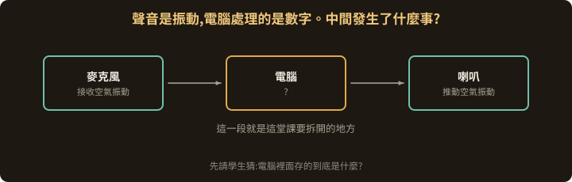

聲音是**振動**，電腦處理的是**數字**。

這兩件事怎麼接起來的？

Note:
先不要講答案。請學生猜：電腦裡面到底存了什麼？
常見的回答是「存聲音檔」，可以追問一句：那聲音檔裡面是什麼？
這個問題會在第 10 張得到完整回答。

---

## 聲音是隨時間變化的振動

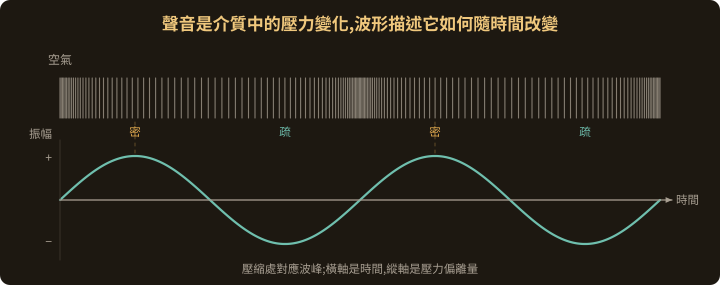

上面是空氣的疏密，下面是同一件事畫成波形

Note:
重點是「波形描述的是某一個位置的壓力如何隨時間改變」，不是聲音在空間中的形狀。
圖上的虛線把壓縮帶和波峰連起來，就是要學生看到這兩張圖是同一件事。

---

## 先認識波形：振幅與頻率

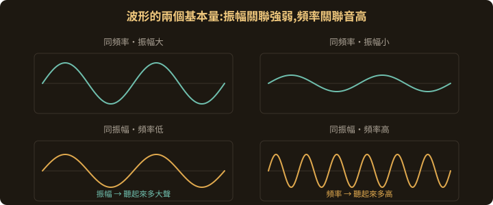

- **振幅**：波形離中線多遠，關聯聲音的強弱
- **頻率**：一秒鐘來回幾次，關聯聽到的音高

Note:
四格圖是控制變因的寫法：上排固定頻率只改振幅，下排固定振幅只改頻率。
「關聯」而不是「等於」——響度與音高還牽涉聽覺的非線性，這裡不展開。

---

## Analog：用連續變化的物理量表示聲音

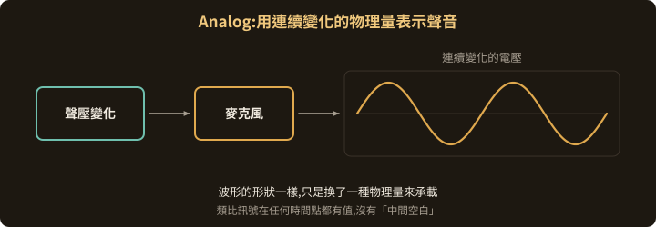

麥克風把空氣的壓力變化轉成電壓變化。

波形的形狀沒變，只是換了一種物理量來承載。

Note:
類比訊號的關鍵性質：任何一個時間點都有值，沒有「中間空白」。
這一點正好是下一張數位化要打破的。

---

## Digital：在特定時間記錄數值

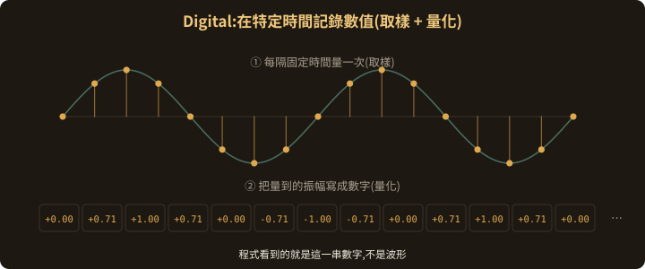

數位化是兩個動作：

1. **取樣（sampling）**：每隔固定時間量一次
2. **量化（quantization）**：把量到的振幅寫成可表示的數字

Note:
這裡是全章的樞紐。請學生注意最下面那一排數字——那就是程式真正拿到的東西。
波形是我們畫給人看的，程式看到的只有一串數值。
這一串數字會一路用到第 13 張的 block。

---

## Sample Rate：每秒取樣多少次？

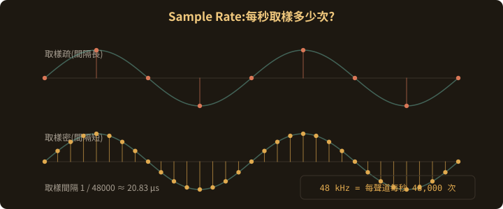

**48 kHz** 代表每個聲道每秒取樣 48,000 次。

取樣間隔 = 1 ÷ 48000 ≈ **20.83 µs**

Note:
可以讓學生自己算 44.1 kHz 的間隔（約 22.68 µs）。
44.1 kHz 來自 CD 規格，48 kHz 來自數位影音，兩個都常見，沒有誰比較「正確」。

---

## 取樣太慢，會發生什麼事？

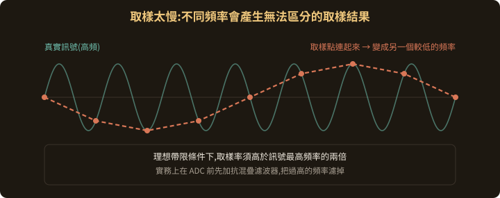

取樣點太疏的時候，高頻訊號會被記錄成**另一個較低的頻率**，而且事後分不出來。這個現象叫 **aliasing（混疊）**。

理想帶限條件下，取樣率必須高於訊號最高頻率的兩倍。

Note:
這就是 44.1 kHz 能覆蓋到約 22 kHz 的原因，人耳上限大約在 20 kHz。
實務上 ADC 之前會加抗混疊濾波器，先把過高的頻率濾掉，而不是指望輸入乖乖不超頻。
「兩倍」是理想帶限訊號的條件，不是隨便什麼訊號都成立，講到這裡就好。

---

## Bit Depth：振幅能分成多少階？

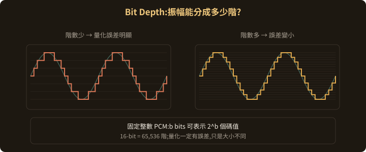

固定整數 PCM 中，`b` bits 可以表示 <code>2b</code> 個碼值。

16-bit 就是 **65,536 階**。階數再多，量化誤差也不會是零。

Note:
左圖故意只用 6 階，讓誤差看得見；右圖 20 階就順很多。
要強調：量化一定有誤差，差別只在大小。
⚠️ 提醒：階梯圖是量化的示意，不代表經過重建濾波之後的類比輸出真的長成階梯狀。這是很常見的誤解。

---

## Sample Rate 與 Bit Depth 有什麼不同？

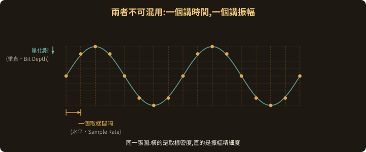

| | 描述什麼 | 圖上的方向 |
|---|---|---|
| **Sample rate** | 時間上的取樣密度 | 水平 |
| **Bit depth** | 振幅的表示精細度 | 垂直 |

兩者是不同維度，不能互相換算。

Note:
這張是第一段最容易考的觀念。學生很常把「音質好」籠統歸給其中一個。
可以問：把取樣率加倍，量化誤差會變小嗎？（不會，那是垂直方向的事。）

---

## 從聲音到數字，再回到聲音

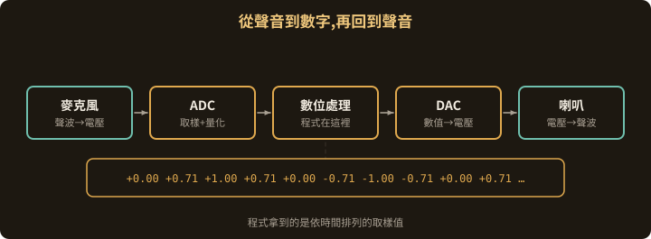

麥克風 → **ADC** → 數位處理 → **DAC**／重建濾波 → 喇叭

程式拿到的，就是那一串依時間排列的取樣值。

Note:
轉場提問，講完停一下再進第二段：
「每個聲道一秒就有 48,000 筆資料，程式要一筆一筆交給音效裝置嗎？」
讓學生想幾秒，答案是第二段的全部內容。

---

<!-- .slide: class="title" -->
## 第二段

### Buffer：聲音資料為什麼要分批處理？

Note:
十張投影片，約 20 分鐘。目標是讓學生知道 buffer 大小在調什麼，以及它不等於總延遲。

---

## 聲音不能停下來等電腦

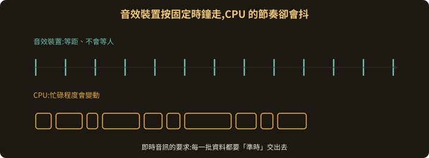

音效裝置依**固定時鐘**持續播放，不會等人。

但 CPU 的執行與排程會波動。即時音訊的要求是：每一批資料都要**準時**交出去。

Note:
「準時」比「快」更重要。平均很快但偶爾遲到，聽起來就是爆音。
這個觀念會在第 18 張再出現一次。

---

## 為什麼一次處理一批？

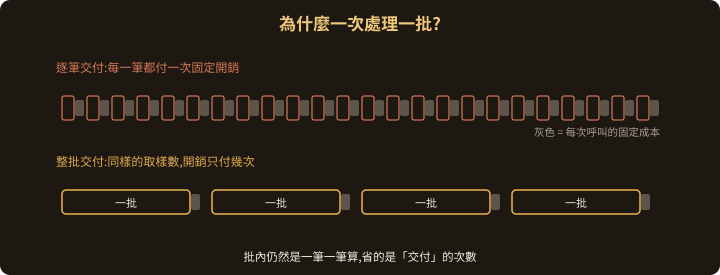

每一次呼叫與資料傳遞都有固定開銷。分批交付可以把這個開銷攤薄。

批次之內，程式仍然是一筆一筆算。

Note:
容易誤解的地方：分批不是「一次算 256 筆比較快」，而是「少付 255 次交付成本」。
運算量本身沒有變少。

---

## Buffer 是暫存聲音資料的空間

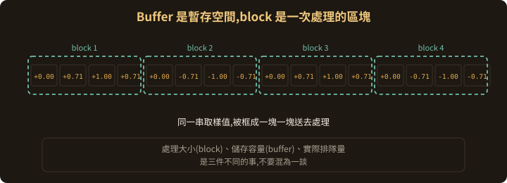

- **buffer**：存放待處理或待播放的取樣
- **block**：一次處理的資料區塊

處理大小、儲存容量、實際排隊量是三件事。

Note:
留意術語重疊：Max 的 `[buffer~]` 指的是「載入音檔的記憶體」，跟這裡講的 I/O 緩衝不是同一件事。第 8 章會遇到。
圖上的數字就是第 5 張那一串，讓學生看見是同一個訊號。

---

## 一邊播放，一邊準備下一批

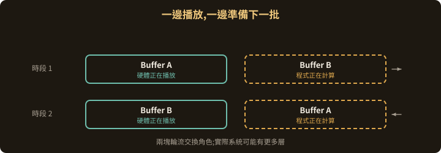

硬體在讀已經算完的那一塊時，程式同時準備下一塊。兩塊輪流交換角色。

實際系統可能有更多層緩衝。

Note:
雙緩衝是最小可行的模型，用來建立直覺。
真實的音訊堆疊（驅動、裝置、作業系統）常常不只兩層，這也是第 19 張要講的事。

---

## 一個 Buffer 代表多少時間？

同一時間點所有聲道的取樣合起來叫一個 **frame**。

區塊時長：<code>T = N / fs</code>（N 是 frames，fs 是取樣率）

| 區塊大小 | 區塊音訊時長 |
|---:|---:|
| 64 frames | 1.33 ms |
| 128 frames | 2.67 ms |
| 256 frames | 5.33 ms |
| 512 frames | 10.67 ms |
| 1024 frames | 21.33 ms |

取樣率 48 kHz。立體聲的 256 frames 包含 512 個取樣值，時長仍為 5.33 ms。以上不是系統總延遲。

Note:
讓學生自己算 256 frames：256 ÷ 48000 = 5.33 ms。
frame 與 sample 的差別一定要講清楚，不然立體聲的數字會對不起來。
下方那行「以上不是系統總延遲」很重要，第 19 張會回來收。

---

## Buffer 調小：反應快，期限也短

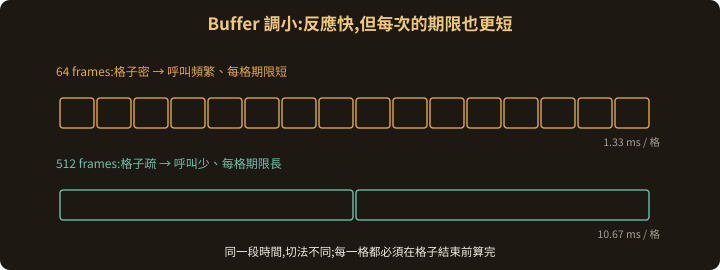

通常能減少緩衝相關的延遲。

代價是呼叫更頻繁、每次處理的期限更短，對時間波動更敏感。

Note:
「期限」這個詞從這裡開始固定使用：每一格都必須在該格結束前算完。
即時演奏、監聽自己的歌聲，這類場合才需要把 buffer 壓小。

---

## Buffer 調大：多一點餘裕，多一點等待

固定開銷比較容易攤薄，也比較能容忍短暫的運算波動。

代價是排隊播放的資料變多，等待也跟著增加。

持續性的運算不足，調大 buffer 一樣救不了。

Note:
比較兩種情境：即時演奏要小 buffer；非即時的混音、算圖、離線輸出，大 buffer 反而省事。
最後一句要強調：buffer 是拿來吸收「短暫尖峰」的，不是拿來補「CPU 根本不夠」的。

---

## 來不及交付，就可能斷音

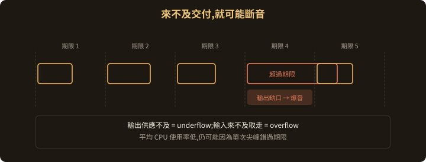

- **underflow**：輸出資料供應不及
- **overflow**：輸入資料來不及取走，空間被塞滿

平均 CPU 使用率很低，仍然可能因為單次尖峰錯過期限。

Note:
這張要打掉「CPU 只用 30%，不可能爆音」這種直覺。
即時系統看的是最壞情況，不是平均值。

---

## 區塊時長，不等於總延遲

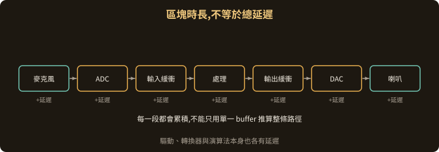

實際延遲還包含輸入／輸出緩衝、驅動、轉換器，以及演算法本身。

不能只用單一 buffer 的時長去推算整條路徑。

Note:
學生常把「buffer 設 5.33 ms」直接當成「延遲 5.33 ms」，那是低估。
軟體要求的延遲值和實際量到的延遲是兩回事，PortAudio 的串流參數文件對這點有清楚說明。

---

## 接下來：讓 Pure Data 幫我們處理聲音

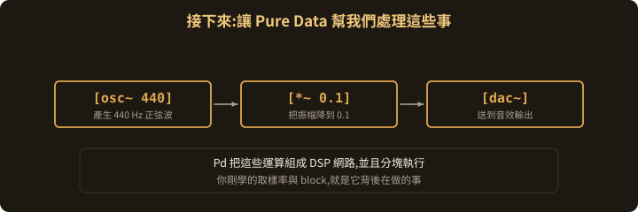

Pure Data 把音訊運算組成 **DSP 網路**，並且分塊執行。

下一章開始建立振盪器、調整振幅、輸出聲音。

Note:
只是預告，不展開操作。
⚠️ 提醒：Pd 內部的 DSP block size 和音訊裝置的 I/O 緩衝設定屬於不同層次，之後實際操作時要分開講，不然學生會把兩個設定混在一起調。
如果時間還有剩，可以打開 Pd 的 Audio Settings 讓他們看一眼那兩個欄位長什麼樣，先留個印象。
