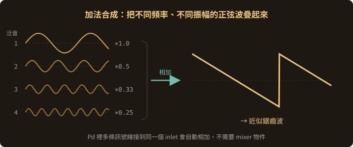
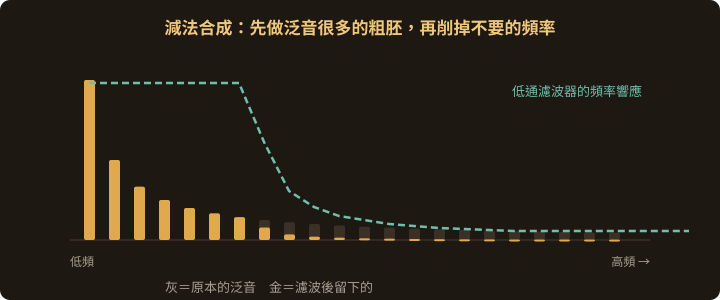
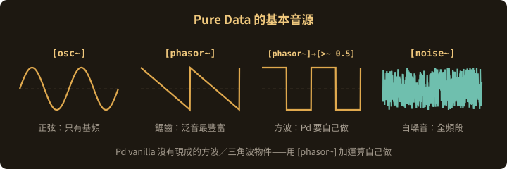
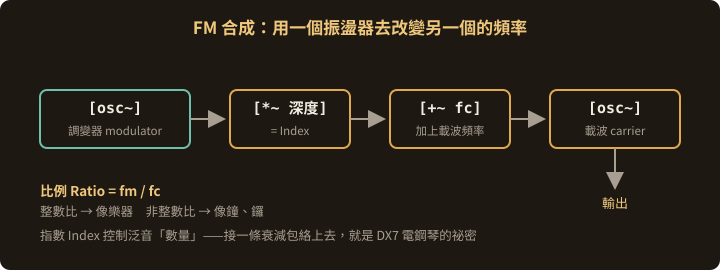
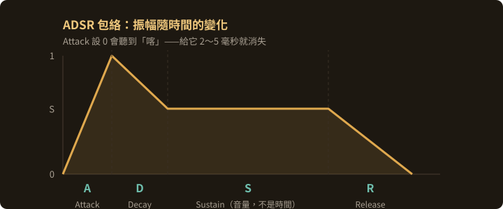
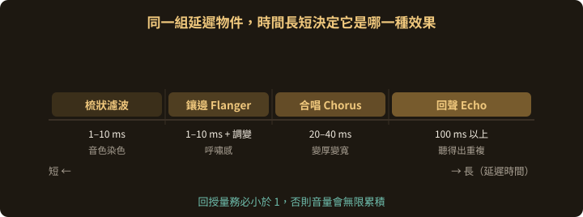

<!-- .slide: class="title" -->
# 聲音的合成

## 用 Pure Data 把聲音做出來

第 7 章

Note:
這一章的目標很具體：下課時每個人都要有一台自己接的、會發聲的合成器。

---

## 這一章只有一句話

> ## 聲音合成 = 產生一個數字流，然後不斷改變它

- **產生**：`[osc~]` `[phasor~]` `[noise~]` `[tabread4~]`
- **改變振幅**：`[*~]` 配合包絡
- **改變頻率內容**：濾波、疊加、相乘、FM
- **改變時間**：延遲家族與殘響

<p class="vidlinks">▶ <a href="https://www.youtube.com/watch?v=Fx5nTjUrK-g">Learning Synthesis with Pure Data 第一講</a><span class="sep">·</span><a href="https://www.youtube.com/watch?v=6VccfmBczHE">深夜樂堂：用 Pd 製作音列（中文）</a></p>

---

## Pd 眼中的聲音

- **取樣率** 44100 Hz — 一秒切成 44100 個數字
- **數值範圍** −1 到 1 — **超過就破音**
- **區塊** 一次算 64 個取樣點 — 所以最小延遲是 1.45 毫秒，不是 0

---

## 一個非常好用的規則

> ### 多條訊號線接到同一個 inlet 時，Pd 會自動相加。

**所以「混音」不需要任何 mixer 物件。**

三個 `[osc~]` 都接到同一個 `[*~]` 的左 inlet，它們就混在一起了。

這也是下一節加法合成的基礎。

---

## 兩個開場的坑

**1. DSP 預設是關的**
補丁接得再漂亮都不會有聲音。

- 主視窗右上角勾選 **DSP**
- 或 `Media → DSP On`（Ctrl/Cmd + `/`）
- 或放一個訊息盒：`[; pd dsp 1(`

**2. 戴耳機請先壓音量**

> ⚠️ 任何音源到 `[dac~]` 之間，**一定先經過 `[*~ 0.05]`**。
> `[osc~]` 的輸出是滿振幅的，不壓會很痛。

---

## 最小可發聲補丁

```plaintext
[osc~ 440]      <- 440 Hz 正弦波
    |
[*~ 0.05]       <- 音量 5%
    |
[dac~ ]         <- 左右兩個 inlet 都要接
```

> `[dac~]` 只接左邊 = 只有左耳有聲音。

---

## 加法合成

> 任何週期性波形，都可以拆成一堆正弦波相加。（傅立葉）

反過來做：**用一堆正弦波疊出想要的音色**。

| 泛音 | 頻率（基頻 220） | 振幅 |
|---|---|---|
| 1（基頻） | 220 Hz | 1.0 |
| 2 | 440 Hz | 0.5 |
| 3 | 660 Hz | 0.33 |
| 4 | 880 Hz | 0.25 |

**泛音的相對強度 = 音色。**

<p class="vidlinks">▶ <a href="https://www.youtube.com/watch?v=97jwN_MBEWI">加法合成（Simon Hutchinson）</a><span class="sep">·</span><a href="https://www.youtube.com/watch?v=YsZKvLnf7wU">泛音與諧波</a></p>

--

## 加法合成：疊出來的音色



<p class="figcap">振幅 1、1/2、1/3、1/4 的整數倍泛音相加，就逼近一個鋸齒波</p>

--

## 手工做一個鋸齒波

```plaintext
[nbx]  <- 基頻 220
  |
[t f f f f]                        <- 保證四路的順序
  |     |       |        |
  |  [* 2]   [* 3]    [* 4]
  |     |       |        |
[osc~][osc~] [osc~]   [osc~]
  |     |       |        |
[*~ 1][*~ .5][*~ .33][*~ .25]
  |     |       |        |
  +-----+-------+--------+         <- 自動相加
        |
    [*~ 0.05]
        |
     [dac~ ]
```

--

## 動手改改看

- `[* 2]` → `[* 2.01]`：泛音略微失諧，聲音開始「活」起來（拍音）
- 改成 `[* 2.7]` `[* 5.1]` `[* 8.4]`：**非諧波**泛音 → 鐘、鑼
- 只留奇數倍（1、3、5、7）：接近方波，像單簧管

> **代價**：豐富音色需要很多振盪器，CPU 重、參數多到難控制。
> 所以實務上更常用減法合成。

---

## 減法合成

思路相反：**先做泛音很多的粗胚，再把不要的頻率削掉**。像雕塑。

```
音源（泛音豐富）→ 濾波器（削掉頻率）→ 放大器（音量隨時間變化）
     OSC              FILTER                 AMP
```

這是類比合成器（Moog、Roland）的標準架構，也是**最容易控制**的合成方式。

<p class="vidlinks">▶ <a href="https://www.youtube.com/watch?v=2QIyaS6B3rY">減法合成：濾波器與濾波包絡</a></p>

--

## 減法合成：削掉的音色



<p class="figcap">同一組泛音，濾波器決定哪些留下來——這就是「雕塑」的意思</p>

--

## 音源與濾波器

| 音源 | 泛音 |
|---|---|
| `[phasor~]` 鋸齒 | 所有整數倍，最豐富 |
| `[noise~]` 白噪音 | 全頻段，做風、海浪、打擊 |
| `[osc~]` 正弦 | **幾乎沒東西可減，不適合** |

| 濾波器 | 作用 |
|---|---|
| `[lop~ 1000]` | 低通，聲音變悶、變暖 |
| `[hip~ 300]` | 高通，去掉低頻轟隆 |
| `[bp~ 800 5]` | 帶通，只留某一段 |
| `[vcf~ 800 5]` | 帶通，中心頻率**吃訊號** → 可掃頻 |

> `[phasor~]` 輸出是 0～1，要當音源記得 `[-~ 0.5]` 移到中心。

--

## 四種基本音源



<p class="figcap">泛音越多，濾波器能雕的東西越多——所以減法合成不從正弦波開始</p>

--

## LFO：讓聲音會呼吸

**LFO** = 低頻振盪器（0.1～20 Hz）。頻率低到聽不見，**不拿來發聲，拿來控制別的參數**。

```plaintext
[noise~]              [osc~ 0.2]     <- 慢速 LFO
    |                     |
    |                 [*~ 300]       <- 擺幅 ±300 Hz
    |                     |
    |                 [+~ 700]       <- 中心 700 Hz
    |                     |
[vcf~ 700 8] <-------------+          <- 掃動中心頻率
    |
[*~ 0.3]
    |
[dac~ ]
```

> `[*~ 幅度] → [+~ 中心]` 是 Pd 裡把 −1~1 映射到任意範圍的**標準寫法**，之後一直用。

---

## 調變合成

用一個訊號改變另一個訊號的參數。**當調變速度快到聽覺範圍（20 Hz 以上），就會產生全新的泛音。**

--

## 環形調變

兩個訊號直接相乘：

```plaintext
[osc~ 440]    [osc~ 137]
     |            |
     +---[*~ ]----+
           |
       [*~ 0.1]
           |
       [dac~ ]
```

產生**和頻與差頻**（577 Hz 與 303 Hz），原本的 440 Hz 反而消失。

→ 金屬味、鐘聲味的非諧波音色。科幻片機器人聲音的經典作法。

--

## FM 合成

1973 年 John Chowning 發表，1983 年 Yamaha DX7 讓它席捲整個 80 年代流行樂。

```plaintext
[nbx]  <- 載波頻率 fc
  |
[t f f]
  |       |
  |    [* 1]         <- 調變頻率 fm（比例 1:1）
  |       |
  |    [osc~ ]
  |       |
  |    [*~ 500]      <- 調變深度
  |       |
  +----[+~ ]
         |
      [osc~ ]        <- 載波
         |
      [*~ 0.1]
         |
      [dac~ ]
```

--

## FM 合成的訊號鏈



<p class="figcap">比例決定音色的「性格」，指數決定它有多亮</p>

--

## FM 的兩個關鍵參數

**比例（Ratio）= fm / fc**
整數比 → 諧波音色，像樂器
非整數比 → 非諧波，像鐘、鑼、金屬

**調變指數（Index）= 偏移量 / fm**
控制泛音的**數量**。越大越亮越尖。

> **最大的祕密**：把調變深度接上一條**會衰減的包絡**。
> 「一開始很亮、然後變柔和」也是真實樂器的行為（撥弦、敲擊的瞬間泛音最豐富）。

<p class="vidlinks">▶ <a href="https://www.youtube.com/watch?v=_X5ZRuP_Uyw">How FM Synthesis Works</a><span class="sep">·</span><a href="https://www.youtube.com/watch?v=w4g92vX1YF4">Chowning 談 FM 合成的起源</a></p>

---

## 包絡：讓聲音有開始與結束

前面所有補丁都有同一個毛病——用 `[tgl]` 直接開關會聽到「喀」。

**原因**：振幅瞬間從 0 跳到 1，這個垂直跳變本身就含有全頻段能量，是一次點擊噪音。

--

## ADSR

| 階段 | 意義 | 典型值 |
|---|---|---|
| **A** Attack | 從 0 升到最大要多久 | 鋼琴 5 ms、弦樂 300 ms |
| **D** Decay | 從最大掉到持續音量要多久 | 100 ms |
| **S** Sustain | 按著不放時的**音量**（不是時間） | 0.6 |
| **R** Release | 放開後衰減到 0 要多久 | 鋼琴 800 ms |

<p class="vidlinks">▶ <a href="https://www.youtube.com/watch?v=iGOgIdgGCN8">ADSR 包絡怎麼運作</a></p>

--

## ADSR 長什麼樣子



<p class="figcap">Sustain 是唯一一個不是時間的參數——它是「按著不放時的音量」</p>

--

## `[vline~]` 一行寫完

```plaintext
[1 5, 0.6 100 5, 0 400 400(
 ↑        ↑           ↑
 5ms升到1  5ms後花100ms到0.6   400ms後花400ms歸零
     |
[vline~ ]
     |
[osc~ 440]--[*~ ]     <- 用包絡乘音源
              |
          [*~ 0.3]
              |
           [dac~ ]
```

**為什麼是 `[vline~]` 不是 `[line~]`**：取樣點精度（不受 64 取樣點的 block 限制）+ 可以一次寫完多段。

> **經驗法則**：Attack 再短也不要設 0。給它 2～5 毫秒，click 消失，而人耳完全察覺不到。

---

## 取樣與波表

| 物件 | 用途 |
|---|---|
| `[soundfiler]` | 讀音檔進陣列 |
| `[tabplay~]` | 最簡單，收到 bang 就原速播 |
| `[tabread4~]` | 依索引讀取 → **可變速、倒放、凍結** |
| `[readsf~]` | 從硬碟串流，不佔記憶體 |

--

## `[tabread4~]` 的玩法

```plaintext
[phasor~ 0.5]        <- 0~1 循環斜坡
     |
[*~ 88200]           <- 乘上陣列總長度 → 位置訊號
     |
[tabread4~ mysound]
     |
[*~ 0.3] --- [dac~ ]
```

- 改 `[phasor~]` 頻率 → **變速**（音高跟著變，像轉盤）
- 給**負**頻率 → **倒放**
- 換成固定數字 `[sig~ 30000]` → **凍結**在某一點無限重複

> 結尾的 **4** 代表四點內插。做音訊播放一律用 `[tabread4~]`，`[tabread~]` 會有雜訊。

---

## 延遲家族

```plaintext
[音源] ──┬─────────────────┐
         |                 |
  [delwrite~ buf 2000]     |    <- 寫進 2 秒緩衝區
                           |
  [delread~ buf 375]       |    <- 讀 375 ms 前的訊號
         |                 |
     [*~ 0.6] ─────────────┘    <- 回授，務必 < 1
         |
     [*~ 0.3] ── [dac~ ]
```

> ⚠️ **回授量 ≥ 1 會無限累積，幾秒內炸掉喇叭和耳朵。**
> 第一次先設 0.3，確認會衰減再往上調。

--

## 同一組物件，四種效果

差別只在延遲時間長短與有沒有調變：

| 效果 | 延遲時間 | 調變 | 聽感 |
|---|---|---|---|
| **梳狀濾波** | 1～10 ms | 否 | 音色染色、金屬感 |
| **鑲邊 Flanger** | 1～10 ms | 是（慢速掃） | 噴射機掠過 |
| **合唱 Chorus** | 20～40 ms | 是（隨機微幅） | 變厚、變寬 |
| **回聲 Echo** | 100 ms 以上 | 否 | 聽得出是重複 |

要做 Flanger：把 `[delread~]` 換成 `[delread4~]`（延遲時間吃訊號），接一條 LFO 進去。

--

## 延遲時間決定它是哪一種效果



<p class="figcap">從 1 毫秒到 1 秒，同一組 [delwrite~] / [delread~] 走完四種效果</p>

--

## 殘響

殘響 = 幾百個不同時間的延遲疊加，模擬空間反射。

Pd vanilla 內建三個現成的：

- `[rev1~]` — 參數少、好上手
- `[rev2~]` — 較細緻可調
- `[rev3~]` — 立體聲輸出，音質最好

（PlugData 與 Pd-extended 另有 `[freeverb~]`。）

---

## 顆粒合成初探

把聲音切成幾十毫秒的極短片段（grain），再大量重疊播放。

每顆 grain 的**位置、長度、音高、音量**都能獨立亂數決定——所以它做得到「**把一秒的聲音拉長成三分鐘而不變調**」，這是其他合成法辦不到的。

最小邏輯：

1. `[metro 20]` 每 20 毫秒觸發一顆 grain
2. `[random]` 決定從陣列哪個位置開始讀
3. `[vline~]` 給每顆 grain 一個很短的包絡（避免 click）
4. 用多個複製讓 grain 彼此重疊

> 說穿了就是**「包絡 + 陣列讀取」重複幾十次**。熟悉 5.6 與 5.7 之後再回頭挑戰。

<p class="vidlinks">▶ <a href="https://www.youtube.com/watch?v=GksWUB_B1OY">顆粒合成解說（Simon Hutchinson）</a><span class="sep">·</span><a href="https://www.youtube.com/watch?v=bmsz5JNi2Mo">Granular Synthesis Explained Simply</a></p>

---

## 沒聲音的時候，按順序檢查

1. **DSP 開了嗎？**（九成是這個）
2. 接到 `[dac~]` 了嗎？**兩個 inlet 都接了嗎？**
3. 音量是不是 0？`[*~]` 沒給參數時**預設是 0**
4. 主控台有紅字嗎？`couldn't create` = 物件名打錯
5. 訊號線接到訊息 inlet 了嗎？
6. 音效卡設定對嗎？

**破音** → 訊號超過 ±1，加 `[clip~ -1 1]` 當保險
**低頻轟隆** → 直流偏移，輸出前串 `[hip~ 5]`

---

## 物件名稱正名

網路教材常寫出**實際上不存在**的物件：

| 常見誤寫 | 正確 |
|---|---|
| `[delay~]` | `[delwrite~]` + `[delread~]` |
| `[reverb~]` | `[rev1~]` / `[rev2~]` / `[rev3~]` |
| `[button]` | `[bng]` |
| `[toggle]` | `[tgl]` |
| `[slider]` | `[hsl]` / `[vsl]` |
| `[number]` | 數字框 / `[nbx]` |

> UI 物件平常都從 `Put` 選單放，很少手打——所以打錯不易被發現。

---

## 練習

1. **警報器** — `[osc~]` + 0.5 Hz LFO 掃頻率
2. **無 click 節拍器** — `[metro]` 觸發 `[vline~]` 包絡
3. **風聲** — `[noise~]` → `[vcf~]`，兩個不同速度的 LFO 相加去掃
4. **FM 電鋼琴** — 比例 1:1，調變深度接 400 ms 衰減包絡
5. **凍結取樣** — 載入自己的錄音，用 `[sig~]` 停在某一點慢慢移動
6. **綜合** — 把第 4 題送進 Flanger 與 `[rev3~]`

---

## 小結

**技術部分到這裡已經夠用了。**

剩下的是回到第 1、2 章講的那些——

> ### 你想讓聽的人聽見什麼。

Note:
真的要強調這句。學生很容易陷入「再學一個新物件」的無限迴圈，但決定作品好壞的從來不是物件數量。

---

<!-- .slide: class="title" -->
## 本章結束

下一章：Max/MSP
